---
jupyter:
  accelerator: GPU
  colab:
    gpuType: V100
    machine_shape: hm
  kernelspec:
    display_name: Python 3
    name: python3
  language_info:
    codemirror_mode:
      name: ipython
      version: 3
    file_extension: .py
    mimetype: text/x-python
    name: python
    nbconvert_exporter: python
    pygments_lexer: ipython3
    version: 3.8.12
  nbformat: 4
  nbformat_minor: 0
  widgets:
    application/vnd.jupyter.widget-state+json:
      009f68d8f00645588ddb12f18b45a15f:
        model_module: \@jupyter-widgets/base
        model_module_version: 1.2.0
        model_name: LayoutModel
        state:
          _model_module: \@jupyter-widgets/base
          _model_module_version: 1.2.0
          _model_name: LayoutModel
          _view_module: \@jupyter-widgets/base
          _view_module_version: 1.2.0
          _view_name: LayoutView
      010a75cfc93546beb2e8df0a0803a8e1:
        model_module: \@jupyter-widgets/base
        model_module_version: 1.2.0
        model_name: LayoutModel
        state:
          _model_module: \@jupyter-widgets/base
          _model_module_version: 1.2.0
          _model_name: LayoutModel
          _view_module: \@jupyter-widgets/base
          _view_module_version: 1.2.0
          _view_name: LayoutView
      023b15aa464e41e68e7ef661b1678122:
        model_module: \@jupyter-widgets/controls
        model_module_version: 1.5.0
        model_name: ProgressStyleModel
        state:
          _model_module: \@jupyter-widgets/controls
          _model_module_version: 1.5.0
          _model_name: ProgressStyleModel
          _view_module: \@jupyter-widgets/base
          _view_module_version: 1.2.0
          _view_name: StyleView
      025b3602700145858972137ba3b2fdd0:
        model_module: \@jupyter-widgets/base
        model_module_version: 1.2.0
        model_name: LayoutModel
        state:
          _model_module: \@jupyter-widgets/base
          _model_module_version: 1.2.0
          _model_name: LayoutModel
          _view_module: \@jupyter-widgets/base
          _view_module_version: 1.2.0
          _view_name: LayoutView
      029c60df5eed454bbc3f27cdcac2c522:
        model_module: \@jupyter-widgets/controls
        model_module_version: 1.5.0
        model_name: HTMLModel
        state:
          _model_module: \@jupyter-widgets/controls
          _model_module_version: 1.5.0
          _model_name: HTMLModel
          _view_module: \@jupyter-widgets/controls
          _view_module_version: 1.5.0
          _view_name: HTMLView
          layout: IPY_MODEL_4a43f2f6387f4e6eb702f96135947efc
          placeholder: ​
          style: IPY_MODEL_5c1b93bce7444c49abf45dea0e958d31
          value: " 500/500 \\[02:34&lt;00:00, 3.32it/s\\]"
      02b7c534ca344596a35a4fe77edeecb7:
        model_module: \@jupyter-widgets/controls
        model_module_version: 1.5.0
        model_name: ProgressStyleModel
        state:
          _model_module: \@jupyter-widgets/controls
          _model_module_version: 1.5.0
          _model_name: ProgressStyleModel
          _view_module: \@jupyter-widgets/base
          _view_module_version: 1.2.0
          _view_name: StyleView
      02c1ffa5d55a42ae9667320fd3e84ac9:
        model_module: \@jupyter-widgets/controls
        model_module_version: 1.5.0
        model_name: HTMLModel
        state:
          _model_module: \@jupyter-widgets/controls
          _model_module_version: 1.5.0
          _model_name: HTMLModel
          _view_module: \@jupyter-widgets/controls
          _view_module_version: 1.5.0
          _view_name: HTMLView
          layout: IPY_MODEL_b231d684489e41228954a07bd3ce877e
          placeholder: ​
          style: IPY_MODEL_62e3f1eb04c848edb3636e619530b55e
          value: 100%
      03b59d09a17c4a0d8b8a2cda26c5ccff:
        model_module: \@jupyter-widgets/controls
        model_module_version: 1.5.0
        model_name: HBoxModel
        state:
          _model_module: \@jupyter-widgets/controls
          _model_module_version: 1.5.0
          _model_name: HBoxModel
          _view_module: \@jupyter-widgets/controls
          _view_module_version: 1.5.0
          _view_name: HBoxView
          children:
          - IPY_MODEL_c998b7a20bee4caebdf84898336112a3
          - IPY_MODEL_1c40428c45124864afc78f2791e99610
          - IPY_MODEL_e09c5f9a769e41b5b59dbc74c2980c1d
          layout: IPY_MODEL_6e71ca33782d435fa8932b406e7e60c3
      04153979b020467089970320da5e8daa:
        model_module: \@jupyter-widgets/controls
        model_module_version: 1.5.0
        model_name: HBoxModel
        state:
          _model_module: \@jupyter-widgets/controls
          _model_module_version: 1.5.0
          _model_name: HBoxModel
          _view_module: \@jupyter-widgets/controls
          _view_module_version: 1.5.0
          _view_name: HBoxView
          children:
          - IPY_MODEL_148e1084dcf0422fa73b9933c378c22f
          - IPY_MODEL_7df1f6139fbf4bc9ba26ccb49fe83bcc
          - IPY_MODEL_53102c12dbd8419ca774fd9a50129dbb
          layout: IPY_MODEL_d779352436a74db19070c6968d58d175
      0546e9e7b27241d1b2815ee54c11b2d1:
        model_module: \@jupyter-widgets/controls
        model_module_version: 1.5.0
        model_name: FloatProgressModel
        state:
          _model_module: \@jupyter-widgets/controls
          _model_module_version: 1.5.0
          _model_name: FloatProgressModel
          _view_module: \@jupyter-widgets/controls
          _view_module_version: 1.5.0
          _view_name: ProgressView
          bar_style: success
          layout: IPY_MODEL_fb665bfdd44d4236be690768bb293a87
          max: 500
          min: 0
          orientation: horizontal
          style: IPY_MODEL_43d1278a98cb4e5a807fd5305f9cfde5
          value: 500
      06d462dd3dbb4d7d8ee6be9e3141d15f:
        model_module: \@jupyter-widgets/controls
        model_module_version: 1.5.0
        model_name: HBoxModel
        state:
          _model_module: \@jupyter-widgets/controls
          _model_module_version: 1.5.0
          _model_name: HBoxModel
          _view_module: \@jupyter-widgets/controls
          _view_module_version: 1.5.0
          _view_name: HBoxView
          children:
          - IPY_MODEL_38142ec1f18b4784933af2893ccb41e1
          - IPY_MODEL_b941a1b55cd7469380aee0a98ec3cdc9
          - IPY_MODEL_2a730403968f4d7fa113f02d2b143010
          layout: IPY_MODEL_f347f7fff21f47bda4b2c37430b11071
      06e0fea4e4ae4e5d82d672b77f20b238:
        model_module: \@jupyter-widgets/controls
        model_module_version: 1.5.0
        model_name: DescriptionStyleModel
        state:
          _model_module: \@jupyter-widgets/controls
          _model_module_version: 1.5.0
          _model_name: DescriptionStyleModel
          _view_module: \@jupyter-widgets/base
          _view_module_version: 1.2.0
          _view_name: StyleView
      06f40181d59442698a7412be44b2d228:
        model_module: \@jupyter-widgets/controls
        model_module_version: 1.5.0
        model_name: HTMLModel
        state:
          _model_module: \@jupyter-widgets/controls
          _model_module_version: 1.5.0
          _model_name: HTMLModel
          _view_module: \@jupyter-widgets/controls
          _view_module_version: 1.5.0
          _view_name: HTMLView
          layout: IPY_MODEL_95ed243c77e94623b9556ef40c229ca5
          placeholder: ​
          style: IPY_MODEL_0e28932ffb66474ba6de4230ee494682
          value: " 500/500 \\[01:47&lt;00:00, 4.68it/s\\]"
      0753e6a787d4465b965759e765aec0fc:
        model_module: \@jupyter-widgets/controls
        model_module_version: 1.5.0
        model_name: ProgressStyleModel
        state:
          _model_module: \@jupyter-widgets/controls
          _model_module_version: 1.5.0
          _model_name: ProgressStyleModel
          _view_module: \@jupyter-widgets/base
          _view_module_version: 1.2.0
          _view_name: StyleView
      07b4f0e8403846cbadd1b3eb965dd8c1:
        model_module: \@jupyter-widgets/controls
        model_module_version: 1.5.0
        model_name: HTMLModel
        state:
          _model_module: \@jupyter-widgets/controls
          _model_module_version: 1.5.0
          _model_name: HTMLModel
          _view_module: \@jupyter-widgets/controls
          _view_module_version: 1.5.0
          _view_name: HTMLView
          layout: IPY_MODEL_34e08780e6dd47a8957d4afe19d1fd33
          placeholder: ​
          style: IPY_MODEL_50090a1fd2e243c587a32b60a08e5dff
          value: " 500/500 \\[01:47&lt;00:00, 4.67it/s\\]"
      089581e7efec45d2963cb914efacb855:
        model_module: \@jupyter-widgets/base
        model_module_version: 1.2.0
        model_name: LayoutModel
        state:
          _model_module: \@jupyter-widgets/base
          _model_module_version: 1.2.0
          _model_name: LayoutModel
          _view_module: \@jupyter-widgets/base
          _view_module_version: 1.2.0
          _view_name: LayoutView
      09a6c8edf6e148c58ed5e3e22ac75ce2:
        model_module: \@jupyter-widgets/controls
        model_module_version: 1.5.0
        model_name: HTMLModel
        state:
          _model_module: \@jupyter-widgets/controls
          _model_module_version: 1.5.0
          _model_name: HTMLModel
          _view_module: \@jupyter-widgets/controls
          _view_module_version: 1.5.0
          _view_name: HTMLView
          layout: IPY_MODEL_8f1b7c3c477241be93b61d4d69c001c5
          placeholder: ​
          style: IPY_MODEL_61ef1780f03341f7aa5c784ae1c80361
          value: " 500/500 \\[01:47&lt;00:00, 4.67it/s\\]"
      0a2b2c4eb6aa4b8eb5d4d4da9186ee23:
        model_module: \@jupyter-widgets/controls
        model_module_version: 1.5.0
        model_name: HBoxModel
        state:
          _model_module: \@jupyter-widgets/controls
          _model_module_version: 1.5.0
          _model_name: HBoxModel
          _view_module: \@jupyter-widgets/controls
          _view_module_version: 1.5.0
          _view_name: HBoxView
          children:
          - IPY_MODEL_a4953d1be5224476a0c4d2d6b48e0b26
          - IPY_MODEL_cc8d49c9c73f46a6b04323707a737e50
          - IPY_MODEL_70774233e8f6417a9717e37c52958f2a
          layout: IPY_MODEL_c2115bfc60f14269ba4fc86c29f752b2
      0abe75bcabcf43cfb349e38613ee81fc:
        model_module: \@jupyter-widgets/base
        model_module_version: 1.2.0
        model_name: LayoutModel
        state:
          _model_module: \@jupyter-widgets/base
          _model_module_version: 1.2.0
          _model_name: LayoutModel
          _view_module: \@jupyter-widgets/base
          _view_module_version: 1.2.0
          _view_name: LayoutView
      0c839724d3864cbb8d0cbc3c6221e6d9:
        model_module: \@jupyter-widgets/controls
        model_module_version: 1.5.0
        model_name: DescriptionStyleModel
        state:
          _model_module: \@jupyter-widgets/controls
          _model_module_version: 1.5.0
          _model_name: DescriptionStyleModel
          _view_module: \@jupyter-widgets/base
          _view_module_version: 1.2.0
          _view_name: StyleView
      0d44e6d9178d48f18d1ea4705e559202:
        model_module: \@jupyter-widgets/base
        model_module_version: 1.2.0
        model_name: LayoutModel
        state:
          _model_module: \@jupyter-widgets/base
          _model_module_version: 1.2.0
          _model_name: LayoutModel
          _view_module: \@jupyter-widgets/base
          _view_module_version: 1.2.0
          _view_name: LayoutView
      0e28932ffb66474ba6de4230ee494682:
        model_module: \@jupyter-widgets/controls
        model_module_version: 1.5.0
        model_name: DescriptionStyleModel
        state:
          _model_module: \@jupyter-widgets/controls
          _model_module_version: 1.5.0
          _model_name: DescriptionStyleModel
          _view_module: \@jupyter-widgets/base
          _view_module_version: 1.2.0
          _view_name: StyleView
      1108602957f6489f8fa6116802c45b96:
        model_module: \@jupyter-widgets/controls
        model_module_version: 1.5.0
        model_name: FloatProgressModel
        state:
          _model_module: \@jupyter-widgets/controls
          _model_module_version: 1.5.0
          _model_name: FloatProgressModel
          _view_module: \@jupyter-widgets/controls
          _view_module_version: 1.5.0
          _view_name: ProgressView
          bar_style: success
          layout: IPY_MODEL_5f78ec0f056c4e7694925fe8eda3556c
          max: 500
          min: 0
          orientation: horizontal
          style: IPY_MODEL_71387bf760834f96bb57f2c9c2285529
          value: 500
      13343061b9e6489da15ba27ffea3f3a7:
        model_module: \@jupyter-widgets/base
        model_module_version: 1.2.0
        model_name: LayoutModel
        state:
          _model_module: \@jupyter-widgets/base
          _model_module_version: 1.2.0
          _model_name: LayoutModel
          _view_module: \@jupyter-widgets/base
          _view_module_version: 1.2.0
          _view_name: LayoutView
      13617b2106fa4a5fb7c5183a575909ae:
        model_module: \@jupyter-widgets/base
        model_module_version: 1.2.0
        model_name: LayoutModel
        state:
          _model_module: \@jupyter-widgets/base
          _model_module_version: 1.2.0
          _model_name: LayoutModel
          _view_module: \@jupyter-widgets/base
          _view_module_version: 1.2.0
          _view_name: LayoutView
      13cd3eafb1d14e0dadb8ac6b54c37ddf:
        model_module: \@jupyter-widgets/base
        model_module_version: 1.2.0
        model_name: LayoutModel
        state:
          _model_module: \@jupyter-widgets/base
          _model_module_version: 1.2.0
          _model_name: LayoutModel
          _view_module: \@jupyter-widgets/base
          _view_module_version: 1.2.0
          _view_name: LayoutView
      142177bf5af4458599dbe11e62b47fb0:
        model_module: \@jupyter-widgets/base
        model_module_version: 1.2.0
        model_name: LayoutModel
        state:
          _model_module: \@jupyter-widgets/base
          _model_module_version: 1.2.0
          _model_name: LayoutModel
          _view_module: \@jupyter-widgets/base
          _view_module_version: 1.2.0
          _view_name: LayoutView
      148e1084dcf0422fa73b9933c378c22f:
        model_module: \@jupyter-widgets/controls
        model_module_version: 1.5.0
        model_name: HTMLModel
        state:
          _model_module: \@jupyter-widgets/controls
          _model_module_version: 1.5.0
          _model_name: HTMLModel
          _view_module: \@jupyter-widgets/controls
          _view_module_version: 1.5.0
          _view_name: HTMLView
          layout: IPY_MODEL_28e9e0d1941c47fb8f20a9d28067eff6
          placeholder: ​
          style: IPY_MODEL_ac2dfb0c292240c49d438cda539bc42e
          value: 100%
      14d70edb48d24ad2a08fd164b2602ade:
        model_module: \@jupyter-widgets/controls
        model_module_version: 1.5.0
        model_name: ProgressStyleModel
        state:
          _model_module: \@jupyter-widgets/controls
          _model_module_version: 1.5.0
          _model_name: ProgressStyleModel
          _view_module: \@jupyter-widgets/base
          _view_module_version: 1.2.0
          _view_name: StyleView
      1555a6b107524df2bf7acfe32a198b4f:
        model_module: \@jupyter-widgets/controls
        model_module_version: 1.5.0
        model_name: DescriptionStyleModel
        state:
          _model_module: \@jupyter-widgets/controls
          _model_module_version: 1.5.0
          _model_name: DescriptionStyleModel
          _view_module: \@jupyter-widgets/base
          _view_module_version: 1.2.0
          _view_name: StyleView
      15fc82ee65bf4e24b8e687414d203828:
        model_module: \@jupyter-widgets/controls
        model_module_version: 1.5.0
        model_name: FloatProgressModel
        state:
          _model_module: \@jupyter-widgets/controls
          _model_module_version: 1.5.0
          _model_name: FloatProgressModel
          _view_module: \@jupyter-widgets/controls
          _view_module_version: 1.5.0
          _view_name: ProgressView
          bar_style: success
          layout: IPY_MODEL_d9ecb3d85b0e4d92aa3129bb24241f8c
          max: 500
          min: 0
          orientation: horizontal
          style: IPY_MODEL_33ef0cb331ea4d309de5ccccab790ef9
          value: 500
      1863bb510ae14988921d4eb22f3a6cfa:
        model_module: \@jupyter-widgets/controls
        model_module_version: 1.5.0
        model_name: HTMLModel
        state:
          _model_module: \@jupyter-widgets/controls
          _model_module_version: 1.5.0
          _model_name: HTMLModel
          _view_module: \@jupyter-widgets/controls
          _view_module_version: 1.5.0
          _view_name: HTMLView
          layout: IPY_MODEL_74ff68fe533a4eee9d38e21569c4d33d
          placeholder: ​
          style: IPY_MODEL_f95a542a77b14527a4d97c26c490c65d
          value: 100%
      18a8a87684bb4e29876e23805bdcae08:
        model_module: \@jupyter-widgets/controls
        model_module_version: 1.5.0
        model_name: ProgressStyleModel
        state:
          _model_module: \@jupyter-widgets/controls
          _model_module_version: 1.5.0
          _model_name: ProgressStyleModel
          _view_module: \@jupyter-widgets/base
          _view_module_version: 1.2.0
          _view_name: StyleView
      19823ea7122c47e59b3ded8d71896b49:
        model_module: \@jupyter-widgets/base
        model_module_version: 1.2.0
        model_name: LayoutModel
        state:
          _model_module: \@jupyter-widgets/base
          _model_module_version: 1.2.0
          _model_name: LayoutModel
          _view_module: \@jupyter-widgets/base
          _view_module_version: 1.2.0
          _view_name: LayoutView
      199badb3ef944da697254738d3fc5330:
        model_module: \@jupyter-widgets/controls
        model_module_version: 1.5.0
        model_name: HBoxModel
        state:
          _model_module: \@jupyter-widgets/controls
          _model_module_version: 1.5.0
          _model_name: HBoxModel
          _view_module: \@jupyter-widgets/controls
          _view_module_version: 1.5.0
          _view_name: HBoxView
          children:
          - IPY_MODEL_3f613fc4c6214ac4b53e52a7780c726b
          - IPY_MODEL_38c295c8b3414b2b992a22d6c4443054
          - IPY_MODEL_44503f4009c14439a886b2ff8e25852f
          layout: IPY_MODEL_c29c7e7351dd4cd085bc5fa13ff62b8f
      1a13d023ac344120897ecbf3df2d2d55:
        model_module: \@jupyter-widgets/controls
        model_module_version: 1.5.0
        model_name: HTMLModel
        state:
          _model_module: \@jupyter-widgets/controls
          _model_module_version: 1.5.0
          _model_name: HTMLModel
          _view_module: \@jupyter-widgets/controls
          _view_module_version: 1.5.0
          _view_name: HTMLView
          layout: IPY_MODEL_b6534f28030840848356f69890f5abc7
          placeholder: ​
          style: IPY_MODEL_5c3086a720ef46159d1baa8bc508dde9
          value: " 500/500 \\[02:33&lt;00:00, 3.33it/s\\]"
      1a24d45c21d84f198ab63b5320cf1a4f:
        model_module: \@jupyter-widgets/base
        model_module_version: 1.2.0
        model_name: LayoutModel
        state:
          _model_module: \@jupyter-widgets/base
          _model_module_version: 1.2.0
          _model_name: LayoutModel
          _view_module: \@jupyter-widgets/base
          _view_module_version: 1.2.0
          _view_name: LayoutView
      1baa148677bc4ae19ee86003b650cc11:
        model_module: \@jupyter-widgets/controls
        model_module_version: 1.5.0
        model_name: FloatProgressModel
        state:
          _model_module: \@jupyter-widgets/controls
          _model_module_version: 1.5.0
          _model_name: FloatProgressModel
          _view_module: \@jupyter-widgets/controls
          _view_module_version: 1.5.0
          _view_name: ProgressView
          bar_style: success
          layout: IPY_MODEL_5310e72e1df74619a87bf279071903e2
          max: 500
          min: 0
          orientation: horizontal
          style: IPY_MODEL_7bc831af6fe1424dbe5ad67e408ce16f
          value: 500
      1bc84fd431cb43f0b216f0e0fc06335c:
        model_module: \@jupyter-widgets/base
        model_module_version: 1.2.0
        model_name: LayoutModel
        state:
          _model_module: \@jupyter-widgets/base
          _model_module_version: 1.2.0
          _model_name: LayoutModel
          _view_module: \@jupyter-widgets/base
          _view_module_version: 1.2.0
          _view_name: LayoutView
      1be9dc64f65642009b09024ce6cb4d69:
        model_module: \@jupyter-widgets/base
        model_module_version: 1.2.0
        model_name: LayoutModel
        state:
          _model_module: \@jupyter-widgets/base
          _model_module_version: 1.2.0
          _model_name: LayoutModel
          _view_module: \@jupyter-widgets/base
          _view_module_version: 1.2.0
          _view_name: LayoutView
      1c40428c45124864afc78f2791e99610:
        model_module: \@jupyter-widgets/controls
        model_module_version: 1.5.0
        model_name: FloatProgressModel
        state:
          _model_module: \@jupyter-widgets/controls
          _model_module_version: 1.5.0
          _model_name: FloatProgressModel
          _view_module: \@jupyter-widgets/controls
          _view_module_version: 1.5.0
          _view_name: ProgressView
          layout: IPY_MODEL_da8dde5b515f46ea886c2b1df03102e1
          max: 500
          min: 0
          orientation: horizontal
          style: IPY_MODEL_905ea6461143426b8b712dab022c320a
          value: 461
      1e397ed98b994410b8f801b591278e0c:
        model_module: \@jupyter-widgets/controls
        model_module_version: 1.5.0
        model_name: HBoxModel
        state:
          _model_module: \@jupyter-widgets/controls
          _model_module_version: 1.5.0
          _model_name: HBoxModel
          _view_module: \@jupyter-widgets/controls
          _view_module_version: 1.5.0
          _view_name: HBoxView
          children:
          - IPY_MODEL_2ea507fe60294a5c8c95eccd1e2a1b10
          - IPY_MODEL_b8a49989caee4f80bc629da4337dd6be
          - IPY_MODEL_ea001cb1f12f4c2abf1136edeb694008
          layout: IPY_MODEL_089581e7efec45d2963cb914efacb855
      1eb1a528f6754f54be480926de11c098:
        model_module: \@jupyter-widgets/controls
        model_module_version: 1.5.0
        model_name: ProgressStyleModel
        state:
          _model_module: \@jupyter-widgets/controls
          _model_module_version: 1.5.0
          _model_name: ProgressStyleModel
          _view_module: \@jupyter-widgets/base
          _view_module_version: 1.2.0
          _view_name: StyleView
      1f01c9e00caf4afd882344b6f114dff7:
        model_module: \@jupyter-widgets/controls
        model_module_version: 1.5.0
        model_name: DescriptionStyleModel
        state:
          _model_module: \@jupyter-widgets/controls
          _model_module_version: 1.5.0
          _model_name: DescriptionStyleModel
          _view_module: \@jupyter-widgets/base
          _view_module_version: 1.2.0
          _view_name: StyleView
      1f096c624aef42a0a0be77306d538d1f:
        model_module: \@jupyter-widgets/controls
        model_module_version: 1.5.0
        model_name: HTMLModel
        state:
          _model_module: \@jupyter-widgets/controls
          _model_module_version: 1.5.0
          _model_name: HTMLModel
          _view_module: \@jupyter-widgets/controls
          _view_module_version: 1.5.0
          _view_name: HTMLView
          layout: IPY_MODEL_7537a7f33042462494f2b653ae0856b3
          placeholder: ​
          style: IPY_MODEL_b61938c009344f92994ac77e977be0bc
          value: " 500/500 \\[02:33&lt;00:00, 3.32it/s\\]"
      1fb04e7044224dff87bd3733013868a9:
        model_module: \@jupyter-widgets/base
        model_module_version: 1.2.0
        model_name: LayoutModel
        state:
          _model_module: \@jupyter-widgets/base
          _model_module_version: 1.2.0
          _model_name: LayoutModel
          _view_module: \@jupyter-widgets/base
          _view_module_version: 1.2.0
          _view_name: LayoutView
      1fda8275fcd24b73a740867ef5136754:
        model_module: \@jupyter-widgets/controls
        model_module_version: 1.5.0
        model_name: HTMLModel
        state:
          _model_module: \@jupyter-widgets/controls
          _model_module_version: 1.5.0
          _model_name: HTMLModel
          _view_module: \@jupyter-widgets/controls
          _view_module_version: 1.5.0
          _view_name: HTMLView
          layout: IPY_MODEL_7ee582c28da64dcfbb0a147ecee1985d
          placeholder: ​
          style: IPY_MODEL_d764aa75e66c4a37a3e9a50dd523ae26
          value: 100%
      20c03ee0a17e4749a7d548a90ca4b98c:
        model_module: \@jupyter-widgets/controls
        model_module_version: 1.5.0
        model_name: ProgressStyleModel
        state:
          _model_module: \@jupyter-widgets/controls
          _model_module_version: 1.5.0
          _model_name: ProgressStyleModel
          _view_module: \@jupyter-widgets/base
          _view_module_version: 1.2.0
          _view_name: StyleView
      20da1006ce294701b200d4f976b359fe:
        model_module: \@jupyter-widgets/controls
        model_module_version: 1.5.0
        model_name: HTMLModel
        state:
          _model_module: \@jupyter-widgets/controls
          _model_module_version: 1.5.0
          _model_name: HTMLModel
          _view_module: \@jupyter-widgets/controls
          _view_module_version: 1.5.0
          _view_name: HTMLView
          layout: IPY_MODEL_e2a6e08befef47d197e452d5829a5041
          placeholder: ​
          style: IPY_MODEL_788b3fdef60b4f90a47ea68ef44d3917
          value: 100%
      21e6a87a17be48e39b46589de5981fb2:
        model_module: \@jupyter-widgets/base
        model_module_version: 1.2.0
        model_name: LayoutModel
        state:
          _model_module: \@jupyter-widgets/base
          _model_module_version: 1.2.0
          _model_name: LayoutModel
          _view_module: \@jupyter-widgets/base
          _view_module_version: 1.2.0
          _view_name: LayoutView
      227b96e637b847f6ad9c9b97ba7642cd:
        model_module: \@jupyter-widgets/base
        model_module_version: 1.2.0
        model_name: LayoutModel
        state:
          _model_module: \@jupyter-widgets/base
          _model_module_version: 1.2.0
          _model_name: LayoutModel
          _view_module: \@jupyter-widgets/base
          _view_module_version: 1.2.0
          _view_name: LayoutView
      22c72f3b90f74f20858980ea01f7ad6c:
        model_module: \@jupyter-widgets/controls
        model_module_version: 1.5.0
        model_name: HBoxModel
        state:
          _model_module: \@jupyter-widgets/controls
          _model_module_version: 1.5.0
          _model_name: HBoxModel
          _view_module: \@jupyter-widgets/controls
          _view_module_version: 1.5.0
          _view_name: HBoxView
          children:
          - IPY_MODEL_c8dca229e99b4b808b7f05f8d786cfd6
          - IPY_MODEL_1108602957f6489f8fa6116802c45b96
          - IPY_MODEL_48fb99a3dc3645239631a858c8d8c916
          layout: IPY_MODEL_77714a79b86c49b8b13442dd1d458d8f
      23100945e7a643499e7401e88e8714f9:
        model_module: \@jupyter-widgets/controls
        model_module_version: 1.5.0
        model_name: DescriptionStyleModel
        state:
          _model_module: \@jupyter-widgets/controls
          _model_module_version: 1.5.0
          _model_name: DescriptionStyleModel
          _view_module: \@jupyter-widgets/base
          _view_module_version: 1.2.0
          _view_name: StyleView
      23589e1ecdf4433baf8a2f068392e919:
        model_module: \@jupyter-widgets/controls
        model_module_version: 1.5.0
        model_name: HTMLModel
        state:
          _model_module: \@jupyter-widgets/controls
          _model_module_version: 1.5.0
          _model_name: HTMLModel
          _view_module: \@jupyter-widgets/controls
          _view_module_version: 1.5.0
          _view_name: HTMLView
          layout: IPY_MODEL_8f8db6b8f5144b20a41c8da651641859
          placeholder: ​
          style: IPY_MODEL_c8f5b816ad2f448e84ee9440d76d949d
          value: " 500/500 \\[01:47&lt;00:00, 4.67it/s\\]"
      2388015ec5e745b18aa7a1607989966f:
        model_module: \@jupyter-widgets/base
        model_module_version: 1.2.0
        model_name: LayoutModel
        state:
          _model_module: \@jupyter-widgets/base
          _model_module_version: 1.2.0
          _model_name: LayoutModel
          _view_module: \@jupyter-widgets/base
          _view_module_version: 1.2.0
          _view_name: LayoutView
      24a788214a9a4335940439133d7ff2f7:
        model_module: \@jupyter-widgets/controls
        model_module_version: 1.5.0
        model_name: DescriptionStyleModel
        state:
          _model_module: \@jupyter-widgets/controls
          _model_module_version: 1.5.0
          _model_name: DescriptionStyleModel
          _view_module: \@jupyter-widgets/base
          _view_module_version: 1.2.0
          _view_name: StyleView
      252a9de00f024d77b2f8b31546480588:
        model_module: \@jupyter-widgets/base
        model_module_version: 1.2.0
        model_name: LayoutModel
        state:
          _model_module: \@jupyter-widgets/base
          _model_module_version: 1.2.0
          _model_name: LayoutModel
          _view_module: \@jupyter-widgets/base
          _view_module_version: 1.2.0
          _view_name: LayoutView
      2568545102d243868c0ca429fb7ccdc8:
        model_module: \@jupyter-widgets/controls
        model_module_version: 1.5.0
        model_name: DescriptionStyleModel
        state:
          _model_module: \@jupyter-widgets/controls
          _model_module_version: 1.5.0
          _model_name: DescriptionStyleModel
          _view_module: \@jupyter-widgets/base
          _view_module_version: 1.2.0
          _view_name: StyleView
      26737ce318e549a1aaa2d37824e2d5c4:
        model_module: \@jupyter-widgets/controls
        model_module_version: 1.5.0
        model_name: FloatProgressModel
        state:
          _model_module: \@jupyter-widgets/controls
          _model_module_version: 1.5.0
          _model_name: FloatProgressModel
          _view_module: \@jupyter-widgets/controls
          _view_module_version: 1.5.0
          _view_name: ProgressView
          bar_style: success
          layout: IPY_MODEL_e53a471387a64ec894568805f41bbbef
          max: 500
          min: 0
          orientation: horizontal
          style: IPY_MODEL_18a8a87684bb4e29876e23805bdcae08
          value: 500
      26e791480b744ce690c9def446540093:
        model_module: \@jupyter-widgets/base
        model_module_version: 1.2.0
        model_name: LayoutModel
        state:
          _model_module: \@jupyter-widgets/base
          _model_module_version: 1.2.0
          _model_name: LayoutModel
          _view_module: \@jupyter-widgets/base
          _view_module_version: 1.2.0
          _view_name: LayoutView
      2741c2afc1f140f4a18a7041551789ba:
        model_module: \@jupyter-widgets/controls
        model_module_version: 1.5.0
        model_name: HBoxModel
        state:
          _model_module: \@jupyter-widgets/controls
          _model_module_version: 1.5.0
          _model_name: HBoxModel
          _view_module: \@jupyter-widgets/controls
          _view_module_version: 1.5.0
          _view_name: HBoxView
          children:
          - IPY_MODEL_5e9860bb6b61498bb088ced1336cf5a5
          - IPY_MODEL_dac97544f11948e5a5dc83e8962b0fa5
          - IPY_MODEL_e162589bc64b465c99dead428c27ee7f
          layout: IPY_MODEL_30d59784b4da44c08a0fdc189d927dde
      2779aa1e5d774d5abbe8c5e4998c86a5:
        model_module: \@jupyter-widgets/base
        model_module_version: 1.2.0
        model_name: LayoutModel
        state:
          _model_module: \@jupyter-widgets/base
          _model_module_version: 1.2.0
          _model_name: LayoutModel
          _view_module: \@jupyter-widgets/base
          _view_module_version: 1.2.0
          _view_name: LayoutView
      27e784a3b73d4f4196ec79549999ecc3:
        model_module: \@jupyter-widgets/controls
        model_module_version: 1.5.0
        model_name: FloatProgressModel
        state:
          _model_module: \@jupyter-widgets/controls
          _model_module_version: 1.5.0
          _model_name: FloatProgressModel
          _view_module: \@jupyter-widgets/controls
          _view_module_version: 1.5.0
          _view_name: ProgressView
          bar_style: success
          layout: IPY_MODEL_0d44e6d9178d48f18d1ea4705e559202
          max: 500
          min: 0
          orientation: horizontal
          style: IPY_MODEL_a99b2ddc7dc74b2db7d5af0aea6551d6
          value: 500
      28e9e0d1941c47fb8f20a9d28067eff6:
        model_module: \@jupyter-widgets/base
        model_module_version: 1.2.0
        model_name: LayoutModel
        state:
          _model_module: \@jupyter-widgets/base
          _model_module_version: 1.2.0
          _model_name: LayoutModel
          _view_module: \@jupyter-widgets/base
          _view_module_version: 1.2.0
          _view_name: LayoutView
      294353020b0b40d5ad876a9959854fe3:
        model_module: \@jupyter-widgets/controls
        model_module_version: 1.5.0
        model_name: HBoxModel
        state:
          _model_module: \@jupyter-widgets/controls
          _model_module_version: 1.5.0
          _model_name: HBoxModel
          _view_module: \@jupyter-widgets/controls
          _view_module_version: 1.5.0
          _view_name: HBoxView
          children:
          - IPY_MODEL_9dec7bd76029410f8165e9b8bf47e45b
          - IPY_MODEL_671310aeb9394bf6b08f8513e8c68fe9
          - IPY_MODEL_c7bf9823a3634ae695af9fc61dce3eb7
          layout: IPY_MODEL_65c8c2c4b07d45ceb6fc07fec54d4a85
      294c570e26c0490ba399cf0739edc6ba:
        model_module: \@jupyter-widgets/controls
        model_module_version: 1.5.0
        model_name: HTMLModel
        state:
          _model_module: \@jupyter-widgets/controls
          _model_module_version: 1.5.0
          _model_name: HTMLModel
          _view_module: \@jupyter-widgets/controls
          _view_module_version: 1.5.0
          _view_name: HTMLView
          layout: IPY_MODEL_f5f536e6eb66409eb86b266ae404b563
          placeholder: ​
          style: IPY_MODEL_d527ba8ae8ba4de6842306b449e0be79
          value: 100%
      2a730403968f4d7fa113f02d2b143010:
        model_module: \@jupyter-widgets/controls
        model_module_version: 1.5.0
        model_name: HTMLModel
        state:
          _model_module: \@jupyter-widgets/controls
          _model_module_version: 1.5.0
          _model_name: HTMLModel
          _view_module: \@jupyter-widgets/controls
          _view_module_version: 1.5.0
          _view_name: HTMLView
          layout: IPY_MODEL_abe05321fa1741968dc14b6b1413abfd
          placeholder: ​
          style: IPY_MODEL_6294741ef0464c8ab0b605798b105eef
          value: " 500/500 \\[02:33&lt;00:00, 3.32it/s\\]"
      2cb856cc193647989653fe193f8c9406:
        model_module: \@jupyter-widgets/controls
        model_module_version: 1.5.0
        model_name: FloatProgressModel
        state:
          _model_module: \@jupyter-widgets/controls
          _model_module_version: 1.5.0
          _model_name: FloatProgressModel
          _view_module: \@jupyter-widgets/controls
          _view_module_version: 1.5.0
          _view_name: ProgressView
          bar_style: success
          layout: IPY_MODEL_9e32a883afe241fc98cfd4576b4b6940
          max: 500
          min: 0
          orientation: horizontal
          style: IPY_MODEL_3be514c2167a4ae1bdd7adf8cd407eeb
          value: 500
      2dd4b895183c40238fd5e15b8cd66370:
        model_module: \@jupyter-widgets/controls
        model_module_version: 1.5.0
        model_name: FloatProgressModel
        state:
          _model_module: \@jupyter-widgets/controls
          _model_module_version: 1.5.0
          _model_name: FloatProgressModel
          _view_module: \@jupyter-widgets/controls
          _view_module_version: 1.5.0
          _view_name: ProgressView
          bar_style: success
          layout: IPY_MODEL_f7af6443f76a4dcdae12302e06bac829
          max: 500
          min: 0
          orientation: horizontal
          style: IPY_MODEL_c031208f6f214b68b7731f8a248c2cb2
          value: 500
      2e75685971a7484f9f6a736ecf0947ef:
        model_module: \@jupyter-widgets/controls
        model_module_version: 1.5.0
        model_name: ProgressStyleModel
        state:
          _model_module: \@jupyter-widgets/controls
          _model_module_version: 1.5.0
          _model_name: ProgressStyleModel
          _view_module: \@jupyter-widgets/base
          _view_module_version: 1.2.0
          _view_name: StyleView
      2ea1ce1cd19f4fd092a93e55665e3e5d:
        model_module: \@jupyter-widgets/base
        model_module_version: 1.2.0
        model_name: LayoutModel
        state:
          _model_module: \@jupyter-widgets/base
          _model_module_version: 1.2.0
          _model_name: LayoutModel
          _view_module: \@jupyter-widgets/base
          _view_module_version: 1.2.0
          _view_name: LayoutView
      2ea507fe60294a5c8c95eccd1e2a1b10:
        model_module: \@jupyter-widgets/controls
        model_module_version: 1.5.0
        model_name: HTMLModel
        state:
          _model_module: \@jupyter-widgets/controls
          _model_module_version: 1.5.0
          _model_name: HTMLModel
          _view_module: \@jupyter-widgets/controls
          _view_module_version: 1.5.0
          _view_name: HTMLView
          layout: IPY_MODEL_aa007f1c55014f6ca3cd738fee714f6e
          placeholder: ​
          style: IPY_MODEL_4174c828e1904a9c896b42110b63f685
          value: 100%
      2f0fc40b51e1423392c94e96cee58f1d:
        model_module: \@jupyter-widgets/controls
        model_module_version: 1.5.0
        model_name: FloatProgressModel
        state:
          _model_module: \@jupyter-widgets/controls
          _model_module_version: 1.5.0
          _model_name: FloatProgressModel
          _view_module: \@jupyter-widgets/controls
          _view_module_version: 1.5.0
          _view_name: ProgressView
          bar_style: success
          layout: IPY_MODEL_78e7ef2c79d64c3dad8c7d4a49a88d70
          max: 500
          min: 0
          orientation: horizontal
          style: IPY_MODEL_afd62faea11a4874aeab5c43edb731f1
          value: 500
      30d59784b4da44c08a0fdc189d927dde:
        model_module: \@jupyter-widgets/base
        model_module_version: 1.2.0
        model_name: LayoutModel
        state:
          _model_module: \@jupyter-widgets/base
          _model_module_version: 1.2.0
          _model_name: LayoutModel
          _view_module: \@jupyter-widgets/base
          _view_module_version: 1.2.0
          _view_name: LayoutView
      312fc53e204c43f3ae92944f8f82c10f:
        model_module: \@jupyter-widgets/controls
        model_module_version: 1.5.0
        model_name: DescriptionStyleModel
        state:
          _model_module: \@jupyter-widgets/controls
          _model_module_version: 1.5.0
          _model_name: DescriptionStyleModel
          _view_module: \@jupyter-widgets/base
          _view_module_version: 1.2.0
          _view_name: StyleView
      33d9b77a9a714c029331d5c6a8e201d8:
        model_module: \@jupyter-widgets/controls
        model_module_version: 1.5.0
        model_name: FloatProgressModel
        state:
          _model_module: \@jupyter-widgets/controls
          _model_module_version: 1.5.0
          _model_name: FloatProgressModel
          _view_module: \@jupyter-widgets/controls
          _view_module_version: 1.5.0
          _view_name: ProgressView
          bar_style: success
          layout: IPY_MODEL_1fb04e7044224dff87bd3733013868a9
          max: 500
          min: 0
          orientation: horizontal
          style: IPY_MODEL_3fe5872bd34d4ffdbbfe3605fc0b1bc6
          value: 500
      33ef0cb331ea4d309de5ccccab790ef9:
        model_module: \@jupyter-widgets/controls
        model_module_version: 1.5.0
        model_name: ProgressStyleModel
        state:
          _model_module: \@jupyter-widgets/controls
          _model_module_version: 1.5.0
          _model_name: ProgressStyleModel
          _view_module: \@jupyter-widgets/base
          _view_module_version: 1.2.0
          _view_name: StyleView
      345eadc454a84a88b0eb79fc314454a4:
        model_module: \@jupyter-widgets/base
        model_module_version: 1.2.0
        model_name: LayoutModel
        state:
          _model_module: \@jupyter-widgets/base
          _model_module_version: 1.2.0
          _model_name: LayoutModel
          _view_module: \@jupyter-widgets/base
          _view_module_version: 1.2.0
          _view_name: LayoutView
      347ae6184cd74bed89936f2e26b56670:
        model_module: \@jupyter-widgets/controls
        model_module_version: 1.5.0
        model_name: DescriptionStyleModel
        state:
          _model_module: \@jupyter-widgets/controls
          _model_module_version: 1.5.0
          _model_name: DescriptionStyleModel
          _view_module: \@jupyter-widgets/base
          _view_module_version: 1.2.0
          _view_name: StyleView
      347c6616d2d843a9bedc81f34250f6ef:
        model_module: \@jupyter-widgets/base
        model_module_version: 1.2.0
        model_name: LayoutModel
        state:
          _model_module: \@jupyter-widgets/base
          _model_module_version: 1.2.0
          _model_name: LayoutModel
          _view_module: \@jupyter-widgets/base
          _view_module_version: 1.2.0
          _view_name: LayoutView
      34e08780e6dd47a8957d4afe19d1fd33:
        model_module: \@jupyter-widgets/base
        model_module_version: 1.2.0
        model_name: LayoutModel
        state:
          _model_module: \@jupyter-widgets/base
          _model_module_version: 1.2.0
          _model_name: LayoutModel
          _view_module: \@jupyter-widgets/base
          _view_module_version: 1.2.0
          _view_name: LayoutView
      3542ccc7c8fb40ff80971fe67ad13527:
        model_module: \@jupyter-widgets/controls
        model_module_version: 1.5.0
        model_name: FloatProgressModel
        state:
          _model_module: \@jupyter-widgets/controls
          _model_module_version: 1.5.0
          _model_name: FloatProgressModel
          _view_module: \@jupyter-widgets/controls
          _view_module_version: 1.5.0
          _view_name: ProgressView
          bar_style: success
          layout: IPY_MODEL_59334876043142439ea50fcb0f1c79d5
          max: 500
          min: 0
          orientation: horizontal
          style: IPY_MODEL_2e75685971a7484f9f6a736ecf0947ef
          value: 500
      3556235859824fb7852b65f082e6c1c0:
        model_module: \@jupyter-widgets/base
        model_module_version: 1.2.0
        model_name: LayoutModel
        state:
          _model_module: \@jupyter-widgets/base
          _model_module_version: 1.2.0
          _model_name: LayoutModel
          _view_module: \@jupyter-widgets/base
          _view_module_version: 1.2.0
          _view_name: LayoutView
      35a7547cfa4a4f49851ce1e37724a37e:
        model_module: \@jupyter-widgets/controls
        model_module_version: 1.5.0
        model_name: HTMLModel
        state:
          _model_module: \@jupyter-widgets/controls
          _model_module_version: 1.5.0
          _model_name: HTMLModel
          _view_module: \@jupyter-widgets/controls
          _view_module_version: 1.5.0
          _view_name: HTMLView
          layout: IPY_MODEL_4f9923626faa4eb19052b31b9fbf60ed
          placeholder: ​
          style: IPY_MODEL_ee71718f98ce4001b745cddbe93c703b
          value: " 500/500 \\[01:47&lt;00:00, 4.67it/s\\]"
      35dbb3c6bfd349428f8454bfce8e3507:
        model_module: \@jupyter-widgets/controls
        model_module_version: 1.5.0
        model_name: HTMLModel
        state:
          _model_module: \@jupyter-widgets/controls
          _model_module_version: 1.5.0
          _model_name: HTMLModel
          _view_module: \@jupyter-widgets/controls
          _view_module_version: 1.5.0
          _view_name: HTMLView
          layout: IPY_MODEL_4697a8174d5f4bd9b4e2cd91fb55b909
          placeholder: ​
          style: IPY_MODEL_84a00ef1559e42688262ee54bb87cd59
          value: 100%
      36bfd6759e51448e8590ee4e4f727f82:
        model_module: \@jupyter-widgets/base
        model_module_version: 1.2.0
        model_name: LayoutModel
        state:
          _model_module: \@jupyter-widgets/base
          _model_module_version: 1.2.0
          _model_name: LayoutModel
          _view_module: \@jupyter-widgets/base
          _view_module_version: 1.2.0
          _view_name: LayoutView
      3791c20b114c4e10a3051912fc8a06ee:
        model_module: \@jupyter-widgets/controls
        model_module_version: 1.5.0
        model_name: FloatProgressModel
        state:
          _model_module: \@jupyter-widgets/controls
          _model_module_version: 1.5.0
          _model_name: FloatProgressModel
          _view_module: \@jupyter-widgets/controls
          _view_module_version: 1.5.0
          _view_name: ProgressView
          bar_style: success
          layout: IPY_MODEL_926a3f4f05b34a93af4b58418fe02a7b
          max: 500
          min: 0
          orientation: horizontal
          style: IPY_MODEL_d8bea906aa884ad3b1d04dbf70bc0a2a
          value: 500
      37c8faa247334edf9ffd004353d6c33b:
        model_module: \@jupyter-widgets/base
        model_module_version: 1.2.0
        model_name: LayoutModel
        state:
          _model_module: \@jupyter-widgets/base
          _model_module_version: 1.2.0
          _model_name: LayoutModel
          _view_module: \@jupyter-widgets/base
          _view_module_version: 1.2.0
          _view_name: LayoutView
      37d065b795604fba8ada0dd080d61939:
        model_module: \@jupyter-widgets/base
        model_module_version: 1.2.0
        model_name: LayoutModel
        state:
          _model_module: \@jupyter-widgets/base
          _model_module_version: 1.2.0
          _model_name: LayoutModel
          _view_module: \@jupyter-widgets/base
          _view_module_version: 1.2.0
          _view_name: LayoutView
      38053483bf034191a6d369866bdd3361:
        model_module: \@jupyter-widgets/base
        model_module_version: 1.2.0
        model_name: LayoutModel
        state:
          _model_module: \@jupyter-widgets/base
          _model_module_version: 1.2.0
          _model_name: LayoutModel
          _view_module: \@jupyter-widgets/base
          _view_module_version: 1.2.0
          _view_name: LayoutView
      38142ec1f18b4784933af2893ccb41e1:
        model_module: \@jupyter-widgets/controls
        model_module_version: 1.5.0
        model_name: HTMLModel
        state:
          _model_module: \@jupyter-widgets/controls
          _model_module_version: 1.5.0
          _model_name: HTMLModel
          _view_module: \@jupyter-widgets/controls
          _view_module_version: 1.5.0
          _view_name: HTMLView
          layout: IPY_MODEL_b4e16681655b4d1aa3cd4dc68c87e5ac
          placeholder: ​
          style: IPY_MODEL_d1bb1b2d0a9f41e0914d30137c51629f
          value: 100%
      3875531efe3944d0aacef15fc70eb9a8:
        model_module: \@jupyter-widgets/controls
        model_module_version: 1.5.0
        model_name: HTMLModel
        state:
          _model_module: \@jupyter-widgets/controls
          _model_module_version: 1.5.0
          _model_name: HTMLModel
          _view_module: \@jupyter-widgets/controls
          _view_module_version: 1.5.0
          _view_name: HTMLView
          layout: IPY_MODEL_cbe82e1c435046d5870ce420de2684e5
          placeholder: ​
          style: IPY_MODEL_7c25ce848658442282539669de389d5a
          value: " 500/500 \\[02:34&lt;00:00, 3.32it/s\\]"
      38c295c8b3414b2b992a22d6c4443054:
        model_module: \@jupyter-widgets/controls
        model_module_version: 1.5.0
        model_name: FloatProgressModel
        state:
          _model_module: \@jupyter-widgets/controls
          _model_module_version: 1.5.0
          _model_name: FloatProgressModel
          _view_module: \@jupyter-widgets/controls
          _view_module_version: 1.5.0
          _view_name: ProgressView
          bar_style: success
          layout: IPY_MODEL_d38bd062e65148118d0914d391ac0ce6
          max: 500
          min: 0
          orientation: horizontal
          style: IPY_MODEL_7a37c7901e1a4468ac3a0464ed73d12b
          value: 500
      396727b9b70c45979f99f2f595def373:
        model_module: \@jupyter-widgets/base
        model_module_version: 1.2.0
        model_name: LayoutModel
        state:
          _model_module: \@jupyter-widgets/base
          _model_module_version: 1.2.0
          _model_name: LayoutModel
          _view_module: \@jupyter-widgets/base
          _view_module_version: 1.2.0
          _view_name: LayoutView
      39d9e7e0ddf344248aa4a6f5c8a909d7:
        model_module: \@jupyter-widgets/base
        model_module_version: 1.2.0
        model_name: LayoutModel
        state:
          _model_module: \@jupyter-widgets/base
          _model_module_version: 1.2.0
          _model_name: LayoutModel
          _view_module: \@jupyter-widgets/base
          _view_module_version: 1.2.0
          _view_name: LayoutView
      3afcdb223e8e400287c98529f3982b35:
        model_module: \@jupyter-widgets/controls
        model_module_version: 1.5.0
        model_name: DescriptionStyleModel
        state:
          _model_module: \@jupyter-widgets/controls
          _model_module_version: 1.5.0
          _model_name: DescriptionStyleModel
          _view_module: \@jupyter-widgets/base
          _view_module_version: 1.2.0
          _view_name: StyleView
      3be514c2167a4ae1bdd7adf8cd407eeb:
        model_module: \@jupyter-widgets/controls
        model_module_version: 1.5.0
        model_name: ProgressStyleModel
        state:
          _model_module: \@jupyter-widgets/controls
          _model_module_version: 1.5.0
          _model_name: ProgressStyleModel
          _view_module: \@jupyter-widgets/base
          _view_module_version: 1.2.0
          _view_name: StyleView
      3c7d5c78a4e04fdfb66bcecffb618fed:
        model_module: \@jupyter-widgets/base
        model_module_version: 1.2.0
        model_name: LayoutModel
        state:
          _model_module: \@jupyter-widgets/base
          _model_module_version: 1.2.0
          _model_name: LayoutModel
          _view_module: \@jupyter-widgets/base
          _view_module_version: 1.2.0
          _view_name: LayoutView
      3cccc445000742be9a8418f8d60f42fe:
        model_module: \@jupyter-widgets/controls
        model_module_version: 1.5.0
        model_name: ProgressStyleModel
        state:
          _model_module: \@jupyter-widgets/controls
          _model_module_version: 1.5.0
          _model_name: ProgressStyleModel
          _view_module: \@jupyter-widgets/base
          _view_module_version: 1.2.0
          _view_name: StyleView
      3e0a523bcd7c4562baa4bed741d1ae29:
        model_module: \@jupyter-widgets/base
        model_module_version: 1.2.0
        model_name: LayoutModel
        state:
          _model_module: \@jupyter-widgets/base
          _model_module_version: 1.2.0
          _model_name: LayoutModel
          _view_module: \@jupyter-widgets/base
          _view_module_version: 1.2.0
          _view_name: LayoutView
      3e6dcb5f416a45b9bbbb59b9e61a1733:
        model_module: \@jupyter-widgets/base
        model_module_version: 1.2.0
        model_name: LayoutModel
        state:
          _model_module: \@jupyter-widgets/base
          _model_module_version: 1.2.0
          _model_name: LayoutModel
          _view_module: \@jupyter-widgets/base
          _view_module_version: 1.2.0
          _view_name: LayoutView
      3f04607a602d467bba642e178e5a3781:
        model_module: \@jupyter-widgets/controls
        model_module_version: 1.5.0
        model_name: HBoxModel
        state:
          _model_module: \@jupyter-widgets/controls
          _model_module_version: 1.5.0
          _model_name: HBoxModel
          _view_module: \@jupyter-widgets/controls
          _view_module_version: 1.5.0
          _view_name: HBoxView
          children:
          - IPY_MODEL_efd6e3c6877d4173808352c2be569841
          - IPY_MODEL_fb6c66addf7d46f883ab1fc7032f2782
          - IPY_MODEL_a351aca99fba4eec9796da5c75ec7d87
          layout: IPY_MODEL_6c2f334f361b4b409c9aac74abdeaa31
      3f613fc4c6214ac4b53e52a7780c726b:
        model_module: \@jupyter-widgets/controls
        model_module_version: 1.5.0
        model_name: HTMLModel
        state:
          _model_module: \@jupyter-widgets/controls
          _model_module_version: 1.5.0
          _model_name: HTMLModel
          _view_module: \@jupyter-widgets/controls
          _view_module_version: 1.5.0
          _view_name: HTMLView
          layout: IPY_MODEL_7d7a7361a38f4f1595e1f4b49d2ab521
          placeholder: ​
          style: IPY_MODEL_fec25bcee0e14661b9eaa6b762face1a
          value: 100%
      3f6bc515759442148d10aac1d54e38d7:
        model_module: \@jupyter-widgets/controls
        model_module_version: 1.5.0
        model_name: DescriptionStyleModel
        state:
          _model_module: \@jupyter-widgets/controls
          _model_module_version: 1.5.0
          _model_name: DescriptionStyleModel
          _view_module: \@jupyter-widgets/base
          _view_module_version: 1.2.0
          _view_name: StyleView
      3fe5872bd34d4ffdbbfe3605fc0b1bc6:
        model_module: \@jupyter-widgets/controls
        model_module_version: 1.5.0
        model_name: ProgressStyleModel
        state:
          _model_module: \@jupyter-widgets/controls
          _model_module_version: 1.5.0
          _model_name: ProgressStyleModel
          _view_module: \@jupyter-widgets/base
          _view_module_version: 1.2.0
          _view_name: StyleView
      3ff0b98e55ca434b82709b9a2f12872c:
        model_module: \@jupyter-widgets/controls
        model_module_version: 1.5.0
        model_name: HTMLModel
        state:
          _model_module: \@jupyter-widgets/controls
          _model_module_version: 1.5.0
          _model_name: HTMLModel
          _view_module: \@jupyter-widgets/controls
          _view_module_version: 1.5.0
          _view_name: HTMLView
          layout: IPY_MODEL_977fc3dc9fdb44d096f3d5d2cd24bfaf
          placeholder: ​
          style: IPY_MODEL_dec1982d2be140f88c4f370146eea21e
          value: 100%
      3ff5a0c62ac44ffeb6a6e511161e1cf0:
        model_module: \@jupyter-widgets/base
        model_module_version: 1.2.0
        model_name: LayoutModel
        state:
          _model_module: \@jupyter-widgets/base
          _model_module_version: 1.2.0
          _model_name: LayoutModel
          _view_module: \@jupyter-widgets/base
          _view_module_version: 1.2.0
          _view_name: LayoutView
      416fd463142249ec867ca834e0eceaeb:
        model_module: \@jupyter-widgets/controls
        model_module_version: 1.5.0
        model_name: HTMLModel
        state:
          _model_module: \@jupyter-widgets/controls
          _model_module_version: 1.5.0
          _model_name: HTMLModel
          _view_module: \@jupyter-widgets/controls
          _view_module_version: 1.5.0
          _view_name: HTMLView
          layout: IPY_MODEL_347c6616d2d843a9bedc81f34250f6ef
          placeholder: ​
          style: IPY_MODEL_deed473d9a68496ca928b16dd6648b35
          value: 100%
      4174c828e1904a9c896b42110b63f685:
        model_module: \@jupyter-widgets/controls
        model_module_version: 1.5.0
        model_name: DescriptionStyleModel
        state:
          _model_module: \@jupyter-widgets/controls
          _model_module_version: 1.5.0
          _model_name: DescriptionStyleModel
          _view_module: \@jupyter-widgets/base
          _view_module_version: 1.2.0
          _view_name: StyleView
      423b3ac9acb843fa970af08d5a33fd0e:
        model_module: \@jupyter-widgets/controls
        model_module_version: 1.5.0
        model_name: HTMLModel
        state:
          _model_module: \@jupyter-widgets/controls
          _model_module_version: 1.5.0
          _model_name: HTMLModel
          _view_module: \@jupyter-widgets/controls
          _view_module_version: 1.5.0
          _view_name: HTMLView
          layout: IPY_MODEL_da2750a8a0014feea664c92c18879444
          placeholder: ​
          style: IPY_MODEL_b5c24052329049eaaa8bc5803c4b7406
          value: " 500/500 \\[01:47&lt;00:00, 4.67it/s\\]"
      42f2cd74ace54bc7a3a031d19469966e:
        model_module: \@jupyter-widgets/controls
        model_module_version: 1.5.0
        model_name: DescriptionStyleModel
        state:
          _model_module: \@jupyter-widgets/controls
          _model_module_version: 1.5.0
          _model_name: DescriptionStyleModel
          _view_module: \@jupyter-widgets/base
          _view_module_version: 1.2.0
          _view_name: StyleView
      43d1278a98cb4e5a807fd5305f9cfde5:
        model_module: \@jupyter-widgets/controls
        model_module_version: 1.5.0
        model_name: ProgressStyleModel
        state:
          _model_module: \@jupyter-widgets/controls
          _model_module_version: 1.5.0
          _model_name: ProgressStyleModel
          _view_module: \@jupyter-widgets/base
          _view_module_version: 1.2.0
          _view_name: StyleView
      44503f4009c14439a886b2ff8e25852f:
        model_module: \@jupyter-widgets/controls
        model_module_version: 1.5.0
        model_name: HTMLModel
        state:
          _model_module: \@jupyter-widgets/controls
          _model_module_version: 1.5.0
          _model_name: HTMLModel
          _view_module: \@jupyter-widgets/controls
          _view_module_version: 1.5.0
          _view_name: HTMLView
          layout: IPY_MODEL_142177bf5af4458599dbe11e62b47fb0
          placeholder: ​
          style: IPY_MODEL_ce831908b63a41c38f6da3aac0639f8b
          value: " 500/500 \\[01:47&lt;00:00, 4.67it/s\\]"
      4478e82c993e4c02a0b8d108461891c6:
        model_module: \@jupyter-widgets/controls
        model_module_version: 1.5.0
        model_name: HTMLModel
        state:
          _model_module: \@jupyter-widgets/controls
          _model_module_version: 1.5.0
          _model_name: HTMLModel
          _view_module: \@jupyter-widgets/controls
          _view_module_version: 1.5.0
          _view_name: HTMLView
          layout: IPY_MODEL_36bfd6759e51448e8590ee4e4f727f82
          placeholder: ​
          style: IPY_MODEL_5e81c2a7b983442b82fd06475ab5b7a7
          value: 100%
      4697a8174d5f4bd9b4e2cd91fb55b909:
        model_module: \@jupyter-widgets/base
        model_module_version: 1.2.0
        model_name: LayoutModel
        state:
          _model_module: \@jupyter-widgets/base
          _model_module_version: 1.2.0
          _model_name: LayoutModel
          _view_module: \@jupyter-widgets/base
          _view_module_version: 1.2.0
          _view_name: LayoutView
      4774c60db5054ca9a58ab252a92928fe:
        model_module: \@jupyter-widgets/controls
        model_module_version: 1.5.0
        model_name: HBoxModel
        state:
          _model_module: \@jupyter-widgets/controls
          _model_module_version: 1.5.0
          _model_name: HBoxModel
          _view_module: \@jupyter-widgets/controls
          _view_module_version: 1.5.0
          _view_name: HBoxView
          children:
          - IPY_MODEL_79ec1adf9f2444249ea6ea919146b873
          - IPY_MODEL_fd1e38d3651341c28e87e90c69e42195
          - IPY_MODEL_a104ff67c9a445b5a568254d8fad6a6b
          layout: IPY_MODEL_d743e0d1e9884d5592a12cb4dfd0cb5f
      488f933399ec4321825f4a46479ca207:
        model_module: \@jupyter-widgets/controls
        model_module_version: 1.5.0
        model_name: DescriptionStyleModel
        state:
          _model_module: \@jupyter-widgets/controls
          _model_module_version: 1.5.0
          _model_name: DescriptionStyleModel
          _view_module: \@jupyter-widgets/base
          _view_module_version: 1.2.0
          _view_name: StyleView
      48a48ccc4d60447ca587128ea08beef0:
        model_module: \@jupyter-widgets/base
        model_module_version: 1.2.0
        model_name: LayoutModel
        state:
          _model_module: \@jupyter-widgets/base
          _model_module_version: 1.2.0
          _model_name: LayoutModel
          _view_module: \@jupyter-widgets/base
          _view_module_version: 1.2.0
          _view_name: LayoutView
      48fb99a3dc3645239631a858c8d8c916:
        model_module: \@jupyter-widgets/controls
        model_module_version: 1.5.0
        model_name: HTMLModel
        state:
          _model_module: \@jupyter-widgets/controls
          _model_module_version: 1.5.0
          _model_name: HTMLModel
          _view_module: \@jupyter-widgets/controls
          _view_module_version: 1.5.0
          _view_name: HTMLView
          layout: IPY_MODEL_1a24d45c21d84f198ab63b5320cf1a4f
          placeholder: ​
          style: IPY_MODEL_312fc53e204c43f3ae92944f8f82c10f
          value: " 500/500 \\[01:47&lt;00:00, 4.67it/s\\]"
      49297fd74d554d43b924aa517695d5ce:
        model_module: \@jupyter-widgets/controls
        model_module_version: 1.5.0
        model_name: HBoxModel
        state:
          _model_module: \@jupyter-widgets/controls
          _model_module_version: 1.5.0
          _model_name: HBoxModel
          _view_module: \@jupyter-widgets/controls
          _view_module_version: 1.5.0
          _view_name: HBoxView
          children:
          - IPY_MODEL_416fd463142249ec867ca834e0eceaeb
          - IPY_MODEL_2cb856cc193647989653fe193f8c9406
          - IPY_MODEL_1a13d023ac344120897ecbf3df2d2d55
          layout: IPY_MODEL_345eadc454a84a88b0eb79fc314454a4
      49e11395db824b09a59426a75c386340:
        model_module: \@jupyter-widgets/base
        model_module_version: 1.2.0
        model_name: LayoutModel
        state:
          _model_module: \@jupyter-widgets/base
          _model_module_version: 1.2.0
          _model_name: LayoutModel
          _view_module: \@jupyter-widgets/base
          _view_module_version: 1.2.0
          _view_name: LayoutView
      4a43f2f6387f4e6eb702f96135947efc:
        model_module: \@jupyter-widgets/base
        model_module_version: 1.2.0
        model_name: LayoutModel
        state:
          _model_module: \@jupyter-widgets/base
          _model_module_version: 1.2.0
          _model_name: LayoutModel
          _view_module: \@jupyter-widgets/base
          _view_module_version: 1.2.0
          _view_name: LayoutView
      4a9c8cbaaf524575bd190ec65b0a31cd:
        model_module: \@jupyter-widgets/controls
        model_module_version: 1.5.0
        model_name: HTMLModel
        state:
          _model_module: \@jupyter-widgets/controls
          _model_module_version: 1.5.0
          _model_name: HTMLModel
          _view_module: \@jupyter-widgets/controls
          _view_module_version: 1.5.0
          _view_name: HTMLView
          layout: IPY_MODEL_562b5c6cf21246b784512eb813b090ba
          placeholder: ​
          style: IPY_MODEL_f2d30bcefaa44a6d858a5b3d37b7230f
          value: 100%
      4d3ac21c5f754c1eb8acbe8fa2715aef:
        model_module: \@jupyter-widgets/controls
        model_module_version: 1.5.0
        model_name: HTMLModel
        state:
          _model_module: \@jupyter-widgets/controls
          _model_module_version: 1.5.0
          _model_name: HTMLModel
          _view_module: \@jupyter-widgets/controls
          _view_module_version: 1.5.0
          _view_name: HTMLView
          layout: IPY_MODEL_638e35773dca49bfb31e973222d602cc
          placeholder: ​
          style: IPY_MODEL_d02298936bdf46f1b7532928b5733a76
          value: 100%
      4eef7ad99e9742a38606d756c92d9d2e:
        model_module: \@jupyter-widgets/base
        model_module_version: 1.2.0
        model_name: LayoutModel
        state:
          _model_module: \@jupyter-widgets/base
          _model_module_version: 1.2.0
          _model_name: LayoutModel
          _view_module: \@jupyter-widgets/base
          _view_module_version: 1.2.0
          _view_name: LayoutView
      4f1af20d175f473d8cf02e78e8e4ee6d:
        model_module: \@jupyter-widgets/controls
        model_module_version: 1.5.0
        model_name: HTMLModel
        state:
          _model_module: \@jupyter-widgets/controls
          _model_module_version: 1.5.0
          _model_name: HTMLModel
          _view_module: \@jupyter-widgets/controls
          _view_module_version: 1.5.0
          _view_name: HTMLView
          layout: IPY_MODEL_13cd3eafb1d14e0dadb8ac6b54c37ddf
          placeholder: ​
          style: IPY_MODEL_9830a90eb0f744a1b280de1b3838ae07
          value: " 500/500 \\[01:47&lt;00:00, 4.67it/s\\]"
      4f9923626faa4eb19052b31b9fbf60ed:
        model_module: \@jupyter-widgets/base
        model_module_version: 1.2.0
        model_name: LayoutModel
        state:
          _model_module: \@jupyter-widgets/base
          _model_module_version: 1.2.0
          _model_name: LayoutModel
          _view_module: \@jupyter-widgets/base
          _view_module_version: 1.2.0
          _view_name: LayoutView
      4fbd3eb9faa942408ee2108d1f0178ac:
        model_module: \@jupyter-widgets/controls
        model_module_version: 1.5.0
        model_name: HTMLModel
        state:
          _model_module: \@jupyter-widgets/controls
          _model_module_version: 1.5.0
          _model_name: HTMLModel
          _view_module: \@jupyter-widgets/controls
          _view_module_version: 1.5.0
          _view_name: HTMLView
          layout: IPY_MODEL_a03c452ae61a42a7bd2f21fd5384957b
          placeholder: ​
          style: IPY_MODEL_347ae6184cd74bed89936f2e26b56670
          value: " 500/500 \\[01:47&lt;00:00, 4.68it/s\\]"
      50090a1fd2e243c587a32b60a08e5dff:
        model_module: \@jupyter-widgets/controls
        model_module_version: 1.5.0
        model_name: DescriptionStyleModel
        state:
          _model_module: \@jupyter-widgets/controls
          _model_module_version: 1.5.0
          _model_name: DescriptionStyleModel
          _view_module: \@jupyter-widgets/base
          _view_module_version: 1.2.0
          _view_name: StyleView
      510b03c7a6894727baf736f06166c3be:
        model_module: \@jupyter-widgets/controls
        model_module_version: 1.5.0
        model_name: HBoxModel
        state:
          _model_module: \@jupyter-widgets/controls
          _model_module_version: 1.5.0
          _model_name: HBoxModel
          _view_module: \@jupyter-widgets/controls
          _view_module_version: 1.5.0
          _view_name: HBoxView
          children:
          - IPY_MODEL_20da1006ce294701b200d4f976b359fe
          - IPY_MODEL_c387bb45fb284ccb8b5a9f53bbd19439
          - IPY_MODEL_f345b899aec34ca89124fb53c2772852
          layout: IPY_MODEL_ed7cd086368a4b02a088f17e59cca2ff
      517bc692f0604f149600776b1d8b52fc:
        model_module: \@jupyter-widgets/controls
        model_module_version: 1.5.0
        model_name: DescriptionStyleModel
        state:
          _model_module: \@jupyter-widgets/controls
          _model_module_version: 1.5.0
          _model_name: DescriptionStyleModel
          _view_module: \@jupyter-widgets/base
          _view_module_version: 1.2.0
          _view_name: StyleView
      53102c12dbd8419ca774fd9a50129dbb:
        model_module: \@jupyter-widgets/controls
        model_module_version: 1.5.0
        model_name: HTMLModel
        state:
          _model_module: \@jupyter-widgets/controls
          _model_module_version: 1.5.0
          _model_name: HTMLModel
          _view_module: \@jupyter-widgets/controls
          _view_module_version: 1.5.0
          _view_name: HTMLView
          layout: IPY_MODEL_5e7b09d83eaa473c9c3a8ae7236af007
          placeholder: ​
          style: IPY_MODEL_7fe734770970460195ba88862b6a2453
          value: " 500/500 \\[01:47&lt;00:00, 4.67it/s\\]"
      5310e72e1df74619a87bf279071903e2:
        model_module: \@jupyter-widgets/base
        model_module_version: 1.2.0
        model_name: LayoutModel
        state:
          _model_module: \@jupyter-widgets/base
          _model_module_version: 1.2.0
          _model_name: LayoutModel
          _view_module: \@jupyter-widgets/base
          _view_module_version: 1.2.0
          _view_name: LayoutView
      543722359c1f48b687e4955c1b9adf18:
        model_module: \@jupyter-widgets/base
        model_module_version: 1.2.0
        model_name: LayoutModel
        state:
          _model_module: \@jupyter-widgets/base
          _model_module_version: 1.2.0
          _model_name: LayoutModel
          _view_module: \@jupyter-widgets/base
          _view_module_version: 1.2.0
          _view_name: LayoutView
      54eabef8306b47538d173974768f021c:
        model_module: \@jupyter-widgets/controls
        model_module_version: 1.5.0
        model_name: DescriptionStyleModel
        state:
          _model_module: \@jupyter-widgets/controls
          _model_module_version: 1.5.0
          _model_name: DescriptionStyleModel
          _view_module: \@jupyter-widgets/base
          _view_module_version: 1.2.0
          _view_name: StyleView
      55b0604d3260417d92a727d2da6f2693:
        model_module: \@jupyter-widgets/controls
        model_module_version: 1.5.0
        model_name: HBoxModel
        state:
          _model_module: \@jupyter-widgets/controls
          _model_module_version: 1.5.0
          _model_name: HBoxModel
          _view_module: \@jupyter-widgets/controls
          _view_module_version: 1.5.0
          _view_name: HBoxView
          children:
          - IPY_MODEL_cf5ac47e146343e2aa25406a5924e305
          - IPY_MODEL_e403fd08a7be445da339d23c01af97ef
          - IPY_MODEL_7ca7e7017e1d45c9a75e83304a3b88ec
          layout: IPY_MODEL_956603db1a1447bebfddfe9ef7f0acfc
      55c78e1791af4537936fec2d9a44b010:
        model_module: \@jupyter-widgets/base
        model_module_version: 1.2.0
        model_name: LayoutModel
        state:
          _model_module: \@jupyter-widgets/base
          _model_module_version: 1.2.0
          _model_name: LayoutModel
          _view_module: \@jupyter-widgets/base
          _view_module_version: 1.2.0
          _view_name: LayoutView
      562b5c6cf21246b784512eb813b090ba:
        model_module: \@jupyter-widgets/base
        model_module_version: 1.2.0
        model_name: LayoutModel
        state:
          _model_module: \@jupyter-widgets/base
          _model_module_version: 1.2.0
          _model_name: LayoutModel
          _view_module: \@jupyter-widgets/base
          _view_module_version: 1.2.0
          _view_name: LayoutView
      57b88eb7221d412182d288eaa3f2e26d:
        model_module: \@jupyter-widgets/controls
        model_module_version: 1.5.0
        model_name: HTMLModel
        state:
          _model_module: \@jupyter-widgets/controls
          _model_module_version: 1.5.0
          _model_name: HTMLModel
          _view_module: \@jupyter-widgets/controls
          _view_module_version: 1.5.0
          _view_name: HTMLView
          layout: IPY_MODEL_1be9dc64f65642009b09024ce6cb4d69
          placeholder: ​
          style: IPY_MODEL_0c839724d3864cbb8d0cbc3c6221e6d9
          value: 100%
      584bd2be47d14e439141d0a98623000c:
        model_module: \@jupyter-widgets/controls
        model_module_version: 1.5.0
        model_name: DescriptionStyleModel
        state:
          _model_module: \@jupyter-widgets/controls
          _model_module_version: 1.5.0
          _model_name: DescriptionStyleModel
          _view_module: \@jupyter-widgets/base
          _view_module_version: 1.2.0
          _view_name: StyleView
      592da5e013714e858ea9b9bfe5d059fa:
        model_module: \@jupyter-widgets/controls
        model_module_version: 1.5.0
        model_name: DescriptionStyleModel
        state:
          _model_module: \@jupyter-widgets/controls
          _model_module_version: 1.5.0
          _model_name: DescriptionStyleModel
          _view_module: \@jupyter-widgets/base
          _view_module_version: 1.2.0
          _view_name: StyleView
      59334876043142439ea50fcb0f1c79d5:
        model_module: \@jupyter-widgets/base
        model_module_version: 1.2.0
        model_name: LayoutModel
        state:
          _model_module: \@jupyter-widgets/base
          _model_module_version: 1.2.0
          _model_name: LayoutModel
          _view_module: \@jupyter-widgets/base
          _view_module_version: 1.2.0
          _view_name: LayoutView
      5a0fa745706a47eab376af32ac7e0bef:
        model_module: \@jupyter-widgets/base
        model_module_version: 1.2.0
        model_name: LayoutModel
        state:
          _model_module: \@jupyter-widgets/base
          _model_module_version: 1.2.0
          _model_name: LayoutModel
          _view_module: \@jupyter-widgets/base
          _view_module_version: 1.2.0
          _view_name: LayoutView
      5b40828efc6a40f6b77cccbb960dc0f8:
        model_module: \@jupyter-widgets/base
        model_module_version: 1.2.0
        model_name: LayoutModel
        state:
          _model_module: \@jupyter-widgets/base
          _model_module_version: 1.2.0
          _model_name: LayoutModel
          _view_module: \@jupyter-widgets/base
          _view_module_version: 1.2.0
          _view_name: LayoutView
      5bc91556caa144f196ca3b82cfef704a:
        model_module: \@jupyter-widgets/base
        model_module_version: 1.2.0
        model_name: LayoutModel
        state:
          _model_module: \@jupyter-widgets/base
          _model_module_version: 1.2.0
          _model_name: LayoutModel
          _view_module: \@jupyter-widgets/base
          _view_module_version: 1.2.0
          _view_name: LayoutView
      5bcc8a6ffc2e4a15a6b20c2359b73c57:
        model_module: \@jupyter-widgets/controls
        model_module_version: 1.5.0
        model_name: DescriptionStyleModel
        state:
          _model_module: \@jupyter-widgets/controls
          _model_module_version: 1.5.0
          _model_name: DescriptionStyleModel
          _view_module: \@jupyter-widgets/base
          _view_module_version: 1.2.0
          _view_name: StyleView
      5bd849aa9f724b1ea4bc53b1ece4769a:
        model_module: \@jupyter-widgets/base
        model_module_version: 1.2.0
        model_name: LayoutModel
        state:
          _model_module: \@jupyter-widgets/base
          _model_module_version: 1.2.0
          _model_name: LayoutModel
          _view_module: \@jupyter-widgets/base
          _view_module_version: 1.2.0
          _view_name: LayoutView
      5c1b93bce7444c49abf45dea0e958d31:
        model_module: \@jupyter-widgets/controls
        model_module_version: 1.5.0
        model_name: DescriptionStyleModel
        state:
          _model_module: \@jupyter-widgets/controls
          _model_module_version: 1.5.0
          _model_name: DescriptionStyleModel
          _view_module: \@jupyter-widgets/base
          _view_module_version: 1.2.0
          _view_name: StyleView
      5c3086a720ef46159d1baa8bc508dde9:
        model_module: \@jupyter-widgets/controls
        model_module_version: 1.5.0
        model_name: DescriptionStyleModel
        state:
          _model_module: \@jupyter-widgets/controls
          _model_module_version: 1.5.0
          _model_name: DescriptionStyleModel
          _view_module: \@jupyter-widgets/base
          _view_module_version: 1.2.0
          _view_name: StyleView
      5e3c7ffb7f144f6f95480255d99c0721:
        model_module: \@jupyter-widgets/controls
        model_module_version: 1.5.0
        model_name: HTMLModel
        state:
          _model_module: \@jupyter-widgets/controls
          _model_module_version: 1.5.0
          _model_name: HTMLModel
          _view_module: \@jupyter-widgets/controls
          _view_module_version: 1.5.0
          _view_name: HTMLView
          layout: IPY_MODEL_def22e37ab5f4b30b5311daeddc6c6b1
          placeholder: ​
          style: IPY_MODEL_c896c381603a44c999d9aa4fc29507ad
          value: " 500/500 \\[02:34&lt;00:00, 3.32it/s\\]"
      5e74bf26cbaa4ad280ef57920cb2a79f:
        model_module: \@jupyter-widgets/base
        model_module_version: 1.2.0
        model_name: LayoutModel
        state:
          _model_module: \@jupyter-widgets/base
          _model_module_version: 1.2.0
          _model_name: LayoutModel
          _view_module: \@jupyter-widgets/base
          _view_module_version: 1.2.0
          _view_name: LayoutView
      5e7b09d83eaa473c9c3a8ae7236af007:
        model_module: \@jupyter-widgets/base
        model_module_version: 1.2.0
        model_name: LayoutModel
        state:
          _model_module: \@jupyter-widgets/base
          _model_module_version: 1.2.0
          _model_name: LayoutModel
          _view_module: \@jupyter-widgets/base
          _view_module_version: 1.2.0
          _view_name: LayoutView
      5e81c2a7b983442b82fd06475ab5b7a7:
        model_module: \@jupyter-widgets/controls
        model_module_version: 1.5.0
        model_name: DescriptionStyleModel
        state:
          _model_module: \@jupyter-widgets/controls
          _model_module_version: 1.5.0
          _model_name: DescriptionStyleModel
          _view_module: \@jupyter-widgets/base
          _view_module_version: 1.2.0
          _view_name: StyleView
      5e9860bb6b61498bb088ced1336cf5a5:
        model_module: \@jupyter-widgets/controls
        model_module_version: 1.5.0
        model_name: HTMLModel
        state:
          _model_module: \@jupyter-widgets/controls
          _model_module_version: 1.5.0
          _model_name: HTMLModel
          _view_module: \@jupyter-widgets/controls
          _view_module_version: 1.5.0
          _view_name: HTMLView
          layout: IPY_MODEL_2779aa1e5d774d5abbe8c5e4998c86a5
          placeholder: ​
          style: IPY_MODEL_b4dea9e72d414b57973a10d1d8159518
          value: 100%
      5f78ec0f056c4e7694925fe8eda3556c:
        model_module: \@jupyter-widgets/base
        model_module_version: 1.2.0
        model_name: LayoutModel
        state:
          _model_module: \@jupyter-widgets/base
          _model_module_version: 1.2.0
          _model_name: LayoutModel
          _view_module: \@jupyter-widgets/base
          _view_module_version: 1.2.0
          _view_name: LayoutView
      61557153463349b3ad7c0f8c91f29554:
        model_module: \@jupyter-widgets/controls
        model_module_version: 1.5.0
        model_name: DescriptionStyleModel
        state:
          _model_module: \@jupyter-widgets/controls
          _model_module_version: 1.5.0
          _model_name: DescriptionStyleModel
          _view_module: \@jupyter-widgets/base
          _view_module_version: 1.2.0
          _view_name: StyleView
      61ef1780f03341f7aa5c784ae1c80361:
        model_module: \@jupyter-widgets/controls
        model_module_version: 1.5.0
        model_name: DescriptionStyleModel
        state:
          _model_module: \@jupyter-widgets/controls
          _model_module_version: 1.5.0
          _model_name: DescriptionStyleModel
          _view_module: \@jupyter-widgets/base
          _view_module_version: 1.2.0
          _view_name: StyleView
      6294741ef0464c8ab0b605798b105eef:
        model_module: \@jupyter-widgets/controls
        model_module_version: 1.5.0
        model_name: DescriptionStyleModel
        state:
          _model_module: \@jupyter-widgets/controls
          _model_module_version: 1.5.0
          _model_name: DescriptionStyleModel
          _view_module: \@jupyter-widgets/base
          _view_module_version: 1.2.0
          _view_name: StyleView
      62977955cba247a1bd1f24d7cea0192f:
        model_module: \@jupyter-widgets/controls
        model_module_version: 1.5.0
        model_name: HBoxModel
        state:
          _model_module: \@jupyter-widgets/controls
          _model_module_version: 1.5.0
          _model_name: HBoxModel
          _view_module: \@jupyter-widgets/controls
          _view_module_version: 1.5.0
          _view_name: HBoxView
          children:
          - IPY_MODEL_a783733965c24c5282918d8e903b3365
          - IPY_MODEL_c0b9414022d740d08424357855a13cf6
          - IPY_MODEL_c061b438ceeb41e7ab06064da43c4516
          layout: IPY_MODEL_9b7c8602d5ac42b6884492b9c445e7cb
      62e3f1eb04c848edb3636e619530b55e:
        model_module: \@jupyter-widgets/controls
        model_module_version: 1.5.0
        model_name: DescriptionStyleModel
        state:
          _model_module: \@jupyter-widgets/controls
          _model_module_version: 1.5.0
          _model_name: DescriptionStyleModel
          _view_module: \@jupyter-widgets/base
          _view_module_version: 1.2.0
          _view_name: StyleView
      638e35773dca49bfb31e973222d602cc:
        model_module: \@jupyter-widgets/base
        model_module_version: 1.2.0
        model_name: LayoutModel
        state:
          _model_module: \@jupyter-widgets/base
          _model_module_version: 1.2.0
          _model_name: LayoutModel
          _view_module: \@jupyter-widgets/base
          _view_module_version: 1.2.0
          _view_name: LayoutView
      64e5a7e399c14bfba81d6e533f7ec959:
        model_module: \@jupyter-widgets/controls
        model_module_version: 1.5.0
        model_name: ProgressStyleModel
        state:
          _model_module: \@jupyter-widgets/controls
          _model_module_version: 1.5.0
          _model_name: ProgressStyleModel
          _view_module: \@jupyter-widgets/base
          _view_module_version: 1.2.0
          _view_name: StyleView
      6560f3f0233947d8b1e90ad2c92d6626:
        model_module: \@jupyter-widgets/base
        model_module_version: 1.2.0
        model_name: LayoutModel
        state:
          _model_module: \@jupyter-widgets/base
          _model_module_version: 1.2.0
          _model_name: LayoutModel
          _view_module: \@jupyter-widgets/base
          _view_module_version: 1.2.0
          _view_name: LayoutView
      65c8c2c4b07d45ceb6fc07fec54d4a85:
        model_module: \@jupyter-widgets/base
        model_module_version: 1.2.0
        model_name: LayoutModel
        state:
          _model_module: \@jupyter-widgets/base
          _model_module_version: 1.2.0
          _model_name: LayoutModel
          _view_module: \@jupyter-widgets/base
          _view_module_version: 1.2.0
          _view_name: LayoutView
      66cd5aa2df954d00869d7eac17cb131d:
        model_module: \@jupyter-widgets/controls
        model_module_version: 1.5.0
        model_name: DescriptionStyleModel
        state:
          _model_module: \@jupyter-widgets/controls
          _model_module_version: 1.5.0
          _model_name: DescriptionStyleModel
          _view_module: \@jupyter-widgets/base
          _view_module_version: 1.2.0
          _view_name: StyleView
      671310aeb9394bf6b08f8513e8c68fe9:
        model_module: \@jupyter-widgets/controls
        model_module_version: 1.5.0
        model_name: FloatProgressModel
        state:
          _model_module: \@jupyter-widgets/controls
          _model_module_version: 1.5.0
          _model_name: FloatProgressModel
          _view_module: \@jupyter-widgets/controls
          _view_module_version: 1.5.0
          _view_name: ProgressView
          bar_style: success
          layout: IPY_MODEL_37d065b795604fba8ada0dd080d61939
          max: 500
          min: 0
          orientation: horizontal
          style: IPY_MODEL_6c5aeec2599f4d13a8b53b52b07b2aac
          value: 500
      68ab4660a06541aba0ea13df6f00a382:
        model_module: \@jupyter-widgets/controls
        model_module_version: 1.5.0
        model_name: HBoxModel
        state:
          _model_module: \@jupyter-widgets/controls
          _model_module_version: 1.5.0
          _model_name: HBoxModel
          _view_module: \@jupyter-widgets/controls
          _view_module_version: 1.5.0
          _view_name: HBoxView
          children:
          - IPY_MODEL_9099e6318c72462a99cbc06d610d6cfa
          - IPY_MODEL_33d9b77a9a714c029331d5c6a8e201d8
          - IPY_MODEL_07b4f0e8403846cbadd1b3eb965dd8c1
          layout: IPY_MODEL_3e0a523bcd7c4562baa4bed741d1ae29
      6a13a66804f14f60ac2a5f56a8b9dc48:
        model_module: \@jupyter-widgets/base
        model_module_version: 1.2.0
        model_name: LayoutModel
        state:
          _model_module: \@jupyter-widgets/base
          _model_module_version: 1.2.0
          _model_name: LayoutModel
          _view_module: \@jupyter-widgets/base
          _view_module_version: 1.2.0
          _view_name: LayoutView
      6b66a80b5313432a8c8abe49b546ec90:
        model_module: \@jupyter-widgets/base
        model_module_version: 1.2.0
        model_name: LayoutModel
        state:
          _model_module: \@jupyter-widgets/base
          _model_module_version: 1.2.0
          _model_name: LayoutModel
          _view_module: \@jupyter-widgets/base
          _view_module_version: 1.2.0
          _view_name: LayoutView
      6b713d2356614455b8d720122182ebc5:
        model_module: \@jupyter-widgets/base
        model_module_version: 1.2.0
        model_name: LayoutModel
        state:
          _model_module: \@jupyter-widgets/base
          _model_module_version: 1.2.0
          _model_name: LayoutModel
          _view_module: \@jupyter-widgets/base
          _view_module_version: 1.2.0
          _view_name: LayoutView
      6c2f334f361b4b409c9aac74abdeaa31:
        model_module: \@jupyter-widgets/base
        model_module_version: 1.2.0
        model_name: LayoutModel
        state:
          _model_module: \@jupyter-widgets/base
          _model_module_version: 1.2.0
          _model_name: LayoutModel
          _view_module: \@jupyter-widgets/base
          _view_module_version: 1.2.0
          _view_name: LayoutView
      6c5aeec2599f4d13a8b53b52b07b2aac:
        model_module: \@jupyter-widgets/controls
        model_module_version: 1.5.0
        model_name: ProgressStyleModel
        state:
          _model_module: \@jupyter-widgets/controls
          _model_module_version: 1.5.0
          _model_name: ProgressStyleModel
          _view_module: \@jupyter-widgets/base
          _view_module_version: 1.2.0
          _view_name: StyleView
      6d086cff8acd49df8151c9c1579936d4:
        model_module: \@jupyter-widgets/controls
        model_module_version: 1.5.0
        model_name: FloatProgressModel
        state:
          _model_module: \@jupyter-widgets/controls
          _model_module_version: 1.5.0
          _model_name: FloatProgressModel
          _view_module: \@jupyter-widgets/controls
          _view_module_version: 1.5.0
          _view_name: ProgressView
          bar_style: success
          layout: IPY_MODEL_d017d60f7f0a4566b9f4ed0229280ecd
          max: 500
          min: 0
          orientation: horizontal
          style: IPY_MODEL_d0355445e9e74c2c8fd854ea4d237c37
          value: 500
      6e12dc66f32b471a8dfa157cd814de33:
        model_module: \@jupyter-widgets/controls
        model_module_version: 1.5.0
        model_name: ProgressStyleModel
        state:
          _model_module: \@jupyter-widgets/controls
          _model_module_version: 1.5.0
          _model_name: ProgressStyleModel
          _view_module: \@jupyter-widgets/base
          _view_module_version: 1.2.0
          _view_name: StyleView
      6e71ca33782d435fa8932b406e7e60c3:
        model_module: \@jupyter-widgets/base
        model_module_version: 1.2.0
        model_name: LayoutModel
        state:
          _model_module: \@jupyter-widgets/base
          _model_module_version: 1.2.0
          _model_name: LayoutModel
          _view_module: \@jupyter-widgets/base
          _view_module_version: 1.2.0
          _view_name: LayoutView
      6e9c8ac6e1624328a806f08a0bca03c8:
        model_module: \@jupyter-widgets/base
        model_module_version: 1.2.0
        model_name: LayoutModel
        state:
          _model_module: \@jupyter-widgets/base
          _model_module_version: 1.2.0
          _model_name: LayoutModel
          _view_module: \@jupyter-widgets/base
          _view_module_version: 1.2.0
          _view_name: LayoutView
      6eb86a1d534c4205ad684ff8eea79993:
        model_module: \@jupyter-widgets/controls
        model_module_version: 1.5.0
        model_name: DescriptionStyleModel
        state:
          _model_module: \@jupyter-widgets/controls
          _model_module_version: 1.5.0
          _model_name: DescriptionStyleModel
          _view_module: \@jupyter-widgets/base
          _view_module_version: 1.2.0
          _view_name: StyleView
      6fa2c0ee2858415999d5d89c2415e87c:
        model_module: \@jupyter-widgets/controls
        model_module_version: 1.5.0
        model_name: HBoxModel
        state:
          _model_module: \@jupyter-widgets/controls
          _model_module_version: 1.5.0
          _model_name: HBoxModel
          _view_module: \@jupyter-widgets/controls
          _view_module_version: 1.5.0
          _view_name: HBoxView
          children:
          - IPY_MODEL_aff9d30da8d1483485101dbaea18993c
          - IPY_MODEL_d650098170a74dcf84087afb30016642
          - IPY_MODEL_1f096c624aef42a0a0be77306d538d1f
          layout: IPY_MODEL_9047f4facf874e0283bec47743986b03
      707328404be5440b840e59631faa5b91:
        model_module: \@jupyter-widgets/base
        model_module_version: 1.2.0
        model_name: LayoutModel
        state:
          _model_module: \@jupyter-widgets/base
          _model_module_version: 1.2.0
          _model_name: LayoutModel
          _view_module: \@jupyter-widgets/base
          _view_module_version: 1.2.0
          _view_name: LayoutView
      70774233e8f6417a9717e37c52958f2a:
        model_module: \@jupyter-widgets/controls
        model_module_version: 1.5.0
        model_name: HTMLModel
        state:
          _model_module: \@jupyter-widgets/controls
          _model_module_version: 1.5.0
          _model_name: HTMLModel
          _view_module: \@jupyter-widgets/controls
          _view_module_version: 1.5.0
          _view_name: HTMLView
          layout: IPY_MODEL_ebb47b02a90640aba48bd7691a9f0cc7
          placeholder: ​
          style: IPY_MODEL_7febcf42ac5d45c9a8de1a8050acb31c
          value: " 500/500 \\[01:47&lt;00:00, 4.67it/s\\]"
      7103aaba83204b1f8d55b4b291e7a219:
        model_module: \@jupyter-widgets/controls
        model_module_version: 1.5.0
        model_name: HBoxModel
        state:
          _model_module: \@jupyter-widgets/controls
          _model_module_version: 1.5.0
          _model_name: HBoxModel
          _view_module: \@jupyter-widgets/controls
          _view_module_version: 1.5.0
          _view_name: HBoxView
          children:
          - IPY_MODEL_ded9835bf9f14f788cbac71c44cccb88
          - IPY_MODEL_765ab32688934b5b86c82abc8d4ad1db
          - IPY_MODEL_423b3ac9acb843fa970af08d5a33fd0e
          layout: IPY_MODEL_227b96e637b847f6ad9c9b97ba7642cd
      71387bf760834f96bb57f2c9c2285529:
        model_module: \@jupyter-widgets/controls
        model_module_version: 1.5.0
        model_name: ProgressStyleModel
        state:
          _model_module: \@jupyter-widgets/controls
          _model_module_version: 1.5.0
          _model_name: ProgressStyleModel
          _view_module: \@jupyter-widgets/base
          _view_module_version: 1.2.0
          _view_name: StyleView
      71a479777ce342ccaf4fdee4fce50d3a:
        model_module: \@jupyter-widgets/controls
        model_module_version: 1.5.0
        model_name: HBoxModel
        state:
          _model_module: \@jupyter-widgets/controls
          _model_module_version: 1.5.0
          _model_name: HBoxModel
          _view_module: \@jupyter-widgets/controls
          _view_module_version: 1.5.0
          _view_name: HBoxView
          children:
          - IPY_MODEL_b676f2e4d93e42bd88618d48a6c2ad28
          - IPY_MODEL_c28bb438369b423ba5ca8e2e03463839
          - IPY_MODEL_b77ee9be88e1413482619235c86f7c52
          layout: IPY_MODEL_e0b3d1ad47c44515bf88cee6b19c2bd0
      72f6655922d840b58ba7991a83413941:
        model_module: \@jupyter-widgets/controls
        model_module_version: 1.5.0
        model_name: HBoxModel
        state:
          _model_module: \@jupyter-widgets/controls
          _model_module_version: 1.5.0
          _model_name: HBoxModel
          _view_module: \@jupyter-widgets/controls
          _view_module_version: 1.5.0
          _view_name: HBoxView
          children:
          - IPY_MODEL_d0ffeeebcb8940209be109a9dab90aa8
          - IPY_MODEL_f83dca7a75f848fd8509b610f05e65c7
          - IPY_MODEL_e3a328eb267d4d69b14d0847e5b311a6
          layout: IPY_MODEL_26e791480b744ce690c9def446540093
      74ff68fe533a4eee9d38e21569c4d33d:
        model_module: \@jupyter-widgets/base
        model_module_version: 1.2.0
        model_name: LayoutModel
        state:
          _model_module: \@jupyter-widgets/base
          _model_module_version: 1.2.0
          _model_name: LayoutModel
          _view_module: \@jupyter-widgets/base
          _view_module_version: 1.2.0
          _view_name: LayoutView
      7537a7f33042462494f2b653ae0856b3:
        model_module: \@jupyter-widgets/base
        model_module_version: 1.2.0
        model_name: LayoutModel
        state:
          _model_module: \@jupyter-widgets/base
          _model_module_version: 1.2.0
          _model_name: LayoutModel
          _view_module: \@jupyter-widgets/base
          _view_module_version: 1.2.0
          _view_name: LayoutView
      765ab32688934b5b86c82abc8d4ad1db:
        model_module: \@jupyter-widgets/controls
        model_module_version: 1.5.0
        model_name: FloatProgressModel
        state:
          _model_module: \@jupyter-widgets/controls
          _model_module_version: 1.5.0
          _model_name: FloatProgressModel
          _view_module: \@jupyter-widgets/controls
          _view_module_version: 1.5.0
          _view_name: ProgressView
          bar_style: success
          layout: IPY_MODEL_c67a34f10b1f4a588fbcdab067c8cd49
          max: 500
          min: 0
          orientation: horizontal
          style: IPY_MODEL_023b15aa464e41e68e7ef661b1678122
          value: 500
      77714a79b86c49b8b13442dd1d458d8f:
        model_module: \@jupyter-widgets/base
        model_module_version: 1.2.0
        model_name: LayoutModel
        state:
          _model_module: \@jupyter-widgets/base
          _model_module_version: 1.2.0
          _model_name: LayoutModel
          _view_module: \@jupyter-widgets/base
          _view_module_version: 1.2.0
          _view_name: LayoutView
      788b3fdef60b4f90a47ea68ef44d3917:
        model_module: \@jupyter-widgets/controls
        model_module_version: 1.5.0
        model_name: DescriptionStyleModel
        state:
          _model_module: \@jupyter-widgets/controls
          _model_module_version: 1.5.0
          _model_name: DescriptionStyleModel
          _view_module: \@jupyter-widgets/base
          _view_module_version: 1.2.0
          _view_name: StyleView
      78e7ef2c79d64c3dad8c7d4a49a88d70:
        model_module: \@jupyter-widgets/base
        model_module_version: 1.2.0
        model_name: LayoutModel
        state:
          _model_module: \@jupyter-widgets/base
          _model_module_version: 1.2.0
          _model_name: LayoutModel
          _view_module: \@jupyter-widgets/base
          _view_module_version: 1.2.0
          _view_name: LayoutView
      7942b3a6c2cb47598dc94ac967cdce60:
        model_module: \@jupyter-widgets/controls
        model_module_version: 1.5.0
        model_name: ProgressStyleModel
        state:
          _model_module: \@jupyter-widgets/controls
          _model_module_version: 1.5.0
          _model_name: ProgressStyleModel
          _view_module: \@jupyter-widgets/base
          _view_module_version: 1.2.0
          _view_name: StyleView
      79d9ec74408540a4afd200e847583fe0:
        model_module: \@jupyter-widgets/controls
        model_module_version: 1.5.0
        model_name: HTMLModel
        state:
          _model_module: \@jupyter-widgets/controls
          _model_module_version: 1.5.0
          _model_name: HTMLModel
          _view_module: \@jupyter-widgets/controls
          _view_module_version: 1.5.0
          _view_name: HTMLView
          layout: IPY_MODEL_55c78e1791af4537936fec2d9a44b010
          placeholder: ​
          style: IPY_MODEL_8a74940591e14f7eb64855d9c0d79c43
          value: " 500/500 \\[01:47&lt;00:00, 4.68it/s\\]"
      79ec1adf9f2444249ea6ea919146b873:
        model_module: \@jupyter-widgets/controls
        model_module_version: 1.5.0
        model_name: HTMLModel
        state:
          _model_module: \@jupyter-widgets/controls
          _model_module_version: 1.5.0
          _model_name: HTMLModel
          _view_module: \@jupyter-widgets/controls
          _view_module_version: 1.5.0
          _view_name: HTMLView
          layout: IPY_MODEL_c043655aede348778f5c09c40738cd69
          placeholder: ​
          style: IPY_MODEL_24a788214a9a4335940439133d7ff2f7
          value: 100%
      79f9002ceb634a2b8d38678e33c647ab:
        model_module: \@jupyter-widgets/controls
        model_module_version: 1.5.0
        model_name: HBoxModel
        state:
          _model_module: \@jupyter-widgets/controls
          _model_module_version: 1.5.0
          _model_name: HBoxModel
          _view_module: \@jupyter-widgets/controls
          _view_module_version: 1.5.0
          _view_name: HBoxView
          children:
          - IPY_MODEL_1fda8275fcd24b73a740867ef5136754
          - IPY_MODEL_816692da2ba849e9884f1eea09c28029
          - IPY_MODEL_06f40181d59442698a7412be44b2d228
          layout: IPY_MODEL_0abe75bcabcf43cfb349e38613ee81fc
      7a37c7901e1a4468ac3a0464ed73d12b:
        model_module: \@jupyter-widgets/controls
        model_module_version: 1.5.0
        model_name: ProgressStyleModel
        state:
          _model_module: \@jupyter-widgets/controls
          _model_module_version: 1.5.0
          _model_name: ProgressStyleModel
          _view_module: \@jupyter-widgets/base
          _view_module_version: 1.2.0
          _view_name: StyleView
      7bc831af6fe1424dbe5ad67e408ce16f:
        model_module: \@jupyter-widgets/controls
        model_module_version: 1.5.0
        model_name: ProgressStyleModel
        state:
          _model_module: \@jupyter-widgets/controls
          _model_module_version: 1.5.0
          _model_name: ProgressStyleModel
          _view_module: \@jupyter-widgets/base
          _view_module_version: 1.2.0
          _view_name: StyleView
      7c25ce848658442282539669de389d5a:
        model_module: \@jupyter-widgets/controls
        model_module_version: 1.5.0
        model_name: DescriptionStyleModel
        state:
          _model_module: \@jupyter-widgets/controls
          _model_module_version: 1.5.0
          _model_name: DescriptionStyleModel
          _view_module: \@jupyter-widgets/base
          _view_module_version: 1.2.0
          _view_name: StyleView
      7ca7e7017e1d45c9a75e83304a3b88ec:
        model_module: \@jupyter-widgets/controls
        model_module_version: 1.5.0
        model_name: HTMLModel
        state:
          _model_module: \@jupyter-widgets/controls
          _model_module_version: 1.5.0
          _model_name: HTMLModel
          _view_module: \@jupyter-widgets/controls
          _view_module_version: 1.5.0
          _view_name: HTMLView
          layout: IPY_MODEL_4eef7ad99e9742a38606d756c92d9d2e
          placeholder: ​
          style: IPY_MODEL_d4da2258c1674472952fd78be4cce382
          value: " 500/500 \\[01:47&lt;00:00, 4.66it/s\\]"
      7d7a7361a38f4f1595e1f4b49d2ab521:
        model_module: \@jupyter-widgets/base
        model_module_version: 1.2.0
        model_name: LayoutModel
        state:
          _model_module: \@jupyter-widgets/base
          _model_module_version: 1.2.0
          _model_name: LayoutModel
          _view_module: \@jupyter-widgets/base
          _view_module_version: 1.2.0
          _view_name: LayoutView
      7df1f6139fbf4bc9ba26ccb49fe83bcc:
        model_module: \@jupyter-widgets/controls
        model_module_version: 1.5.0
        model_name: FloatProgressModel
        state:
          _model_module: \@jupyter-widgets/controls
          _model_module_version: 1.5.0
          _model_name: FloatProgressModel
          _view_module: \@jupyter-widgets/controls
          _view_module_version: 1.5.0
          _view_name: ProgressView
          bar_style: success
          layout: IPY_MODEL_252a9de00f024d77b2f8b31546480588
          max: 500
          min: 0
          orientation: horizontal
          style: IPY_MODEL_9ffbdc6ed36e43f3a765630e252bbc79
          value: 500
      7ee582c28da64dcfbb0a147ecee1985d:
        model_module: \@jupyter-widgets/base
        model_module_version: 1.2.0
        model_name: LayoutModel
        state:
          _model_module: \@jupyter-widgets/base
          _model_module_version: 1.2.0
          _model_name: LayoutModel
          _view_module: \@jupyter-widgets/base
          _view_module_version: 1.2.0
          _view_name: LayoutView
      7fe734770970460195ba88862b6a2453:
        model_module: \@jupyter-widgets/controls
        model_module_version: 1.5.0
        model_name: DescriptionStyleModel
        state:
          _model_module: \@jupyter-widgets/controls
          _model_module_version: 1.5.0
          _model_name: DescriptionStyleModel
          _view_module: \@jupyter-widgets/base
          _view_module_version: 1.2.0
          _view_name: StyleView
      7febcf42ac5d45c9a8de1a8050acb31c:
        model_module: \@jupyter-widgets/controls
        model_module_version: 1.5.0
        model_name: DescriptionStyleModel
        state:
          _model_module: \@jupyter-widgets/controls
          _model_module_version: 1.5.0
          _model_name: DescriptionStyleModel
          _view_module: \@jupyter-widgets/base
          _view_module_version: 1.2.0
          _view_name: StyleView
      816692da2ba849e9884f1eea09c28029:
        model_module: \@jupyter-widgets/controls
        model_module_version: 1.5.0
        model_name: FloatProgressModel
        state:
          _model_module: \@jupyter-widgets/controls
          _model_module_version: 1.5.0
          _model_name: FloatProgressModel
          _view_module: \@jupyter-widgets/controls
          _view_module_version: 1.5.0
          _view_name: ProgressView
          bar_style: success
          layout: IPY_MODEL_3ff5a0c62ac44ffeb6a6e511161e1cf0
          max: 500
          min: 0
          orientation: horizontal
          style: IPY_MODEL_923f5c56f70e46eb835b925e6aed85be
          value: 500
      824fcac8c701483cb9a8d2754a91797d:
        model_module: \@jupyter-widgets/controls
        model_module_version: 1.5.0
        model_name: DescriptionStyleModel
        state:
          _model_module: \@jupyter-widgets/controls
          _model_module_version: 1.5.0
          _model_name: DescriptionStyleModel
          _view_module: \@jupyter-widgets/base
          _view_module_version: 1.2.0
          _view_name: StyleView
      84a00ef1559e42688262ee54bb87cd59:
        model_module: \@jupyter-widgets/controls
        model_module_version: 1.5.0
        model_name: DescriptionStyleModel
        state:
          _model_module: \@jupyter-widgets/controls
          _model_module_version: 1.5.0
          _model_name: DescriptionStyleModel
          _view_module: \@jupyter-widgets/base
          _view_module_version: 1.2.0
          _view_name: StyleView
      85d065ace42b49cc9ebaf16351eba1bd:
        model_module: \@jupyter-widgets/base
        model_module_version: 1.2.0
        model_name: LayoutModel
        state:
          _model_module: \@jupyter-widgets/base
          _model_module_version: 1.2.0
          _model_name: LayoutModel
          _view_module: \@jupyter-widgets/base
          _view_module_version: 1.2.0
          _view_name: LayoutView
      8663db83b4ca4768a83e6b4de0aeb0d1:
        model_module: \@jupyter-widgets/controls
        model_module_version: 1.5.0
        model_name: ProgressStyleModel
        state:
          _model_module: \@jupyter-widgets/controls
          _model_module_version: 1.5.0
          _model_name: ProgressStyleModel
          _view_module: \@jupyter-widgets/base
          _view_module_version: 1.2.0
          _view_name: StyleView
      87602d7909734c73b952f05722f1ab3f:
        model_module: \@jupyter-widgets/controls
        model_module_version: 1.5.0
        model_name: HTMLModel
        state:
          _model_module: \@jupyter-widgets/controls
          _model_module_version: 1.5.0
          _model_name: HTMLModel
          _view_module: \@jupyter-widgets/controls
          _view_module_version: 1.5.0
          _view_name: HTMLView
          layout: IPY_MODEL_ab76b17cf23b42af9298ce5e0c86d7f1
          placeholder: ​
          style: IPY_MODEL_517bc692f0604f149600776b1d8b52fc
          value: 100%
      89ebbbd0f7eb47208bcb15741456dc85:
        model_module: \@jupyter-widgets/controls
        model_module_version: 1.5.0
        model_name: FloatProgressModel
        state:
          _model_module: \@jupyter-widgets/controls
          _model_module_version: 1.5.0
          _model_name: FloatProgressModel
          _view_module: \@jupyter-widgets/controls
          _view_module_version: 1.5.0
          _view_name: ProgressView
          bar_style: success
          layout: IPY_MODEL_de62fcce3248470f828c85ce19687389
          max: 500
          min: 0
          orientation: horizontal
          style: IPY_MODEL_64e5a7e399c14bfba81d6e533f7ec959
          value: 500
      8a1f0b1ae70d4c6c910e45440b703b99:
        model_module: \@jupyter-widgets/controls
        model_module_version: 1.5.0
        model_name: DescriptionStyleModel
        state:
          _model_module: \@jupyter-widgets/controls
          _model_module_version: 1.5.0
          _model_name: DescriptionStyleModel
          _view_module: \@jupyter-widgets/base
          _view_module_version: 1.2.0
          _view_name: StyleView
      8a74940591e14f7eb64855d9c0d79c43:
        model_module: \@jupyter-widgets/controls
        model_module_version: 1.5.0
        model_name: DescriptionStyleModel
        state:
          _model_module: \@jupyter-widgets/controls
          _model_module_version: 1.5.0
          _model_name: DescriptionStyleModel
          _view_module: \@jupyter-widgets/base
          _view_module_version: 1.2.0
          _view_name: StyleView
      8deafce358b54626a82be1f7e901ce63:
        model_module: \@jupyter-widgets/controls
        model_module_version: 1.5.0
        model_name: ProgressStyleModel
        state:
          _model_module: \@jupyter-widgets/controls
          _model_module_version: 1.5.0
          _model_name: ProgressStyleModel
          _view_module: \@jupyter-widgets/base
          _view_module_version: 1.2.0
          _view_name: StyleView
      8ea10ffded52484a8e1829310aee4a08:
        model_module: \@jupyter-widgets/controls
        model_module_version: 1.5.0
        model_name: DescriptionStyleModel
        state:
          _model_module: \@jupyter-widgets/controls
          _model_module_version: 1.5.0
          _model_name: DescriptionStyleModel
          _view_module: \@jupyter-widgets/base
          _view_module_version: 1.2.0
          _view_name: StyleView
      8f1b7c3c477241be93b61d4d69c001c5:
        model_module: \@jupyter-widgets/base
        model_module_version: 1.2.0
        model_name: LayoutModel
        state:
          _model_module: \@jupyter-widgets/base
          _model_module_version: 1.2.0
          _model_name: LayoutModel
          _view_module: \@jupyter-widgets/base
          _view_module_version: 1.2.0
          _view_name: LayoutView
      8f8db6b8f5144b20a41c8da651641859:
        model_module: \@jupyter-widgets/base
        model_module_version: 1.2.0
        model_name: LayoutModel
        state:
          _model_module: \@jupyter-widgets/base
          _model_module_version: 1.2.0
          _model_name: LayoutModel
          _view_module: \@jupyter-widgets/base
          _view_module_version: 1.2.0
          _view_name: LayoutView
      8fbe0471e9aa406aba061b62ba83dc13:
        model_module: \@jupyter-widgets/base
        model_module_version: 1.2.0
        model_name: LayoutModel
        state:
          _model_module: \@jupyter-widgets/base
          _model_module_version: 1.2.0
          _model_name: LayoutModel
          _view_module: \@jupyter-widgets/base
          _view_module_version: 1.2.0
          _view_name: LayoutView
      9047f4facf874e0283bec47743986b03:
        model_module: \@jupyter-widgets/base
        model_module_version: 1.2.0
        model_name: LayoutModel
        state:
          _model_module: \@jupyter-widgets/base
          _model_module_version: 1.2.0
          _model_name: LayoutModel
          _view_module: \@jupyter-widgets/base
          _view_module_version: 1.2.0
          _view_name: LayoutView
      905ea6461143426b8b712dab022c320a:
        model_module: \@jupyter-widgets/controls
        model_module_version: 1.5.0
        model_name: ProgressStyleModel
        state:
          _model_module: \@jupyter-widgets/controls
          _model_module_version: 1.5.0
          _model_name: ProgressStyleModel
          _view_module: \@jupyter-widgets/base
          _view_module_version: 1.2.0
          _view_name: StyleView
      9099e6318c72462a99cbc06d610d6cfa:
        model_module: \@jupyter-widgets/controls
        model_module_version: 1.5.0
        model_name: HTMLModel
        state:
          _model_module: \@jupyter-widgets/controls
          _model_module_version: 1.5.0
          _model_name: HTMLModel
          _view_module: \@jupyter-widgets/controls
          _view_module_version: 1.5.0
          _view_name: HTMLView
          layout: IPY_MODEL_d680a1a043ca4a0eafbb08a8c7fbc96c
          placeholder: ​
          style: IPY_MODEL_8a1f0b1ae70d4c6c910e45440b703b99
          value: 100%
      90ebd024bdc54e62a23ac502a64ad964:
        model_module: \@jupyter-widgets/controls
        model_module_version: 1.5.0
        model_name: DescriptionStyleModel
        state:
          _model_module: \@jupyter-widgets/controls
          _model_module_version: 1.5.0
          _model_name: DescriptionStyleModel
          _view_module: \@jupyter-widgets/base
          _view_module_version: 1.2.0
          _view_name: StyleView
      9206f565ec3b48a399a605c97b94a919:
        model_module: \@jupyter-widgets/controls
        model_module_version: 1.5.0
        model_name: ProgressStyleModel
        state:
          _model_module: \@jupyter-widgets/controls
          _model_module_version: 1.5.0
          _model_name: ProgressStyleModel
          _view_module: \@jupyter-widgets/base
          _view_module_version: 1.2.0
          _view_name: StyleView
      923f5c56f70e46eb835b925e6aed85be:
        model_module: \@jupyter-widgets/controls
        model_module_version: 1.5.0
        model_name: ProgressStyleModel
        state:
          _model_module: \@jupyter-widgets/controls
          _model_module_version: 1.5.0
          _model_name: ProgressStyleModel
          _view_module: \@jupyter-widgets/base
          _view_module_version: 1.2.0
          _view_name: StyleView
      924dfe3c435c4dd986152b38c56ff52c:
        model_module: \@jupyter-widgets/controls
        model_module_version: 1.5.0
        model_name: FloatProgressModel
        state:
          _model_module: \@jupyter-widgets/controls
          _model_module_version: 1.5.0
          _model_name: FloatProgressModel
          _view_module: \@jupyter-widgets/controls
          _view_module_version: 1.5.0
          _view_name: ProgressView
          bar_style: success
          layout: IPY_MODEL_3e6dcb5f416a45b9bbbb59b9e61a1733
          max: 500
          min: 0
          orientation: horizontal
          style: IPY_MODEL_8deafce358b54626a82be1f7e901ce63
          value: 500
      926a3f4f05b34a93af4b58418fe02a7b:
        model_module: \@jupyter-widgets/base
        model_module_version: 1.2.0
        model_name: LayoutModel
        state:
          _model_module: \@jupyter-widgets/base
          _model_module_version: 1.2.0
          _model_name: LayoutModel
          _view_module: \@jupyter-widgets/base
          _view_module_version: 1.2.0
          _view_name: LayoutView
      93376492841a48d2bbb6cd08175547e7:
        model_module: \@jupyter-widgets/controls
        model_module_version: 1.5.0
        model_name: HTMLModel
        state:
          _model_module: \@jupyter-widgets/controls
          _model_module_version: 1.5.0
          _model_name: HTMLModel
          _view_module: \@jupyter-widgets/controls
          _view_module_version: 1.5.0
          _view_name: HTMLView
          layout: IPY_MODEL_f9057190921242cca0e13736a5d516c4
          placeholder: ​
          style: IPY_MODEL_9701ac197cdf4d20ad1f3c70b5d550aa
          value: " 500/500 \\[01:47&lt;00:00, 4.67it/s\\]"
      955135dd0a1e4c0f9eb5b18f4e4bd906:
        model_module: \@jupyter-widgets/controls
        model_module_version: 1.5.0
        model_name: HBoxModel
        state:
          _model_module: \@jupyter-widgets/controls
          _model_module_version: 1.5.0
          _model_name: HBoxModel
          _view_module: \@jupyter-widgets/controls
          _view_module_version: 1.5.0
          _view_name: HBoxView
          children:
          - IPY_MODEL_da6b9ae560bf49adb37c5f84ec5155d7
          - IPY_MODEL_15fc82ee65bf4e24b8e687414d203828
          - IPY_MODEL_4fbd3eb9faa942408ee2108d1f0178ac
          layout: IPY_MODEL_bea1df7a81e047c589fc6c13ded10875
      956603db1a1447bebfddfe9ef7f0acfc:
        model_module: \@jupyter-widgets/base
        model_module_version: 1.2.0
        model_name: LayoutModel
        state:
          _model_module: \@jupyter-widgets/base
          _model_module_version: 1.2.0
          _model_name: LayoutModel
          _view_module: \@jupyter-widgets/base
          _view_module_version: 1.2.0
          _view_name: LayoutView
      957c564948b740eb947d3cd6df311f94:
        model_module: \@jupyter-widgets/base
        model_module_version: 1.2.0
        model_name: LayoutModel
        state:
          _model_module: \@jupyter-widgets/base
          _model_module_version: 1.2.0
          _model_name: LayoutModel
          _view_module: \@jupyter-widgets/base
          _view_module_version: 1.2.0
          _view_name: LayoutView
      95ed243c77e94623b9556ef40c229ca5:
        model_module: \@jupyter-widgets/base
        model_module_version: 1.2.0
        model_name: LayoutModel
        state:
          _model_module: \@jupyter-widgets/base
          _model_module_version: 1.2.0
          _model_name: LayoutModel
          _view_module: \@jupyter-widgets/base
          _view_module_version: 1.2.0
          _view_name: LayoutView
      95fbed57e7da4e77972278afbd124747:
        model_module: \@jupyter-widgets/controls
        model_module_version: 1.5.0
        model_name: ProgressStyleModel
        state:
          _model_module: \@jupyter-widgets/controls
          _model_module_version: 1.5.0
          _model_name: ProgressStyleModel
          _view_module: \@jupyter-widgets/base
          _view_module_version: 1.2.0
          _view_name: StyleView
      9701ac197cdf4d20ad1f3c70b5d550aa:
        model_module: \@jupyter-widgets/controls
        model_module_version: 1.5.0
        model_name: DescriptionStyleModel
        state:
          _model_module: \@jupyter-widgets/controls
          _model_module_version: 1.5.0
          _model_name: DescriptionStyleModel
          _view_module: \@jupyter-widgets/base
          _view_module_version: 1.2.0
          _view_name: StyleView
      973a245e166447f18b7effb9e36de5ee:
        model_module: \@jupyter-widgets/controls
        model_module_version: 1.5.0
        model_name: HBoxModel
        state:
          _model_module: \@jupyter-widgets/controls
          _model_module_version: 1.5.0
          _model_name: HBoxModel
          _view_module: \@jupyter-widgets/controls
          _view_module_version: 1.5.0
          _view_name: HBoxView
          children:
          - IPY_MODEL_a6b21753e1be42cf893a57efbacd527d
          - IPY_MODEL_6d086cff8acd49df8151c9c1579936d4
          - IPY_MODEL_9f62b631e7804dc7af26221b1de293d2
          layout: IPY_MODEL_c19ca7e8b6e94349a011bcce84569fb4
      977fc3dc9fdb44d096f3d5d2cd24bfaf:
        model_module: \@jupyter-widgets/base
        model_module_version: 1.2.0
        model_name: LayoutModel
        state:
          _model_module: \@jupyter-widgets/base
          _model_module_version: 1.2.0
          _model_name: LayoutModel
          _view_module: \@jupyter-widgets/base
          _view_module_version: 1.2.0
          _view_name: LayoutView
      97b73c439755434ab751e72f4fcbe935:
        model_module: \@jupyter-widgets/controls
        model_module_version: 1.5.0
        model_name: DescriptionStyleModel
        state:
          _model_module: \@jupyter-widgets/controls
          _model_module_version: 1.5.0
          _model_name: DescriptionStyleModel
          _view_module: \@jupyter-widgets/base
          _view_module_version: 1.2.0
          _view_name: StyleView
      97db431b755e4ff2bc98128e336d3417:
        model_module: \@jupyter-widgets/base
        model_module_version: 1.2.0
        model_name: LayoutModel
        state:
          _model_module: \@jupyter-widgets/base
          _model_module_version: 1.2.0
          _model_name: LayoutModel
          _view_module: \@jupyter-widgets/base
          _view_module_version: 1.2.0
          _view_name: LayoutView
      9830a90eb0f744a1b280de1b3838ae07:
        model_module: \@jupyter-widgets/controls
        model_module_version: 1.5.0
        model_name: DescriptionStyleModel
        state:
          _model_module: \@jupyter-widgets/controls
          _model_module_version: 1.5.0
          _model_name: DescriptionStyleModel
          _view_module: \@jupyter-widgets/base
          _view_module_version: 1.2.0
          _view_name: StyleView
      994d54dae7d5470b9dbba124b895395d:
        model_module: \@jupyter-widgets/base
        model_module_version: 1.2.0
        model_name: LayoutModel
        state:
          _model_module: \@jupyter-widgets/base
          _model_module_version: 1.2.0
          _model_name: LayoutModel
          _view_module: \@jupyter-widgets/base
          _view_module_version: 1.2.0
          _view_name: LayoutView
      9b7c8602d5ac42b6884492b9c445e7cb:
        model_module: \@jupyter-widgets/base
        model_module_version: 1.2.0
        model_name: LayoutModel
        state:
          _model_module: \@jupyter-widgets/base
          _model_module_version: 1.2.0
          _model_name: LayoutModel
          _view_module: \@jupyter-widgets/base
          _view_module_version: 1.2.0
          _view_name: LayoutView
      9d121913a69e42c9bed3be7ecf70334c:
        model_module: \@jupyter-widgets/base
        model_module_version: 1.2.0
        model_name: LayoutModel
        state:
          _model_module: \@jupyter-widgets/base
          _model_module_version: 1.2.0
          _model_name: LayoutModel
          _view_module: \@jupyter-widgets/base
          _view_module_version: 1.2.0
          _view_name: LayoutView
      9d4f59d6acf94a19b796a06245f57d58:
        model_module: \@jupyter-widgets/controls
        model_module_version: 1.5.0
        model_name: DescriptionStyleModel
        state:
          _model_module: \@jupyter-widgets/controls
          _model_module_version: 1.5.0
          _model_name: DescriptionStyleModel
          _view_module: \@jupyter-widgets/base
          _view_module_version: 1.2.0
          _view_name: StyleView
      9dec7bd76029410f8165e9b8bf47e45b:
        model_module: \@jupyter-widgets/controls
        model_module_version: 1.5.0
        model_name: HTMLModel
        state:
          _model_module: \@jupyter-widgets/controls
          _model_module_version: 1.5.0
          _model_name: HTMLModel
          _view_module: \@jupyter-widgets/controls
          _view_module_version: 1.5.0
          _view_name: HTMLView
          layout: IPY_MODEL_2388015ec5e745b18aa7a1607989966f
          placeholder: ​
          style: IPY_MODEL_66cd5aa2df954d00869d7eac17cb131d
          value: 100%
      9e32a883afe241fc98cfd4576b4b6940:
        model_module: \@jupyter-widgets/base
        model_module_version: 1.2.0
        model_name: LayoutModel
        state:
          _model_module: \@jupyter-widgets/base
          _model_module_version: 1.2.0
          _model_name: LayoutModel
          _view_module: \@jupyter-widgets/base
          _view_module_version: 1.2.0
          _view_name: LayoutView
      9ee6906ea3d54568b91743e9f1c17027:
        model_module: \@jupyter-widgets/base
        model_module_version: 1.2.0
        model_name: LayoutModel
        state:
          _model_module: \@jupyter-widgets/base
          _model_module_version: 1.2.0
          _model_name: LayoutModel
          _view_module: \@jupyter-widgets/base
          _view_module_version: 1.2.0
          _view_name: LayoutView
      9f62b631e7804dc7af26221b1de293d2:
        model_module: \@jupyter-widgets/controls
        model_module_version: 1.5.0
        model_name: HTMLModel
        state:
          _model_module: \@jupyter-widgets/controls
          _model_module_version: 1.5.0
          _model_name: HTMLModel
          _view_module: \@jupyter-widgets/controls
          _view_module_version: 1.5.0
          _view_name: HTMLView
          layout: IPY_MODEL_8fbe0471e9aa406aba061b62ba83dc13
          placeholder: ​
          style: IPY_MODEL_488f933399ec4321825f4a46479ca207
          value: " 500/500 \\[02:33&lt;00:00, 3.32it/s\\]"
      9fc7aeff2f00408ba65621f85e8d35dc:
        model_module: \@jupyter-widgets/controls
        model_module_version: 1.5.0
        model_name: DescriptionStyleModel
        state:
          _model_module: \@jupyter-widgets/controls
          _model_module_version: 1.5.0
          _model_name: DescriptionStyleModel
          _view_module: \@jupyter-widgets/base
          _view_module_version: 1.2.0
          _view_name: StyleView
      9fe73265b500457c9f07bb4b4327d89c:
        model_module: \@jupyter-widgets/controls
        model_module_version: 1.5.0
        model_name: HBoxModel
        state:
          _model_module: \@jupyter-widgets/controls
          _model_module_version: 1.5.0
          _model_name: HBoxModel
          _view_module: \@jupyter-widgets/controls
          _view_module_version: 1.5.0
          _view_name: HBoxView
          children:
          - IPY_MODEL_4478e82c993e4c02a0b8d108461891c6
          - IPY_MODEL_aa05df980bd946a59bbfb3832a832722
          - IPY_MODEL_93376492841a48d2bbb6cd08175547e7
          layout: IPY_MODEL_b21cb5bc27674a8ba111b181b89e0525
      9ffbdc6ed36e43f3a765630e252bbc79:
        model_module: \@jupyter-widgets/controls
        model_module_version: 1.5.0
        model_name: ProgressStyleModel
        state:
          _model_module: \@jupyter-widgets/controls
          _model_module_version: 1.5.0
          _model_name: ProgressStyleModel
          _view_module: \@jupyter-widgets/base
          _view_module_version: 1.2.0
          _view_name: StyleView
      a03c452ae61a42a7bd2f21fd5384957b:
        model_module: \@jupyter-widgets/base
        model_module_version: 1.2.0
        model_name: LayoutModel
        state:
          _model_module: \@jupyter-widgets/base
          _model_module_version: 1.2.0
          _model_name: LayoutModel
          _view_module: \@jupyter-widgets/base
          _view_module_version: 1.2.0
          _view_name: LayoutView
      a05c53f4ca1e407fa7b07f638b0b710d:
        model_module: \@jupyter-widgets/base
        model_module_version: 1.2.0
        model_name: LayoutModel
        state:
          _model_module: \@jupyter-widgets/base
          _model_module_version: 1.2.0
          _model_name: LayoutModel
          _view_module: \@jupyter-widgets/base
          _view_module_version: 1.2.0
          _view_name: LayoutView
      a104ff67c9a445b5a568254d8fad6a6b:
        model_module: \@jupyter-widgets/controls
        model_module_version: 1.5.0
        model_name: HTMLModel
        state:
          _model_module: \@jupyter-widgets/controls
          _model_module_version: 1.5.0
          _model_name: HTMLModel
          _view_module: \@jupyter-widgets/controls
          _view_module_version: 1.5.0
          _view_name: HTMLView
          layout: IPY_MODEL_bea6fc0384a440b0a7cfa3935785489b
          placeholder: ​
          style: IPY_MODEL_2568545102d243868c0ca429fb7ccdc8
          value: " 500/500 \\[01:47&lt;00:00, 4.67it/s\\]"
      a13fe12828d2481593b673acc0b9d62b:
        model_module: \@jupyter-widgets/controls
        model_module_version: 1.5.0
        model_name: ProgressStyleModel
        state:
          _model_module: \@jupyter-widgets/controls
          _model_module_version: 1.5.0
          _model_name: ProgressStyleModel
          _view_module: \@jupyter-widgets/base
          _view_module_version: 1.2.0
          _view_name: StyleView
      a2f73e8d31f849a9b63a34f99158e696:
        model_module: \@jupyter-widgets/controls
        model_module_version: 1.5.0
        model_name: HTMLModel
        state:
          _model_module: \@jupyter-widgets/controls
          _model_module_version: 1.5.0
          _model_name: HTMLModel
          _view_module: \@jupyter-widgets/controls
          _view_module_version: 1.5.0
          _view_name: HTMLView
          layout: IPY_MODEL_994d54dae7d5470b9dbba124b895395d
          placeholder: ​
          style: IPY_MODEL_ef54f9df4f77414b95d4885628a677c8
          value: " 500/500 \\[01:47&lt;00:00, 4.68it/s\\]"
      a351aca99fba4eec9796da5c75ec7d87:
        model_module: \@jupyter-widgets/controls
        model_module_version: 1.5.0
        model_name: HTMLModel
        state:
          _model_module: \@jupyter-widgets/controls
          _model_module_version: 1.5.0
          _model_name: HTMLModel
          _view_module: \@jupyter-widgets/controls
          _view_module_version: 1.5.0
          _view_name: HTMLView
          layout: IPY_MODEL_a422fd23544f408cbc4aed73ae162f03
          placeholder: ​
          style: IPY_MODEL_06e0fea4e4ae4e5d82d672b77f20b238
          value: " 500/500 \\[02:34&lt;00:00, 3.32it/s\\]"
      a422fd23544f408cbc4aed73ae162f03:
        model_module: \@jupyter-widgets/base
        model_module_version: 1.2.0
        model_name: LayoutModel
        state:
          _model_module: \@jupyter-widgets/base
          _model_module_version: 1.2.0
          _model_name: LayoutModel
          _view_module: \@jupyter-widgets/base
          _view_module_version: 1.2.0
          _view_name: LayoutView
      a4953d1be5224476a0c4d2d6b48e0b26:
        model_module: \@jupyter-widgets/controls
        model_module_version: 1.5.0
        model_name: HTMLModel
        state:
          _model_module: \@jupyter-widgets/controls
          _model_module_version: 1.5.0
          _model_name: HTMLModel
          _view_module: \@jupyter-widgets/controls
          _view_module_version: 1.5.0
          _view_name: HTMLView
          layout: IPY_MODEL_6a13a66804f14f60ac2a5f56a8b9dc48
          placeholder: ​
          style: IPY_MODEL_b2ac429b3290494b9510963431f41605
          value: 100%
      a65a004bb82741aea7b2038c1d410dd4:
        model_module: \@jupyter-widgets/base
        model_module_version: 1.2.0
        model_name: LayoutModel
        state:
          _model_module: \@jupyter-widgets/base
          _model_module_version: 1.2.0
          _model_name: LayoutModel
          _view_module: \@jupyter-widgets/base
          _view_module_version: 1.2.0
          _view_name: LayoutView
      a6b21753e1be42cf893a57efbacd527d:
        model_module: \@jupyter-widgets/controls
        model_module_version: 1.5.0
        model_name: HTMLModel
        state:
          _model_module: \@jupyter-widgets/controls
          _model_module_version: 1.5.0
          _model_name: HTMLModel
          _view_module: \@jupyter-widgets/controls
          _view_module_version: 1.5.0
          _view_name: HTMLView
          layout: IPY_MODEL_396727b9b70c45979f99f2f595def373
          placeholder: ​
          style: IPY_MODEL_5bcc8a6ffc2e4a15a6b20c2359b73c57
          value: 100%
      a783733965c24c5282918d8e903b3365:
        model_module: \@jupyter-widgets/controls
        model_module_version: 1.5.0
        model_name: HTMLModel
        state:
          _model_module: \@jupyter-widgets/controls
          _model_module_version: 1.5.0
          _model_name: HTMLModel
          _view_module: \@jupyter-widgets/controls
          _view_module_version: 1.5.0
          _view_name: HTMLView
          layout: IPY_MODEL_6560f3f0233947d8b1e90ad2c92d6626
          placeholder: ​
          style: IPY_MODEL_e4e3115d93de4c52abf6c9183d21144c
          value: 100%
      a79edcd038af40ffaa93513295bb746f:
        model_module: \@jupyter-widgets/base
        model_module_version: 1.2.0
        model_name: LayoutModel
        state:
          _model_module: \@jupyter-widgets/base
          _model_module_version: 1.2.0
          _model_name: LayoutModel
          _view_module: \@jupyter-widgets/base
          _view_module_version: 1.2.0
          _view_name: LayoutView
      a8816d9100de47e99351e03520b26c16:
        model_module: \@jupyter-widgets/base
        model_module_version: 1.2.0
        model_name: LayoutModel
        state:
          _model_module: \@jupyter-widgets/base
          _model_module_version: 1.2.0
          _model_name: LayoutModel
          _view_module: \@jupyter-widgets/base
          _view_module_version: 1.2.0
          _view_name: LayoutView
      a90b89347af449ffa652bc409a8bd056:
        model_module: \@jupyter-widgets/base
        model_module_version: 1.2.0
        model_name: LayoutModel
        state:
          _model_module: \@jupyter-widgets/base
          _model_module_version: 1.2.0
          _model_name: LayoutModel
          _view_module: \@jupyter-widgets/base
          _view_module_version: 1.2.0
          _view_name: LayoutView
      a99b2ddc7dc74b2db7d5af0aea6551d6:
        model_module: \@jupyter-widgets/controls
        model_module_version: 1.5.0
        model_name: ProgressStyleModel
        state:
          _model_module: \@jupyter-widgets/controls
          _model_module_version: 1.5.0
          _model_name: ProgressStyleModel
          _view_module: \@jupyter-widgets/base
          _view_module_version: 1.2.0
          _view_name: StyleView
      a9a5ee46c9c043d79e2a52f80953b499:
        model_module: \@jupyter-widgets/controls
        model_module_version: 1.5.0
        model_name: DescriptionStyleModel
        state:
          _model_module: \@jupyter-widgets/controls
          _model_module_version: 1.5.0
          _model_name: DescriptionStyleModel
          _view_module: \@jupyter-widgets/base
          _view_module_version: 1.2.0
          _view_name: StyleView
      aa007f1c55014f6ca3cd738fee714f6e:
        model_module: \@jupyter-widgets/base
        model_module_version: 1.2.0
        model_name: LayoutModel
        state:
          _model_module: \@jupyter-widgets/base
          _model_module_version: 1.2.0
          _model_name: LayoutModel
          _view_module: \@jupyter-widgets/base
          _view_module_version: 1.2.0
          _view_name: LayoutView
      aa05df980bd946a59bbfb3832a832722:
        model_module: \@jupyter-widgets/controls
        model_module_version: 1.5.0
        model_name: FloatProgressModel
        state:
          _model_module: \@jupyter-widgets/controls
          _model_module_version: 1.5.0
          _model_name: FloatProgressModel
          _view_module: \@jupyter-widgets/controls
          _view_module_version: 1.5.0
          _view_name: ProgressView
          bar_style: success
          layout: IPY_MODEL_97db431b755e4ff2bc98128e336d3417
          max: 500
          min: 0
          orientation: horizontal
          style: IPY_MODEL_95fbed57e7da4e77972278afbd124747
          value: 500
      ab0cffaf942f4ac1b479a99b0f6b7d66:
        model_module: \@jupyter-widgets/controls
        model_module_version: 1.5.0
        model_name: ProgressStyleModel
        state:
          _model_module: \@jupyter-widgets/controls
          _model_module_version: 1.5.0
          _model_name: ProgressStyleModel
          _view_module: \@jupyter-widgets/base
          _view_module_version: 1.2.0
          _view_name: StyleView
      ab76b17cf23b42af9298ce5e0c86d7f1:
        model_module: \@jupyter-widgets/base
        model_module_version: 1.2.0
        model_name: LayoutModel
        state:
          _model_module: \@jupyter-widgets/base
          _model_module_version: 1.2.0
          _model_name: LayoutModel
          _view_module: \@jupyter-widgets/base
          _view_module_version: 1.2.0
          _view_name: LayoutView
      abe05321fa1741968dc14b6b1413abfd:
        model_module: \@jupyter-widgets/base
        model_module_version: 1.2.0
        model_name: LayoutModel
        state:
          _model_module: \@jupyter-widgets/base
          _model_module_version: 1.2.0
          _model_name: LayoutModel
          _view_module: \@jupyter-widgets/base
          _view_module_version: 1.2.0
          _view_name: LayoutView
      ac2dfb0c292240c49d438cda539bc42e:
        model_module: \@jupyter-widgets/controls
        model_module_version: 1.5.0
        model_name: DescriptionStyleModel
        state:
          _model_module: \@jupyter-widgets/controls
          _model_module_version: 1.5.0
          _model_name: DescriptionStyleModel
          _view_module: \@jupyter-widgets/base
          _view_module_version: 1.2.0
          _view_name: StyleView
      ae9438821dd748b6be5e46e30d00acd5:
        model_module: \@jupyter-widgets/controls
        model_module_version: 1.5.0
        model_name: FloatProgressModel
        state:
          _model_module: \@jupyter-widgets/controls
          _model_module_version: 1.5.0
          _model_name: FloatProgressModel
          _view_module: \@jupyter-widgets/controls
          _view_module_version: 1.5.0
          _view_name: ProgressView
          bar_style: success
          layout: IPY_MODEL_19823ea7122c47e59b3ded8d71896b49
          max: 500
          min: 0
          orientation: horizontal
          style: IPY_MODEL_f06a115414d0402390e27794f530cd89
          value: 500
      afd62faea11a4874aeab5c43edb731f1:
        model_module: \@jupyter-widgets/controls
        model_module_version: 1.5.0
        model_name: ProgressStyleModel
        state:
          _model_module: \@jupyter-widgets/controls
          _model_module_version: 1.5.0
          _model_name: ProgressStyleModel
          _view_module: \@jupyter-widgets/base
          _view_module_version: 1.2.0
          _view_name: StyleView
      aff9d30da8d1483485101dbaea18993c:
        model_module: \@jupyter-widgets/controls
        model_module_version: 1.5.0
        model_name: HTMLModel
        state:
          _model_module: \@jupyter-widgets/controls
          _model_module_version: 1.5.0
          _model_name: HTMLModel
          _view_module: \@jupyter-widgets/controls
          _view_module_version: 1.5.0
          _view_name: HTMLView
          layout: IPY_MODEL_21e6a87a17be48e39b46589de5981fb2
          placeholder: ​
          style: IPY_MODEL_d63ed0933259400d80d8b24a3fb65e67
          value: 100%
      b1557122969e4db392648ba65c1fe386:
        model_module: \@jupyter-widgets/controls
        model_module_version: 1.5.0
        model_name: DescriptionStyleModel
        state:
          _model_module: \@jupyter-widgets/controls
          _model_module_version: 1.5.0
          _model_name: DescriptionStyleModel
          _view_module: \@jupyter-widgets/base
          _view_module_version: 1.2.0
          _view_name: StyleView
      b21cb5bc27674a8ba111b181b89e0525:
        model_module: \@jupyter-widgets/base
        model_module_version: 1.2.0
        model_name: LayoutModel
        state:
          _model_module: \@jupyter-widgets/base
          _model_module_version: 1.2.0
          _model_name: LayoutModel
          _view_module: \@jupyter-widgets/base
          _view_module_version: 1.2.0
          _view_name: LayoutView
      b231d684489e41228954a07bd3ce877e:
        model_module: \@jupyter-widgets/base
        model_module_version: 1.2.0
        model_name: LayoutModel
        state:
          _model_module: \@jupyter-widgets/base
          _model_module_version: 1.2.0
          _model_name: LayoutModel
          _view_module: \@jupyter-widgets/base
          _view_module_version: 1.2.0
          _view_name: LayoutView
      b245bc823c3d4deb83fcfc41b4073c80:
        model_module: \@jupyter-widgets/base
        model_module_version: 1.2.0
        model_name: LayoutModel
        state:
          _model_module: \@jupyter-widgets/base
          _model_module_version: 1.2.0
          _model_name: LayoutModel
          _view_module: \@jupyter-widgets/base
          _view_module_version: 1.2.0
          _view_name: LayoutView
      b2ac429b3290494b9510963431f41605:
        model_module: \@jupyter-widgets/controls
        model_module_version: 1.5.0
        model_name: DescriptionStyleModel
        state:
          _model_module: \@jupyter-widgets/controls
          _model_module_version: 1.5.0
          _model_name: DescriptionStyleModel
          _view_module: \@jupyter-widgets/base
          _view_module_version: 1.2.0
          _view_name: StyleView
      b37d71a40ada47a2965f3939fdfb4139:
        model_module: \@jupyter-widgets/controls
        model_module_version: 1.5.0
        model_name: HTMLModel
        state:
          _model_module: \@jupyter-widgets/controls
          _model_module_version: 1.5.0
          _model_name: HTMLModel
          _view_module: \@jupyter-widgets/controls
          _view_module_version: 1.5.0
          _view_name: HTMLView
          layout: IPY_MODEL_f477bc3cdcec41eaacba5b0ced83bf55
          placeholder: ​
          style: IPY_MODEL_90ebd024bdc54e62a23ac502a64ad964
          value: " 500/500 \\[01:47&lt;00:00, 4.67it/s\\]"
      b3fceff77b7d4053a6aaafc13b938ea1:
        model_module: \@jupyter-widgets/controls
        model_module_version: 1.5.0
        model_name: HBoxModel
        state:
          _model_module: \@jupyter-widgets/controls
          _model_module_version: 1.5.0
          _model_name: HBoxModel
          _view_module: \@jupyter-widgets/controls
          _view_module_version: 1.5.0
          _view_name: HBoxView
          children:
          - IPY_MODEL_1863bb510ae14988921d4eb22f3a6cfa
          - IPY_MODEL_89ebbbd0f7eb47208bcb15741456dc85
          - IPY_MODEL_029c60df5eed454bbc3f27cdcac2c522
          layout: IPY_MODEL_5b40828efc6a40f6b77cccbb960dc0f8
      b4302904df564656a6863736c40bfc5b:
        model_module: \@jupyter-widgets/base
        model_module_version: 1.2.0
        model_name: LayoutModel
        state:
          _model_module: \@jupyter-widgets/base
          _model_module_version: 1.2.0
          _model_name: LayoutModel
          _view_module: \@jupyter-widgets/base
          _view_module_version: 1.2.0
          _view_name: LayoutView
      b47cd7e1d3144942ba530d3bb3831054:
        model_module: \@jupyter-widgets/base
        model_module_version: 1.2.0
        model_name: LayoutModel
        state:
          _model_module: \@jupyter-widgets/base
          _model_module_version: 1.2.0
          _model_name: LayoutModel
          _view_module: \@jupyter-widgets/base
          _view_module_version: 1.2.0
          _view_name: LayoutView
      b4dea9e72d414b57973a10d1d8159518:
        model_module: \@jupyter-widgets/controls
        model_module_version: 1.5.0
        model_name: DescriptionStyleModel
        state:
          _model_module: \@jupyter-widgets/controls
          _model_module_version: 1.5.0
          _model_name: DescriptionStyleModel
          _view_module: \@jupyter-widgets/base
          _view_module_version: 1.2.0
          _view_name: StyleView
      b4e16681655b4d1aa3cd4dc68c87e5ac:
        model_module: \@jupyter-widgets/base
        model_module_version: 1.2.0
        model_name: LayoutModel
        state:
          _model_module: \@jupyter-widgets/base
          _model_module_version: 1.2.0
          _model_name: LayoutModel
          _view_module: \@jupyter-widgets/base
          _view_module_version: 1.2.0
          _view_name: LayoutView
      b5c24052329049eaaa8bc5803c4b7406:
        model_module: \@jupyter-widgets/controls
        model_module_version: 1.5.0
        model_name: DescriptionStyleModel
        state:
          _model_module: \@jupyter-widgets/controls
          _model_module_version: 1.5.0
          _model_name: DescriptionStyleModel
          _view_module: \@jupyter-widgets/base
          _view_module_version: 1.2.0
          _view_name: StyleView
      b61938c009344f92994ac77e977be0bc:
        model_module: \@jupyter-widgets/controls
        model_module_version: 1.5.0
        model_name: DescriptionStyleModel
        state:
          _model_module: \@jupyter-widgets/controls
          _model_module_version: 1.5.0
          _model_name: DescriptionStyleModel
          _view_module: \@jupyter-widgets/base
          _view_module_version: 1.2.0
          _view_name: StyleView
      b6534f28030840848356f69890f5abc7:
        model_module: \@jupyter-widgets/base
        model_module_version: 1.2.0
        model_name: LayoutModel
        state:
          _model_module: \@jupyter-widgets/base
          _model_module_version: 1.2.0
          _model_name: LayoutModel
          _view_module: \@jupyter-widgets/base
          _view_module_version: 1.2.0
          _view_name: LayoutView
      b676f2e4d93e42bd88618d48a6c2ad28:
        model_module: \@jupyter-widgets/controls
        model_module_version: 1.5.0
        model_name: HTMLModel
        state:
          _model_module: \@jupyter-widgets/controls
          _model_module_version: 1.5.0
          _model_name: HTMLModel
          _view_module: \@jupyter-widgets/controls
          _view_module_version: 1.5.0
          _view_name: HTMLView
          layout: IPY_MODEL_f5287eaa05484a82990ef5ad14dd7c1a
          placeholder: ​
          style: IPY_MODEL_1555a6b107524df2bf7acfe32a198b4f
          value: 100%
      b756059535404b6687fd53cab49a3708:
        model_module: \@jupyter-widgets/controls
        model_module_version: 1.5.0
        model_name: HBoxModel
        state:
          _model_module: \@jupyter-widgets/controls
          _model_module_version: 1.5.0
          _model_name: HBoxModel
          _view_module: \@jupyter-widgets/controls
          _view_module_version: 1.5.0
          _view_name: HBoxView
          children:
          - IPY_MODEL_fc4bce3d6fda404dbc727488534c8d08
          - IPY_MODEL_2f0fc40b51e1423392c94e96cee58f1d
          - IPY_MODEL_bbc1b6ad10cc4db9a2b2845656bb4e34
          layout: IPY_MODEL_dd6725164ee94274bf38f66bb7fce160
      b77ee9be88e1413482619235c86f7c52:
        model_module: \@jupyter-widgets/controls
        model_module_version: 1.5.0
        model_name: HTMLModel
        state:
          _model_module: \@jupyter-widgets/controls
          _model_module_version: 1.5.0
          _model_name: HTMLModel
          _view_module: \@jupyter-widgets/controls
          _view_module_version: 1.5.0
          _view_name: HTMLView
          layout: IPY_MODEL_d5bec5d475da401c92122e0b43ed3ac8
          placeholder: ​
          style: IPY_MODEL_3f6bc515759442148d10aac1d54e38d7
          value: " 500/500 \\[01:47&lt;00:00, 4.68it/s\\]"
      b79e8e7feaeb4a8db1004cc33eeda48d:
        model_module: \@jupyter-widgets/base
        model_module_version: 1.2.0
        model_name: LayoutModel
        state:
          _model_module: \@jupyter-widgets/base
          _model_module_version: 1.2.0
          _model_name: LayoutModel
          _view_module: \@jupyter-widgets/base
          _view_module_version: 1.2.0
          _view_name: LayoutView
      b8a49989caee4f80bc629da4337dd6be:
        model_module: \@jupyter-widgets/controls
        model_module_version: 1.5.0
        model_name: FloatProgressModel
        state:
          _model_module: \@jupyter-widgets/controls
          _model_module_version: 1.5.0
          _model_name: FloatProgressModel
          _view_module: \@jupyter-widgets/controls
          _view_module_version: 1.5.0
          _view_name: ProgressView
          bar_style: success
          layout: IPY_MODEL_5a0fa745706a47eab376af32ac7e0bef
          max: 500
          min: 0
          orientation: horizontal
          style: IPY_MODEL_e9421955cea848f98d6560202e10a17a
          value: 500
      b941a1b55cd7469380aee0a98ec3cdc9:
        model_module: \@jupyter-widgets/controls
        model_module_version: 1.5.0
        model_name: FloatProgressModel
        state:
          _model_module: \@jupyter-widgets/controls
          _model_module_version: 1.5.0
          _model_name: FloatProgressModel
          _view_module: \@jupyter-widgets/controls
          _view_module_version: 1.5.0
          _view_name: ProgressView
          bar_style: success
          layout: IPY_MODEL_cde7179e307d4117b5f6b7e862e69f28
          max: 500
          min: 0
          orientation: horizontal
          style: IPY_MODEL_e2910ebc74e04961913c30457c2065ac
          value: 500
      bb5027e9e0854a3a9aae3cdfa2844b49:
        model_module: \@jupyter-widgets/controls
        model_module_version: 1.5.0
        model_name: HBoxModel
        state:
          _model_module: \@jupyter-widgets/controls
          _model_module_version: 1.5.0
          _model_name: HBoxModel
          _view_module: \@jupyter-widgets/controls
          _view_module_version: 1.5.0
          _view_name: HBoxView
          children:
          - IPY_MODEL_d555cc0b02b44426bf328600249e7d26
          - IPY_MODEL_3542ccc7c8fb40ff80971fe67ad13527
          - IPY_MODEL_c84cb3ee05104a4da2e26e2bb621eac9
          layout: IPY_MODEL_3556235859824fb7852b65f082e6c1c0
      bbc1b6ad10cc4db9a2b2845656bb4e34:
        model_module: \@jupyter-widgets/controls
        model_module_version: 1.5.0
        model_name: HTMLModel
        state:
          _model_module: \@jupyter-widgets/controls
          _model_module_version: 1.5.0
          _model_name: HTMLModel
          _view_module: \@jupyter-widgets/controls
          _view_module_version: 1.5.0
          _view_name: HTMLView
          layout: IPY_MODEL_b4302904df564656a6863736c40bfc5b
          placeholder: ​
          style: IPY_MODEL_824fcac8c701483cb9a8d2754a91797d
          value: " 500/500 \\[01:47&lt;00:00, 4.67it/s\\]"
      bcb7a221f3e740719ddb803a26d15dfb:
        model_module: \@jupyter-widgets/base
        model_module_version: 1.2.0
        model_name: LayoutModel
        state:
          _model_module: \@jupyter-widgets/base
          _model_module_version: 1.2.0
          _model_name: LayoutModel
          _view_module: \@jupyter-widgets/base
          _view_module_version: 1.2.0
          _view_name: LayoutView
      bea1df7a81e047c589fc6c13ded10875:
        model_module: \@jupyter-widgets/base
        model_module_version: 1.2.0
        model_name: LayoutModel
        state:
          _model_module: \@jupyter-widgets/base
          _model_module_version: 1.2.0
          _model_name: LayoutModel
          _view_module: \@jupyter-widgets/base
          _view_module_version: 1.2.0
          _view_name: LayoutView
      bea6fc0384a440b0a7cfa3935785489b:
        model_module: \@jupyter-widgets/base
        model_module_version: 1.2.0
        model_name: LayoutModel
        state:
          _model_module: \@jupyter-widgets/base
          _model_module_version: 1.2.0
          _model_name: LayoutModel
          _view_module: \@jupyter-widgets/base
          _view_module_version: 1.2.0
          _view_name: LayoutView
      c031208f6f214b68b7731f8a248c2cb2:
        model_module: \@jupyter-widgets/controls
        model_module_version: 1.5.0
        model_name: ProgressStyleModel
        state:
          _model_module: \@jupyter-widgets/controls
          _model_module_version: 1.5.0
          _model_name: ProgressStyleModel
          _view_module: \@jupyter-widgets/base
          _view_module_version: 1.2.0
          _view_name: StyleView
      c043655aede348778f5c09c40738cd69:
        model_module: \@jupyter-widgets/base
        model_module_version: 1.2.0
        model_name: LayoutModel
        state:
          _model_module: \@jupyter-widgets/base
          _model_module_version: 1.2.0
          _model_name: LayoutModel
          _view_module: \@jupyter-widgets/base
          _view_module_version: 1.2.0
          _view_name: LayoutView
      c061b438ceeb41e7ab06064da43c4516:
        model_module: \@jupyter-widgets/controls
        model_module_version: 1.5.0
        model_name: HTMLModel
        state:
          _model_module: \@jupyter-widgets/controls
          _model_module_version: 1.5.0
          _model_name: HTMLModel
          _view_module: \@jupyter-widgets/controls
          _view_module_version: 1.5.0
          _view_name: HTMLView
          layout: IPY_MODEL_5bc91556caa144f196ca3b82cfef704a
          placeholder: ​
          style: IPY_MODEL_b1557122969e4db392648ba65c1fe386
          value: " 500/500 \\[01:47&lt;00:00, 4.68it/s\\]"
      c0b9414022d740d08424357855a13cf6:
        model_module: \@jupyter-widgets/controls
        model_module_version: 1.5.0
        model_name: FloatProgressModel
        state:
          _model_module: \@jupyter-widgets/controls
          _model_module_version: 1.5.0
          _model_name: FloatProgressModel
          _view_module: \@jupyter-widgets/controls
          _view_module_version: 1.5.0
          _view_name: ProgressView
          bar_style: success
          layout: IPY_MODEL_6b713d2356614455b8d720122182ebc5
          max: 500
          min: 0
          orientation: horizontal
          style: IPY_MODEL_a13fe12828d2481593b673acc0b9d62b
          value: 500
      c104a5b0639948728d2af72fe076414b:
        model_module: \@jupyter-widgets/controls
        model_module_version: 1.5.0
        model_name: HBoxModel
        state:
          _model_module: \@jupyter-widgets/controls
          _model_module_version: 1.5.0
          _model_name: HBoxModel
          _view_module: \@jupyter-widgets/controls
          _view_module_version: 1.5.0
          _view_name: HBoxView
          children:
          - IPY_MODEL_f068354bace84dc28ed43508f8c2ee25
          - IPY_MODEL_f7b40ae560144525ae72ec96fa531b42
          - IPY_MODEL_09a6c8edf6e148c58ed5e3e22ac75ce2
          layout: IPY_MODEL_1bc84fd431cb43f0b216f0e0fc06335c
      c19ca7e8b6e94349a011bcce84569fb4:
        model_module: \@jupyter-widgets/base
        model_module_version: 1.2.0
        model_name: LayoutModel
        state:
          _model_module: \@jupyter-widgets/base
          _model_module_version: 1.2.0
          _model_name: LayoutModel
          _view_module: \@jupyter-widgets/base
          _view_module_version: 1.2.0
          _view_name: LayoutView
      c2115bfc60f14269ba4fc86c29f752b2:
        model_module: \@jupyter-widgets/base
        model_module_version: 1.2.0
        model_name: LayoutModel
        state:
          _model_module: \@jupyter-widgets/base
          _model_module_version: 1.2.0
          _model_name: LayoutModel
          _view_module: \@jupyter-widgets/base
          _view_module_version: 1.2.0
          _view_name: LayoutView
      c28bb438369b423ba5ca8e2e03463839:
        model_module: \@jupyter-widgets/controls
        model_module_version: 1.5.0
        model_name: FloatProgressModel
        state:
          _model_module: \@jupyter-widgets/controls
          _model_module_version: 1.5.0
          _model_name: FloatProgressModel
          _view_module: \@jupyter-widgets/controls
          _view_module_version: 1.5.0
          _view_name: ProgressView
          bar_style: success
          layout: IPY_MODEL_a8816d9100de47e99351e03520b26c16
          max: 500
          min: 0
          orientation: horizontal
          style: IPY_MODEL_0753e6a787d4465b965759e765aec0fc
          value: 500
      c29c7e7351dd4cd085bc5fa13ff62b8f:
        model_module: \@jupyter-widgets/base
        model_module_version: 1.2.0
        model_name: LayoutModel
        state:
          _model_module: \@jupyter-widgets/base
          _model_module_version: 1.2.0
          _model_name: LayoutModel
          _view_module: \@jupyter-widgets/base
          _view_module_version: 1.2.0
          _view_name: LayoutView
      c387bb45fb284ccb8b5a9f53bbd19439:
        model_module: \@jupyter-widgets/controls
        model_module_version: 1.5.0
        model_name: FloatProgressModel
        state:
          _model_module: \@jupyter-widgets/controls
          _model_module_version: 1.5.0
          _model_name: FloatProgressModel
          _view_module: \@jupyter-widgets/controls
          _view_module_version: 1.5.0
          _view_name: ProgressView
          bar_style: success
          layout: IPY_MODEL_6e9c8ac6e1624328a806f08a0bca03c8
          max: 500
          min: 0
          orientation: horizontal
          style: IPY_MODEL_1eb1a528f6754f54be480926de11c098
          value: 500
      c3bd4d45a5c142eead7e20437903752b:
        model_module: \@jupyter-widgets/controls
        model_module_version: 1.5.0
        model_name: HBoxModel
        state:
          _model_module: \@jupyter-widgets/controls
          _model_module_version: 1.5.0
          _model_name: HBoxModel
          _view_module: \@jupyter-widgets/controls
          _view_module_version: 1.5.0
          _view_name: HBoxView
          children:
          - IPY_MODEL_294c570e26c0490ba399cf0739edc6ba
          - IPY_MODEL_26737ce318e549a1aaa2d37824e2d5c4
          - IPY_MODEL_3875531efe3944d0aacef15fc70eb9a8
          layout: IPY_MODEL_13617b2106fa4a5fb7c5183a575909ae
      c3f026768f8f4ac987df4ed10e696e42:
        model_module: \@jupyter-widgets/base
        model_module_version: 1.2.0
        model_name: LayoutModel
        state:
          _model_module: \@jupyter-widgets/base
          _model_module_version: 1.2.0
          _model_name: LayoutModel
          _view_module: \@jupyter-widgets/base
          _view_module_version: 1.2.0
          _view_name: LayoutView
      c40c7305a1f84e2ea9aac195ad275eba:
        model_module: \@jupyter-widgets/base
        model_module_version: 1.2.0
        model_name: LayoutModel
        state:
          _model_module: \@jupyter-widgets/base
          _model_module_version: 1.2.0
          _model_name: LayoutModel
          _view_module: \@jupyter-widgets/base
          _view_module_version: 1.2.0
          _view_name: LayoutView
      c49e0e44a0d54f0fb0a3d2ca801ff3bb:
        model_module: \@jupyter-widgets/controls
        model_module_version: 1.5.0
        model_name: FloatProgressModel
        state:
          _model_module: \@jupyter-widgets/controls
          _model_module_version: 1.5.0
          _model_name: FloatProgressModel
          _view_module: \@jupyter-widgets/controls
          _view_module_version: 1.5.0
          _view_name: ProgressView
          bar_style: success
          layout: IPY_MODEL_543722359c1f48b687e4955c1b9adf18
          max: 500
          min: 0
          orientation: horizontal
          style: IPY_MODEL_7942b3a6c2cb47598dc94ac967cdce60
          value: 500
      c67a34f10b1f4a588fbcdab067c8cd49:
        model_module: \@jupyter-widgets/base
        model_module_version: 1.2.0
        model_name: LayoutModel
        state:
          _model_module: \@jupyter-widgets/base
          _model_module_version: 1.2.0
          _model_name: LayoutModel
          _view_module: \@jupyter-widgets/base
          _view_module_version: 1.2.0
          _view_name: LayoutView
      c739afd6fd3f4ad982310a15d0d1e337:
        model_module: \@jupyter-widgets/base
        model_module_version: 1.2.0
        model_name: LayoutModel
        state:
          _model_module: \@jupyter-widgets/base
          _model_module_version: 1.2.0
          _model_name: LayoutModel
          _view_module: \@jupyter-widgets/base
          _view_module_version: 1.2.0
          _view_name: LayoutView
      c7bf9823a3634ae695af9fc61dce3eb7:
        model_module: \@jupyter-widgets/controls
        model_module_version: 1.5.0
        model_name: HTMLModel
        state:
          _model_module: \@jupyter-widgets/controls
          _model_module_version: 1.5.0
          _model_name: HTMLModel
          _view_module: \@jupyter-widgets/controls
          _view_module_version: 1.5.0
          _view_name: HTMLView
          layout: IPY_MODEL_c739afd6fd3f4ad982310a15d0d1e337
          placeholder: ​
          style: IPY_MODEL_cff5ca4e722c421ab63f69095b8f4234
          value: " 500/500 \\[01:47&lt;00:00, 4.68it/s\\]"
      c7f7285bbb254b18ac757128e8968ea7:
        model_module: \@jupyter-widgets/controls
        model_module_version: 1.5.0
        model_name: ProgressStyleModel
        state:
          _model_module: \@jupyter-widgets/controls
          _model_module_version: 1.5.0
          _model_name: ProgressStyleModel
          _view_module: \@jupyter-widgets/base
          _view_module_version: 1.2.0
          _view_name: StyleView
      c84cb3ee05104a4da2e26e2bb621eac9:
        model_module: \@jupyter-widgets/controls
        model_module_version: 1.5.0
        model_name: HTMLModel
        state:
          _model_module: \@jupyter-widgets/controls
          _model_module_version: 1.5.0
          _model_name: HTMLModel
          _view_module: \@jupyter-widgets/controls
          _view_module_version: 1.5.0
          _view_name: HTMLView
          layout: IPY_MODEL_cda404e7e3384e01b3eca89bcd77581d
          placeholder: ​
          style: IPY_MODEL_d3bcb6faf4f946208041abdb0389d01f
          value: " 500/500 \\[02:33&lt;00:00, 3.32it/s\\]"
      c896c381603a44c999d9aa4fc29507ad:
        model_module: \@jupyter-widgets/controls
        model_module_version: 1.5.0
        model_name: DescriptionStyleModel
        state:
          _model_module: \@jupyter-widgets/controls
          _model_module_version: 1.5.0
          _model_name: DescriptionStyleModel
          _view_module: \@jupyter-widgets/base
          _view_module_version: 1.2.0
          _view_name: StyleView
      c8dca229e99b4b808b7f05f8d786cfd6:
        model_module: \@jupyter-widgets/controls
        model_module_version: 1.5.0
        model_name: HTMLModel
        state:
          _model_module: \@jupyter-widgets/controls
          _model_module_version: 1.5.0
          _model_name: HTMLModel
          _view_module: \@jupyter-widgets/controls
          _view_module_version: 1.5.0
          _view_name: HTMLView
          layout: IPY_MODEL_13343061b9e6489da15ba27ffea3f3a7
          placeholder: ​
          style: IPY_MODEL_9d4f59d6acf94a19b796a06245f57d58
          value: 100%
      c8f5b816ad2f448e84ee9440d76d949d:
        model_module: \@jupyter-widgets/controls
        model_module_version: 1.5.0
        model_name: DescriptionStyleModel
        state:
          _model_module: \@jupyter-widgets/controls
          _model_module_version: 1.5.0
          _model_name: DescriptionStyleModel
          _view_module: \@jupyter-widgets/base
          _view_module_version: 1.2.0
          _view_name: StyleView
      c998b7a20bee4caebdf84898336112a3:
        model_module: \@jupyter-widgets/controls
        model_module_version: 1.5.0
        model_name: HTMLModel
        state:
          _model_module: \@jupyter-widgets/controls
          _model_module_version: 1.5.0
          _model_name: HTMLModel
          _view_module: \@jupyter-widgets/controls
          _view_module_version: 1.5.0
          _view_name: HTMLView
          layout: IPY_MODEL_b79e8e7feaeb4a8db1004cc33eeda48d
          placeholder: ​
          style: IPY_MODEL_d45f5de36ffa4c21a925026897632278
          value:  92%
      cbe82e1c435046d5870ce420de2684e5:
        model_module: \@jupyter-widgets/base
        model_module_version: 1.2.0
        model_name: LayoutModel
        state:
          _model_module: \@jupyter-widgets/base
          _model_module_version: 1.2.0
          _model_name: LayoutModel
          _view_module: \@jupyter-widgets/base
          _view_module_version: 1.2.0
          _view_name: LayoutView
      cc8d49c9c73f46a6b04323707a737e50:
        model_module: \@jupyter-widgets/controls
        model_module_version: 1.5.0
        model_name: FloatProgressModel
        state:
          _model_module: \@jupyter-widgets/controls
          _model_module_version: 1.5.0
          _model_name: FloatProgressModel
          _view_module: \@jupyter-widgets/controls
          _view_module_version: 1.5.0
          _view_name: ProgressView
          bar_style: success
          layout: IPY_MODEL_fc5b65b3d6ff41ab8fca99a6e323886c
          max: 500
          min: 0
          orientation: horizontal
          style: IPY_MODEL_8663db83b4ca4768a83e6b4de0aeb0d1
          value: 500
      cda404e7e3384e01b3eca89bcd77581d:
        model_module: \@jupyter-widgets/base
        model_module_version: 1.2.0
        model_name: LayoutModel
        state:
          _model_module: \@jupyter-widgets/base
          _model_module_version: 1.2.0
          _model_name: LayoutModel
          _view_module: \@jupyter-widgets/base
          _view_module_version: 1.2.0
          _view_name: LayoutView
      cdd28e8087174ec69866f7d2f5c369b9:
        model_module: \@jupyter-widgets/controls
        model_module_version: 1.5.0
        model_name: HTMLModel
        state:
          _model_module: \@jupyter-widgets/controls
          _model_module_version: 1.5.0
          _model_name: HTMLModel
          _view_module: \@jupyter-widgets/controls
          _view_module_version: 1.5.0
          _view_name: HTMLView
          layout: IPY_MODEL_39d9e7e0ddf344248aa4a6f5c8a909d7
          placeholder: ​
          style: IPY_MODEL_592da5e013714e858ea9b9bfe5d059fa
          value: 100%
      cde7179e307d4117b5f6b7e862e69f28:
        model_module: \@jupyter-widgets/base
        model_module_version: 1.2.0
        model_name: LayoutModel
        state:
          _model_module: \@jupyter-widgets/base
          _model_module_version: 1.2.0
          _model_name: LayoutModel
          _view_module: \@jupyter-widgets/base
          _view_module_version: 1.2.0
          _view_name: LayoutView
      ce831908b63a41c38f6da3aac0639f8b:
        model_module: \@jupyter-widgets/controls
        model_module_version: 1.5.0
        model_name: DescriptionStyleModel
        state:
          _model_module: \@jupyter-widgets/controls
          _model_module_version: 1.5.0
          _model_name: DescriptionStyleModel
          _view_module: \@jupyter-widgets/base
          _view_module_version: 1.2.0
          _view_name: StyleView
      cf5ac47e146343e2aa25406a5924e305:
        model_module: \@jupyter-widgets/controls
        model_module_version: 1.5.0
        model_name: HTMLModel
        state:
          _model_module: \@jupyter-widgets/controls
          _model_module_version: 1.5.0
          _model_name: HTMLModel
          _view_module: \@jupyter-widgets/controls
          _view_module_version: 1.5.0
          _view_name: HTMLView
          layout: IPY_MODEL_025b3602700145858972137ba3b2fdd0
          placeholder: ​
          style: IPY_MODEL_dfc2ccac3efd4f1dbf67b31513022b11
          value: 100%
      cff5ca4e722c421ab63f69095b8f4234:
        model_module: \@jupyter-widgets/controls
        model_module_version: 1.5.0
        model_name: DescriptionStyleModel
        state:
          _model_module: \@jupyter-widgets/controls
          _model_module_version: 1.5.0
          _model_name: DescriptionStyleModel
          _view_module: \@jupyter-widgets/base
          _view_module_version: 1.2.0
          _view_name: StyleView
      d017d60f7f0a4566b9f4ed0229280ecd:
        model_module: \@jupyter-widgets/base
        model_module_version: 1.2.0
        model_name: LayoutModel
        state:
          _model_module: \@jupyter-widgets/base
          _model_module_version: 1.2.0
          _model_name: LayoutModel
          _view_module: \@jupyter-widgets/base
          _view_module_version: 1.2.0
          _view_name: LayoutView
      d02298936bdf46f1b7532928b5733a76:
        model_module: \@jupyter-widgets/controls
        model_module_version: 1.5.0
        model_name: DescriptionStyleModel
        state:
          _model_module: \@jupyter-widgets/controls
          _model_module_version: 1.5.0
          _model_name: DescriptionStyleModel
          _view_module: \@jupyter-widgets/base
          _view_module_version: 1.2.0
          _view_name: StyleView
      d0355445e9e74c2c8fd854ea4d237c37:
        model_module: \@jupyter-widgets/controls
        model_module_version: 1.5.0
        model_name: ProgressStyleModel
        state:
          _model_module: \@jupyter-widgets/controls
          _model_module_version: 1.5.0
          _model_name: ProgressStyleModel
          _view_module: \@jupyter-widgets/base
          _view_module_version: 1.2.0
          _view_name: StyleView
      d0ffeeebcb8940209be109a9dab90aa8:
        model_module: \@jupyter-widgets/controls
        model_module_version: 1.5.0
        model_name: HTMLModel
        state:
          _model_module: \@jupyter-widgets/controls
          _model_module_version: 1.5.0
          _model_name: HTMLModel
          _view_module: \@jupyter-widgets/controls
          _view_module_version: 1.5.0
          _view_name: HTMLView
          layout: IPY_MODEL_a05c53f4ca1e407fa7b07f638b0b710d
          placeholder: ​
          style: IPY_MODEL_6eb86a1d534c4205ad684ff8eea79993
          value: 100%
      d1bb1b2d0a9f41e0914d30137c51629f:
        model_module: \@jupyter-widgets/controls
        model_module_version: 1.5.0
        model_name: DescriptionStyleModel
        state:
          _model_module: \@jupyter-widgets/controls
          _model_module_version: 1.5.0
          _model_name: DescriptionStyleModel
          _view_module: \@jupyter-widgets/base
          _view_module_version: 1.2.0
          _view_name: StyleView
      d38b1c56905e415c9d95ebf967877cb6:
        model_module: \@jupyter-widgets/controls
        model_module_version: 1.5.0
        model_name: HBoxModel
        state:
          _model_module: \@jupyter-widgets/controls
          _model_module_version: 1.5.0
          _model_name: HBoxModel
          _view_module: \@jupyter-widgets/controls
          _view_module_version: 1.5.0
          _view_name: HBoxView
          children:
          - IPY_MODEL_4a9c8cbaaf524575bd190ec65b0a31cd
          - IPY_MODEL_924dfe3c435c4dd986152b38c56ff52c
          - IPY_MODEL_b37d71a40ada47a2965f3939fdfb4139
          layout: IPY_MODEL_37c8faa247334edf9ffd004353d6c33b
      d38bd062e65148118d0914d391ac0ce6:
        model_module: \@jupyter-widgets/base
        model_module_version: 1.2.0
        model_name: LayoutModel
        state:
          _model_module: \@jupyter-widgets/base
          _model_module_version: 1.2.0
          _model_name: LayoutModel
          _view_module: \@jupyter-widgets/base
          _view_module_version: 1.2.0
          _view_name: LayoutView
      d3bcb6faf4f946208041abdb0389d01f:
        model_module: \@jupyter-widgets/controls
        model_module_version: 1.5.0
        model_name: DescriptionStyleModel
        state:
          _model_module: \@jupyter-widgets/controls
          _model_module_version: 1.5.0
          _model_name: DescriptionStyleModel
          _view_module: \@jupyter-widgets/base
          _view_module_version: 1.2.0
          _view_name: StyleView
      d45f5de36ffa4c21a925026897632278:
        model_module: \@jupyter-widgets/controls
        model_module_version: 1.5.0
        model_name: DescriptionStyleModel
        state:
          _model_module: \@jupyter-widgets/controls
          _model_module_version: 1.5.0
          _model_name: DescriptionStyleModel
          _view_module: \@jupyter-widgets/base
          _view_module_version: 1.2.0
          _view_name: StyleView
      d4d993f03fc54ab0870b70e5f546234d:
        model_module: \@jupyter-widgets/base
        model_module_version: 1.2.0
        model_name: LayoutModel
        state:
          _model_module: \@jupyter-widgets/base
          _model_module_version: 1.2.0
          _model_name: LayoutModel
          _view_module: \@jupyter-widgets/base
          _view_module_version: 1.2.0
          _view_name: LayoutView
      d4da2258c1674472952fd78be4cce382:
        model_module: \@jupyter-widgets/controls
        model_module_version: 1.5.0
        model_name: DescriptionStyleModel
        state:
          _model_module: \@jupyter-widgets/controls
          _model_module_version: 1.5.0
          _model_name: DescriptionStyleModel
          _view_module: \@jupyter-widgets/base
          _view_module_version: 1.2.0
          _view_name: StyleView
      d527ba8ae8ba4de6842306b449e0be79:
        model_module: \@jupyter-widgets/controls
        model_module_version: 1.5.0
        model_name: DescriptionStyleModel
        state:
          _model_module: \@jupyter-widgets/controls
          _model_module_version: 1.5.0
          _model_name: DescriptionStyleModel
          _view_module: \@jupyter-widgets/base
          _view_module_version: 1.2.0
          _view_name: StyleView
      d555cc0b02b44426bf328600249e7d26:
        model_module: \@jupyter-widgets/controls
        model_module_version: 1.5.0
        model_name: HTMLModel
        state:
          _model_module: \@jupyter-widgets/controls
          _model_module_version: 1.5.0
          _model_name: HTMLModel
          _view_module: \@jupyter-widgets/controls
          _view_module_version: 1.5.0
          _view_name: HTMLView
          layout: IPY_MODEL_9d121913a69e42c9bed3be7ecf70334c
          placeholder: ​
          style: IPY_MODEL_54eabef8306b47538d173974768f021c
          value: 100%
      d5bec5d475da401c92122e0b43ed3ac8:
        model_module: \@jupyter-widgets/base
        model_module_version: 1.2.0
        model_name: LayoutModel
        state:
          _model_module: \@jupyter-widgets/base
          _model_module_version: 1.2.0
          _model_name: LayoutModel
          _view_module: \@jupyter-widgets/base
          _view_module_version: 1.2.0
          _view_name: LayoutView
      d63ed0933259400d80d8b24a3fb65e67:
        model_module: \@jupyter-widgets/controls
        model_module_version: 1.5.0
        model_name: DescriptionStyleModel
        state:
          _model_module: \@jupyter-widgets/controls
          _model_module_version: 1.5.0
          _model_name: DescriptionStyleModel
          _view_module: \@jupyter-widgets/base
          _view_module_version: 1.2.0
          _view_name: StyleView
      d650098170a74dcf84087afb30016642:
        model_module: \@jupyter-widgets/controls
        model_module_version: 1.5.0
        model_name: FloatProgressModel
        state:
          _model_module: \@jupyter-widgets/controls
          _model_module_version: 1.5.0
          _model_name: FloatProgressModel
          _view_module: \@jupyter-widgets/controls
          _view_module_version: 1.5.0
          _view_name: ProgressView
          bar_style: success
          layout: IPY_MODEL_85d065ace42b49cc9ebaf16351eba1bd
          max: 500
          min: 0
          orientation: horizontal
          style: IPY_MODEL_20c03ee0a17e4749a7d548a90ca4b98c
          value: 500
      d680a1a043ca4a0eafbb08a8c7fbc96c:
        model_module: \@jupyter-widgets/base
        model_module_version: 1.2.0
        model_name: LayoutModel
        state:
          _model_module: \@jupyter-widgets/base
          _model_module_version: 1.2.0
          _model_name: LayoutModel
          _view_module: \@jupyter-widgets/base
          _view_module_version: 1.2.0
          _view_name: LayoutView
      d743e0d1e9884d5592a12cb4dfd0cb5f:
        model_module: \@jupyter-widgets/base
        model_module_version: 1.2.0
        model_name: LayoutModel
        state:
          _model_module: \@jupyter-widgets/base
          _model_module_version: 1.2.0
          _model_name: LayoutModel
          _view_module: \@jupyter-widgets/base
          _view_module_version: 1.2.0
          _view_name: LayoutView
      d764aa75e66c4a37a3e9a50dd523ae26:
        model_module: \@jupyter-widgets/controls
        model_module_version: 1.5.0
        model_name: DescriptionStyleModel
        state:
          _model_module: \@jupyter-widgets/controls
          _model_module_version: 1.5.0
          _model_name: DescriptionStyleModel
          _view_module: \@jupyter-widgets/base
          _view_module_version: 1.2.0
          _view_name: StyleView
      d779352436a74db19070c6968d58d175:
        model_module: \@jupyter-widgets/base
        model_module_version: 1.2.0
        model_name: LayoutModel
        state:
          _model_module: \@jupyter-widgets/base
          _model_module_version: 1.2.0
          _model_name: LayoutModel
          _view_module: \@jupyter-widgets/base
          _view_module_version: 1.2.0
          _view_name: LayoutView
      d8312bd7c7a3480db6e93868b246c20b:
        model_module: \@jupyter-widgets/controls
        model_module_version: 1.5.0
        model_name: DescriptionStyleModel
        state:
          _model_module: \@jupyter-widgets/controls
          _model_module_version: 1.5.0
          _model_name: DescriptionStyleModel
          _view_module: \@jupyter-widgets/base
          _view_module_version: 1.2.0
          _view_name: StyleView
      d8bea906aa884ad3b1d04dbf70bc0a2a:
        model_module: \@jupyter-widgets/controls
        model_module_version: 1.5.0
        model_name: ProgressStyleModel
        state:
          _model_module: \@jupyter-widgets/controls
          _model_module_version: 1.5.0
          _model_name: ProgressStyleModel
          _view_module: \@jupyter-widgets/base
          _view_module_version: 1.2.0
          _view_name: StyleView
      d9808ad0faf148b7a1ff45fdaf6d1240:
        model_module: \@jupyter-widgets/base
        model_module_version: 1.2.0
        model_name: LayoutModel
        state:
          _model_module: \@jupyter-widgets/base
          _model_module_version: 1.2.0
          _model_name: LayoutModel
          _view_module: \@jupyter-widgets/base
          _view_module_version: 1.2.0
          _view_name: LayoutView
      d9ecb3d85b0e4d92aa3129bb24241f8c:
        model_module: \@jupyter-widgets/base
        model_module_version: 1.2.0
        model_name: LayoutModel
        state:
          _model_module: \@jupyter-widgets/base
          _model_module_version: 1.2.0
          _model_name: LayoutModel
          _view_module: \@jupyter-widgets/base
          _view_module_version: 1.2.0
          _view_name: LayoutView
      da2750a8a0014feea664c92c18879444:
        model_module: \@jupyter-widgets/base
        model_module_version: 1.2.0
        model_name: LayoutModel
        state:
          _model_module: \@jupyter-widgets/base
          _model_module_version: 1.2.0
          _model_name: LayoutModel
          _view_module: \@jupyter-widgets/base
          _view_module_version: 1.2.0
          _view_name: LayoutView
      da6b9ae560bf49adb37c5f84ec5155d7:
        model_module: \@jupyter-widgets/controls
        model_module_version: 1.5.0
        model_name: HTMLModel
        state:
          _model_module: \@jupyter-widgets/controls
          _model_module_version: 1.5.0
          _model_name: HTMLModel
          _view_module: \@jupyter-widgets/controls
          _view_module_version: 1.5.0
          _view_name: HTMLView
          layout: IPY_MODEL_a90b89347af449ffa652bc409a8bd056
          placeholder: ​
          style: IPY_MODEL_61557153463349b3ad7c0f8c91f29554
          value: 100%
      da8dde5b515f46ea886c2b1df03102e1:
        model_module: \@jupyter-widgets/base
        model_module_version: 1.2.0
        model_name: LayoutModel
        state:
          _model_module: \@jupyter-widgets/base
          _model_module_version: 1.2.0
          _model_name: LayoutModel
          _view_module: \@jupyter-widgets/base
          _view_module_version: 1.2.0
          _view_name: LayoutView
      dac97544f11948e5a5dc83e8962b0fa5:
        model_module: \@jupyter-widgets/controls
        model_module_version: 1.5.0
        model_name: FloatProgressModel
        state:
          _model_module: \@jupyter-widgets/controls
          _model_module_version: 1.5.0
          _model_name: FloatProgressModel
          _view_module: \@jupyter-widgets/controls
          _view_module_version: 1.5.0
          _view_name: ProgressView
          bar_style: success
          layout: IPY_MODEL_38053483bf034191a6d369866bdd3361
          max: 500
          min: 0
          orientation: horizontal
          style: IPY_MODEL_3cccc445000742be9a8418f8d60f42fe
          value: 500
      dca2e1bc266643209fdd3d9444a47d57:
        model_module: \@jupyter-widgets/controls
        model_module_version: 1.5.0
        model_name: HTMLModel
        state:
          _model_module: \@jupyter-widgets/controls
          _model_module_version: 1.5.0
          _model_name: HTMLModel
          _view_module: \@jupyter-widgets/controls
          _view_module_version: 1.5.0
          _view_name: HTMLView
          layout: IPY_MODEL_009f68d8f00645588ddb12f18b45a15f
          placeholder: ​
          style: IPY_MODEL_9fc7aeff2f00408ba65621f85e8d35dc
          value: " 500/500 \\[01:47&lt;00:00, 4.67it/s\\]"
      dd6725164ee94274bf38f66bb7fce160:
        model_module: \@jupyter-widgets/base
        model_module_version: 1.2.0
        model_name: LayoutModel
        state:
          _model_module: \@jupyter-widgets/base
          _model_module_version: 1.2.0
          _model_name: LayoutModel
          _view_module: \@jupyter-widgets/base
          _view_module_version: 1.2.0
          _view_name: LayoutView
      dda097297a494b7eb6245698653ab22e:
        model_module: \@jupyter-widgets/controls
        model_module_version: 1.5.0
        model_name: HTMLModel
        state:
          _model_module: \@jupyter-widgets/controls
          _model_module_version: 1.5.0
          _model_name: HTMLModel
          _view_module: \@jupyter-widgets/controls
          _view_module_version: 1.5.0
          _view_name: HTMLView
          layout: IPY_MODEL_707328404be5440b840e59631faa5b91
          placeholder: ​
          style: IPY_MODEL_3afcdb223e8e400287c98529f3982b35
          value: 100%
      de62fcce3248470f828c85ce19687389:
        model_module: \@jupyter-widgets/base
        model_module_version: 1.2.0
        model_name: LayoutModel
        state:
          _model_module: \@jupyter-widgets/base
          _model_module_version: 1.2.0
          _model_name: LayoutModel
          _view_module: \@jupyter-widgets/base
          _view_module_version: 1.2.0
          _view_name: LayoutView
      dec1982d2be140f88c4f370146eea21e:
        model_module: \@jupyter-widgets/controls
        model_module_version: 1.5.0
        model_name: DescriptionStyleModel
        state:
          _model_module: \@jupyter-widgets/controls
          _model_module_version: 1.5.0
          _model_name: DescriptionStyleModel
          _view_module: \@jupyter-widgets/base
          _view_module_version: 1.2.0
          _view_name: StyleView
      ded9835bf9f14f788cbac71c44cccb88:
        model_module: \@jupyter-widgets/controls
        model_module_version: 1.5.0
        model_name: HTMLModel
        state:
          _model_module: \@jupyter-widgets/controls
          _model_module_version: 1.5.0
          _model_name: HTMLModel
          _view_module: \@jupyter-widgets/controls
          _view_module_version: 1.5.0
          _view_name: HTMLView
          layout: IPY_MODEL_c40c7305a1f84e2ea9aac195ad275eba
          placeholder: ​
          style: IPY_MODEL_a9a5ee46c9c043d79e2a52f80953b499
          value: 100%
      deed473d9a68496ca928b16dd6648b35:
        model_module: \@jupyter-widgets/controls
        model_module_version: 1.5.0
        model_name: DescriptionStyleModel
        state:
          _model_module: \@jupyter-widgets/controls
          _model_module_version: 1.5.0
          _model_name: DescriptionStyleModel
          _view_module: \@jupyter-widgets/base
          _view_module_version: 1.2.0
          _view_name: StyleView
      def22e37ab5f4b30b5311daeddc6c6b1:
        model_module: \@jupyter-widgets/base
        model_module_version: 1.2.0
        model_name: LayoutModel
        state:
          _model_module: \@jupyter-widgets/base
          _model_module_version: 1.2.0
          _model_name: LayoutModel
          _view_module: \@jupyter-widgets/base
          _view_module_version: 1.2.0
          _view_name: LayoutView
      dfc2ccac3efd4f1dbf67b31513022b11:
        model_module: \@jupyter-widgets/controls
        model_module_version: 1.5.0
        model_name: DescriptionStyleModel
        state:
          _model_module: \@jupyter-widgets/controls
          _model_module_version: 1.5.0
          _model_name: DescriptionStyleModel
          _view_module: \@jupyter-widgets/base
          _view_module_version: 1.2.0
          _view_name: StyleView
      e09c5f9a769e41b5b59dbc74c2980c1d:
        model_module: \@jupyter-widgets/controls
        model_module_version: 1.5.0
        model_name: HTMLModel
        state:
          _model_module: \@jupyter-widgets/controls
          _model_module_version: 1.5.0
          _model_name: HTMLModel
          _view_module: \@jupyter-widgets/controls
          _view_module_version: 1.5.0
          _view_name: HTMLView
          layout: IPY_MODEL_c3f026768f8f4ac987df4ed10e696e42
          placeholder: ​
          style: IPY_MODEL_f40f2c0b38344e06a5f52256c0449ec9
          value: " 461/500 \\[02:22&lt;00:11, 3.32it/s\\]"
      e0b3d1ad47c44515bf88cee6b19c2bd0:
        model_module: \@jupyter-widgets/base
        model_module_version: 1.2.0
        model_name: LayoutModel
        state:
          _model_module: \@jupyter-widgets/base
          _model_module_version: 1.2.0
          _model_name: LayoutModel
          _view_module: \@jupyter-widgets/base
          _view_module_version: 1.2.0
          _view_name: LayoutView
      e162589bc64b465c99dead428c27ee7f:
        model_module: \@jupyter-widgets/controls
        model_module_version: 1.5.0
        model_name: HTMLModel
        state:
          _model_module: \@jupyter-widgets/controls
          _model_module_version: 1.5.0
          _model_name: HTMLModel
          _view_module: \@jupyter-widgets/controls
          _view_module_version: 1.5.0
          _view_name: HTMLView
          layout: IPY_MODEL_f55a8a0a31a845bca56c0ef71c7ced16
          placeholder: ​
          style: IPY_MODEL_23100945e7a643499e7401e88e8714f9
          value: " 500/500 \\[02:33&lt;00:00, 3.33it/s\\]"
      e2910ebc74e04961913c30457c2065ac:
        model_module: \@jupyter-widgets/controls
        model_module_version: 1.5.0
        model_name: ProgressStyleModel
        state:
          _model_module: \@jupyter-widgets/controls
          _model_module_version: 1.5.0
          _model_name: ProgressStyleModel
          _view_module: \@jupyter-widgets/base
          _view_module_version: 1.2.0
          _view_name: StyleView
      e2a6e08befef47d197e452d5829a5041:
        model_module: \@jupyter-widgets/base
        model_module_version: 1.2.0
        model_name: LayoutModel
        state:
          _model_module: \@jupyter-widgets/base
          _model_module_version: 1.2.0
          _model_name: LayoutModel
          _view_module: \@jupyter-widgets/base
          _view_module_version: 1.2.0
          _view_name: LayoutView
      e3a328eb267d4d69b14d0847e5b311a6:
        model_module: \@jupyter-widgets/controls
        model_module_version: 1.5.0
        model_name: HTMLModel
        state:
          _model_module: \@jupyter-widgets/controls
          _model_module_version: 1.5.0
          _model_name: HTMLModel
          _view_module: \@jupyter-widgets/controls
          _view_module_version: 1.5.0
          _view_name: HTMLView
          layout: IPY_MODEL_3c7d5c78a4e04fdfb66bcecffb618fed
          placeholder: ​
          style: IPY_MODEL_8ea10ffded52484a8e1829310aee4a08
          value: " 500/500 \\[02:33&lt;00:00, 3.33it/s\\]"
      e403fd08a7be445da339d23c01af97ef:
        model_module: \@jupyter-widgets/controls
        model_module_version: 1.5.0
        model_name: FloatProgressModel
        state:
          _model_module: \@jupyter-widgets/controls
          _model_module_version: 1.5.0
          _model_name: FloatProgressModel
          _view_module: \@jupyter-widgets/controls
          _view_module_version: 1.5.0
          _view_name: ProgressView
          bar_style: success
          layout: IPY_MODEL_bcb7a221f3e740719ddb803a26d15dfb
          max: 500
          min: 0
          orientation: horizontal
          style: IPY_MODEL_c7f7285bbb254b18ac757128e8968ea7
          value: 500
      e4e3115d93de4c52abf6c9183d21144c:
        model_module: \@jupyter-widgets/controls
        model_module_version: 1.5.0
        model_name: DescriptionStyleModel
        state:
          _model_module: \@jupyter-widgets/controls
          _model_module_version: 1.5.0
          _model_name: DescriptionStyleModel
          _view_module: \@jupyter-widgets/base
          _view_module_version: 1.2.0
          _view_name: StyleView
      e53a471387a64ec894568805f41bbbef:
        model_module: \@jupyter-widgets/base
        model_module_version: 1.2.0
        model_name: LayoutModel
        state:
          _model_module: \@jupyter-widgets/base
          _model_module_version: 1.2.0
          _model_name: LayoutModel
          _view_module: \@jupyter-widgets/base
          _view_module_version: 1.2.0
          _view_name: LayoutView
      e856f05272c9492b937659f500fb8998:
        model_module: \@jupyter-widgets/controls
        model_module_version: 1.5.0
        model_name: HBoxModel
        state:
          _model_module: \@jupyter-widgets/controls
          _model_module_version: 1.5.0
          _model_name: HBoxModel
          _view_module: \@jupyter-widgets/controls
          _view_module_version: 1.5.0
          _view_name: HBoxView
          children:
          - IPY_MODEL_02c1ffa5d55a42ae9667320fd3e84ac9
          - IPY_MODEL_f2ffde4332ee4981adad033fdf0f108f
          - IPY_MODEL_dca2e1bc266643209fdd3d9444a47d57
          layout: IPY_MODEL_5bd849aa9f724b1ea4bc53b1ece4769a
      e85a66fa4f24483ba497dad17ab93619:
        model_module: \@jupyter-widgets/base
        model_module_version: 1.2.0
        model_name: LayoutModel
        state:
          _model_module: \@jupyter-widgets/base
          _model_module_version: 1.2.0
          _model_name: LayoutModel
          _view_module: \@jupyter-widgets/base
          _view_module_version: 1.2.0
          _view_name: LayoutView
      e9421955cea848f98d6560202e10a17a:
        model_module: \@jupyter-widgets/controls
        model_module_version: 1.5.0
        model_name: ProgressStyleModel
        state:
          _model_module: \@jupyter-widgets/controls
          _model_module_version: 1.5.0
          _model_name: ProgressStyleModel
          _view_module: \@jupyter-widgets/base
          _view_module_version: 1.2.0
          _view_name: StyleView
      ea001cb1f12f4c2abf1136edeb694008:
        model_module: \@jupyter-widgets/controls
        model_module_version: 1.5.0
        model_name: HTMLModel
        state:
          _model_module: \@jupyter-widgets/controls
          _model_module_version: 1.5.0
          _model_name: HTMLModel
          _view_module: \@jupyter-widgets/controls
          _view_module_version: 1.5.0
          _view_name: HTMLView
          layout: IPY_MODEL_a65a004bb82741aea7b2038c1d410dd4
          placeholder: ​
          style: IPY_MODEL_ec0fed58dd2a4ca0ba67be57ffdbd434
          value: " 500/500 \\[02:33&lt;00:00, 3.32it/s\\]"
      ebb47b02a90640aba48bd7691a9f0cc7:
        model_module: \@jupyter-widgets/base
        model_module_version: 1.2.0
        model_name: LayoutModel
        state:
          _model_module: \@jupyter-widgets/base
          _model_module_version: 1.2.0
          _model_name: LayoutModel
          _view_module: \@jupyter-widgets/base
          _view_module_version: 1.2.0
          _view_name: LayoutView
      ebd6a7d4c33e4f24ae5b96df4717dc1f:
        model_module: \@jupyter-widgets/controls
        model_module_version: 1.5.0
        model_name: HBoxModel
        state:
          _model_module: \@jupyter-widgets/controls
          _model_module_version: 1.5.0
          _model_name: HBoxModel
          _view_module: \@jupyter-widgets/controls
          _view_module_version: 1.5.0
          _view_name: HBoxView
          children:
          - IPY_MODEL_35dbb3c6bfd349428f8454bfce8e3507
          - IPY_MODEL_27e784a3b73d4f4196ec79549999ecc3
          - IPY_MODEL_4f1af20d175f473d8cf02e78e8e4ee6d
          layout: IPY_MODEL_fc6b70dbc409458eb324e0a049992172
      ec0fed58dd2a4ca0ba67be57ffdbd434:
        model_module: \@jupyter-widgets/controls
        model_module_version: 1.5.0
        model_name: DescriptionStyleModel
        state:
          _model_module: \@jupyter-widgets/controls
          _model_module_version: 1.5.0
          _model_name: DescriptionStyleModel
          _view_module: \@jupyter-widgets/base
          _view_module_version: 1.2.0
          _view_name: StyleView
      ed7cd086368a4b02a088f17e59cca2ff:
        model_module: \@jupyter-widgets/base
        model_module_version: 1.2.0
        model_name: LayoutModel
        state:
          _model_module: \@jupyter-widgets/base
          _model_module_version: 1.2.0
          _model_name: LayoutModel
          _view_module: \@jupyter-widgets/base
          _view_module_version: 1.2.0
          _view_name: LayoutView
      ee71718f98ce4001b745cddbe93c703b:
        model_module: \@jupyter-widgets/controls
        model_module_version: 1.5.0
        model_name: DescriptionStyleModel
        state:
          _model_module: \@jupyter-widgets/controls
          _model_module_version: 1.5.0
          _model_name: DescriptionStyleModel
          _view_module: \@jupyter-widgets/base
          _view_module_version: 1.2.0
          _view_name: StyleView
      ef54f9df4f77414b95d4885628a677c8:
        model_module: \@jupyter-widgets/controls
        model_module_version: 1.5.0
        model_name: DescriptionStyleModel
        state:
          _model_module: \@jupyter-widgets/controls
          _model_module_version: 1.5.0
          _model_name: DescriptionStyleModel
          _view_module: \@jupyter-widgets/base
          _view_module_version: 1.2.0
          _view_name: StyleView
      efd6e3c6877d4173808352c2be569841:
        model_module: \@jupyter-widgets/controls
        model_module_version: 1.5.0
        model_name: HTMLModel
        state:
          _model_module: \@jupyter-widgets/controls
          _model_module_version: 1.5.0
          _model_name: HTMLModel
          _view_module: \@jupyter-widgets/controls
          _view_module_version: 1.5.0
          _view_name: HTMLView
          layout: IPY_MODEL_fae546d55dd84bfc9ee27d1c94f1895b
          placeholder: ​
          style: IPY_MODEL_584bd2be47d14e439141d0a98623000c
          value: 100%
      f068354bace84dc28ed43508f8c2ee25:
        model_module: \@jupyter-widgets/controls
        model_module_version: 1.5.0
        model_name: HTMLModel
        state:
          _model_module: \@jupyter-widgets/controls
          _model_module_version: 1.5.0
          _model_name: HTMLModel
          _view_module: \@jupyter-widgets/controls
          _view_module_version: 1.5.0
          _view_name: HTMLView
          layout: IPY_MODEL_b245bc823c3d4deb83fcfc41b4073c80
          placeholder: ​
          style: IPY_MODEL_42f2cd74ace54bc7a3a031d19469966e
          value: 100%
      f06a115414d0402390e27794f530cd89:
        model_module: \@jupyter-widgets/controls
        model_module_version: 1.5.0
        model_name: ProgressStyleModel
        state:
          _model_module: \@jupyter-widgets/controls
          _model_module_version: 1.5.0
          _model_name: ProgressStyleModel
          _view_module: \@jupyter-widgets/base
          _view_module_version: 1.2.0
          _view_name: StyleView
      f0a4614ff12d45dbbe231fc5c024140b:
        model_module: \@jupyter-widgets/base
        model_module_version: 1.2.0
        model_name: LayoutModel
        state:
          _model_module: \@jupyter-widgets/base
          _model_module_version: 1.2.0
          _model_name: LayoutModel
          _view_module: \@jupyter-widgets/base
          _view_module_version: 1.2.0
          _view_name: LayoutView
      f2d30bcefaa44a6d858a5b3d37b7230f:
        model_module: \@jupyter-widgets/controls
        model_module_version: 1.5.0
        model_name: DescriptionStyleModel
        state:
          _model_module: \@jupyter-widgets/controls
          _model_module_version: 1.5.0
          _model_name: DescriptionStyleModel
          _view_module: \@jupyter-widgets/base
          _view_module_version: 1.2.0
          _view_name: StyleView
      f2ffde4332ee4981adad033fdf0f108f:
        model_module: \@jupyter-widgets/controls
        model_module_version: 1.5.0
        model_name: FloatProgressModel
        state:
          _model_module: \@jupyter-widgets/controls
          _model_module_version: 1.5.0
          _model_name: FloatProgressModel
          _view_module: \@jupyter-widgets/controls
          _view_module_version: 1.5.0
          _view_name: ProgressView
          bar_style: success
          layout: IPY_MODEL_d4d993f03fc54ab0870b70e5f546234d
          max: 500
          min: 0
          orientation: horizontal
          style: IPY_MODEL_02b7c534ca344596a35a4fe77edeecb7
          value: 500
      f345b899aec34ca89124fb53c2772852:
        model_module: \@jupyter-widgets/controls
        model_module_version: 1.5.0
        model_name: HTMLModel
        state:
          _model_module: \@jupyter-widgets/controls
          _model_module_version: 1.5.0
          _model_name: HTMLModel
          _view_module: \@jupyter-widgets/controls
          _view_module_version: 1.5.0
          _view_name: HTMLView
          layout: IPY_MODEL_2ea1ce1cd19f4fd092a93e55665e3e5d
          placeholder: ​
          style: IPY_MODEL_d8312bd7c7a3480db6e93868b246c20b
          value: " 500/500 \\[01:47&lt;00:00, 4.67it/s\\]"
      f347f7fff21f47bda4b2c37430b11071:
        model_module: \@jupyter-widgets/base
        model_module_version: 1.2.0
        model_name: LayoutModel
        state:
          _model_module: \@jupyter-widgets/base
          _model_module_version: 1.2.0
          _model_name: LayoutModel
          _view_module: \@jupyter-widgets/base
          _view_module_version: 1.2.0
          _view_name: LayoutView
      f40f2c0b38344e06a5f52256c0449ec9:
        model_module: \@jupyter-widgets/controls
        model_module_version: 1.5.0
        model_name: DescriptionStyleModel
        state:
          _model_module: \@jupyter-widgets/controls
          _model_module_version: 1.5.0
          _model_name: DescriptionStyleModel
          _view_module: \@jupyter-widgets/base
          _view_module_version: 1.2.0
          _view_name: StyleView
      f477bc3cdcec41eaacba5b0ced83bf55:
        model_module: \@jupyter-widgets/base
        model_module_version: 1.2.0
        model_name: LayoutModel
        state:
          _model_module: \@jupyter-widgets/base
          _model_module_version: 1.2.0
          _model_name: LayoutModel
          _view_module: \@jupyter-widgets/base
          _view_module_version: 1.2.0
          _view_name: LayoutView
      f48efbf5fe0f465395d58eaa992302a9:
        model_module: \@jupyter-widgets/controls
        model_module_version: 1.5.0
        model_name: HBoxModel
        state:
          _model_module: \@jupyter-widgets/controls
          _model_module_version: 1.5.0
          _model_name: HBoxModel
          _view_module: \@jupyter-widgets/controls
          _view_module_version: 1.5.0
          _view_name: HBoxView
          children:
          - IPY_MODEL_4d3ac21c5f754c1eb8acbe8fa2715aef
          - IPY_MODEL_0546e9e7b27241d1b2815ee54c11b2d1
          - IPY_MODEL_ffdb77aabe7646a393a3fed6e56df433
          layout: IPY_MODEL_957c564948b740eb947d3cd6df311f94
      f5287eaa05484a82990ef5ad14dd7c1a:
        model_module: \@jupyter-widgets/base
        model_module_version: 1.2.0
        model_name: LayoutModel
        state:
          _model_module: \@jupyter-widgets/base
          _model_module_version: 1.2.0
          _model_name: LayoutModel
          _view_module: \@jupyter-widgets/base
          _view_module_version: 1.2.0
          _view_name: LayoutView
      f55a8a0a31a845bca56c0ef71c7ced16:
        model_module: \@jupyter-widgets/base
        model_module_version: 1.2.0
        model_name: LayoutModel
        state:
          _model_module: \@jupyter-widgets/base
          _model_module_version: 1.2.0
          _model_name: LayoutModel
          _view_module: \@jupyter-widgets/base
          _view_module_version: 1.2.0
          _view_name: LayoutView
      f5f536e6eb66409eb86b266ae404b563:
        model_module: \@jupyter-widgets/base
        model_module_version: 1.2.0
        model_name: LayoutModel
        state:
          _model_module: \@jupyter-widgets/base
          _model_module_version: 1.2.0
          _model_name: LayoutModel
          _view_module: \@jupyter-widgets/base
          _view_module_version: 1.2.0
          _view_name: LayoutView
      f5fa6fb3b659476baa82dcb1a7aa3c57:
        model_module: \@jupyter-widgets/controls
        model_module_version: 1.5.0
        model_name: HBoxModel
        state:
          _model_module: \@jupyter-widgets/controls
          _model_module_version: 1.5.0
          _model_name: HBoxModel
          _view_module: \@jupyter-widgets/controls
          _view_module_version: 1.5.0
          _view_name: HBoxView
          children:
          - IPY_MODEL_87602d7909734c73b952f05722f1ab3f
          - IPY_MODEL_3791c20b114c4e10a3051912fc8a06ee
          - IPY_MODEL_35a7547cfa4a4f49851ce1e37724a37e
          layout: IPY_MODEL_9ee6906ea3d54568b91743e9f1c17027
      f7af6443f76a4dcdae12302e06bac829:
        model_module: \@jupyter-widgets/base
        model_module_version: 1.2.0
        model_name: LayoutModel
        state:
          _model_module: \@jupyter-widgets/base
          _model_module_version: 1.2.0
          _model_name: LayoutModel
          _view_module: \@jupyter-widgets/base
          _view_module_version: 1.2.0
          _view_name: LayoutView
      f7b40ae560144525ae72ec96fa531b42:
        model_module: \@jupyter-widgets/controls
        model_module_version: 1.5.0
        model_name: FloatProgressModel
        state:
          _model_module: \@jupyter-widgets/controls
          _model_module_version: 1.5.0
          _model_name: FloatProgressModel
          _view_module: \@jupyter-widgets/controls
          _view_module_version: 1.5.0
          _view_name: ProgressView
          bar_style: success
          layout: IPY_MODEL_a79edcd038af40ffaa93513295bb746f
          max: 500
          min: 0
          orientation: horizontal
          style: IPY_MODEL_6e12dc66f32b471a8dfa157cd814de33
          value: 500
      f805173ef2744c399693ddc114d4bb91:
        model_module: \@jupyter-widgets/controls
        model_module_version: 1.5.0
        model_name: HBoxModel
        state:
          _model_module: \@jupyter-widgets/controls
          _model_module_version: 1.5.0
          _model_name: HBoxModel
          _view_module: \@jupyter-widgets/controls
          _view_module_version: 1.5.0
          _view_name: HBoxView
          children:
          - IPY_MODEL_57b88eb7221d412182d288eaa3f2e26d
          - IPY_MODEL_1baa148677bc4ae19ee86003b650cc11
          - IPY_MODEL_79d9ec74408540a4afd200e847583fe0
          layout: IPY_MODEL_49e11395db824b09a59426a75c386340
      f83dca7a75f848fd8509b610f05e65c7:
        model_module: \@jupyter-widgets/controls
        model_module_version: 1.5.0
        model_name: FloatProgressModel
        state:
          _model_module: \@jupyter-widgets/controls
          _model_module_version: 1.5.0
          _model_name: FloatProgressModel
          _view_module: \@jupyter-widgets/controls
          _view_module_version: 1.5.0
          _view_name: ProgressView
          bar_style: success
          layout: IPY_MODEL_010a75cfc93546beb2e8df0a0803a8e1
          max: 500
          min: 0
          orientation: horizontal
          style: IPY_MODEL_14d70edb48d24ad2a08fd164b2602ade
          value: 500
      f9057190921242cca0e13736a5d516c4:
        model_module: \@jupyter-widgets/base
        model_module_version: 1.2.0
        model_name: LayoutModel
        state:
          _model_module: \@jupyter-widgets/base
          _model_module_version: 1.2.0
          _model_name: LayoutModel
          _view_module: \@jupyter-widgets/base
          _view_module_version: 1.2.0
          _view_name: LayoutView
      f95a542a77b14527a4d97c26c490c65d:
        model_module: \@jupyter-widgets/controls
        model_module_version: 1.5.0
        model_name: DescriptionStyleModel
        state:
          _model_module: \@jupyter-widgets/controls
          _model_module_version: 1.5.0
          _model_name: DescriptionStyleModel
          _view_module: \@jupyter-widgets/base
          _view_module_version: 1.2.0
          _view_name: StyleView
      fae546d55dd84bfc9ee27d1c94f1895b:
        model_module: \@jupyter-widgets/base
        model_module_version: 1.2.0
        model_name: LayoutModel
        state:
          _model_module: \@jupyter-widgets/base
          _model_module_version: 1.2.0
          _model_name: LayoutModel
          _view_module: \@jupyter-widgets/base
          _view_module_version: 1.2.0
          _view_name: LayoutView
      faee5a4c004e4a42aba556f56bfe007f:
        model_module: \@jupyter-widgets/controls
        model_module_version: 1.5.0
        model_name: HBoxModel
        state:
          _model_module: \@jupyter-widgets/controls
          _model_module_version: 1.5.0
          _model_name: HBoxModel
          _view_module: \@jupyter-widgets/controls
          _view_module_version: 1.5.0
          _view_name: HBoxView
          children:
          - IPY_MODEL_3ff0b98e55ca434b82709b9a2f12872c
          - IPY_MODEL_ae9438821dd748b6be5e46e30d00acd5
          - IPY_MODEL_23589e1ecdf4433baf8a2f068392e919
          layout: IPY_MODEL_6b66a80b5313432a8c8abe49b546ec90
      fb665bfdd44d4236be690768bb293a87:
        model_module: \@jupyter-widgets/base
        model_module_version: 1.2.0
        model_name: LayoutModel
        state:
          _model_module: \@jupyter-widgets/base
          _model_module_version: 1.2.0
          _model_name: LayoutModel
          _view_module: \@jupyter-widgets/base
          _view_module_version: 1.2.0
          _view_name: LayoutView
      fb6c66addf7d46f883ab1fc7032f2782:
        model_module: \@jupyter-widgets/controls
        model_module_version: 1.5.0
        model_name: FloatProgressModel
        state:
          _model_module: \@jupyter-widgets/controls
          _model_module_version: 1.5.0
          _model_name: FloatProgressModel
          _view_module: \@jupyter-widgets/controls
          _view_module_version: 1.5.0
          _view_name: ProgressView
          bar_style: success
          layout: IPY_MODEL_e85a66fa4f24483ba497dad17ab93619
          max: 500
          min: 0
          orientation: horizontal
          style: IPY_MODEL_ab0cffaf942f4ac1b479a99b0f6b7d66
          value: 500
      fbbb314ef59e4f19b883becaf330f19d:
        model_module: \@jupyter-widgets/controls
        model_module_version: 1.5.0
        model_name: HBoxModel
        state:
          _model_module: \@jupyter-widgets/controls
          _model_module_version: 1.5.0
          _model_name: HBoxModel
          _view_module: \@jupyter-widgets/controls
          _view_module_version: 1.5.0
          _view_name: HBoxView
          children:
          - IPY_MODEL_cdd28e8087174ec69866f7d2f5c369b9
          - IPY_MODEL_2dd4b895183c40238fd5e15b8cd66370
          - IPY_MODEL_a2f73e8d31f849a9b63a34f99158e696
          layout: IPY_MODEL_d9808ad0faf148b7a1ff45fdaf6d1240
      fc4bce3d6fda404dbc727488534c8d08:
        model_module: \@jupyter-widgets/controls
        model_module_version: 1.5.0
        model_name: HTMLModel
        state:
          _model_module: \@jupyter-widgets/controls
          _model_module_version: 1.5.0
          _model_name: HTMLModel
          _view_module: \@jupyter-widgets/controls
          _view_module_version: 1.5.0
          _view_name: HTMLView
          layout: IPY_MODEL_5e74bf26cbaa4ad280ef57920cb2a79f
          placeholder: ​
          style: IPY_MODEL_97b73c439755434ab751e72f4fcbe935
          value: 100%
      fc5b65b3d6ff41ab8fca99a6e323886c:
        model_module: \@jupyter-widgets/base
        model_module_version: 1.2.0
        model_name: LayoutModel
        state:
          _model_module: \@jupyter-widgets/base
          _model_module_version: 1.2.0
          _model_name: LayoutModel
          _view_module: \@jupyter-widgets/base
          _view_module_version: 1.2.0
          _view_name: LayoutView
      fc6b70dbc409458eb324e0a049992172:
        model_module: \@jupyter-widgets/base
        model_module_version: 1.2.0
        model_name: LayoutModel
        state:
          _model_module: \@jupyter-widgets/base
          _model_module_version: 1.2.0
          _model_name: LayoutModel
          _view_module: \@jupyter-widgets/base
          _view_module_version: 1.2.0
          _view_name: LayoutView
      fd1e38d3651341c28e87e90c69e42195:
        model_module: \@jupyter-widgets/controls
        model_module_version: 1.5.0
        model_name: FloatProgressModel
        state:
          _model_module: \@jupyter-widgets/controls
          _model_module_version: 1.5.0
          _model_name: FloatProgressModel
          _view_module: \@jupyter-widgets/controls
          _view_module_version: 1.5.0
          _view_name: ProgressView
          bar_style: success
          layout: IPY_MODEL_b47cd7e1d3144942ba530d3bb3831054
          max: 500
          min: 0
          orientation: horizontal
          style: IPY_MODEL_9206f565ec3b48a399a605c97b94a919
          value: 500
      fec25bcee0e14661b9eaa6b762face1a:
        model_module: \@jupyter-widgets/controls
        model_module_version: 1.5.0
        model_name: DescriptionStyleModel
        state:
          _model_module: \@jupyter-widgets/controls
          _model_module_version: 1.5.0
          _model_name: DescriptionStyleModel
          _view_module: \@jupyter-widgets/base
          _view_module_version: 1.2.0
          _view_name: StyleView
      fef97a04820e4afeb60004170275dcb7:
        model_module: \@jupyter-widgets/controls
        model_module_version: 1.5.0
        model_name: HBoxModel
        state:
          _model_module: \@jupyter-widgets/controls
          _model_module_version: 1.5.0
          _model_name: HBoxModel
          _view_module: \@jupyter-widgets/controls
          _view_module_version: 1.5.0
          _view_name: HBoxView
          children:
          - IPY_MODEL_dda097297a494b7eb6245698653ab22e
          - IPY_MODEL_c49e0e44a0d54f0fb0a3d2ca801ff3bb
          - IPY_MODEL_5e3c7ffb7f144f6f95480255d99c0721
          layout: IPY_MODEL_f0a4614ff12d45dbbe231fc5c024140b
      ffdb77aabe7646a393a3fed6e56df433:
        model_module: \@jupyter-widgets/controls
        model_module_version: 1.5.0
        model_name: HTMLModel
        state:
          _model_module: \@jupyter-widgets/controls
          _model_module_version: 1.5.0
          _model_name: HTMLModel
          _view_module: \@jupyter-widgets/controls
          _view_module_version: 1.5.0
          _view_name: HTMLView
          layout: IPY_MODEL_48a48ccc4d60447ca587128ea08beef0
          placeholder: ​
          style: IPY_MODEL_1f01c9e00caf4afd882344b6f114dff7
          value: " 500/500 \\[01:47&lt;00:00, 4.67it/s\\]"
---

::: {.cell .markdown id="nyoNBpvfXXrS"}
# Image Colorization with U-Net and GAN Tutorial
:::

::: {.cell .markdown id="Kp2_JVbjXXrV"}
Credit: Moein Shariatnia from Towards Data Science
<https://towardsdatascience.com/colorizing-black-white-images-with-u-net-and-conditional-gan-a-tutorial-81b2df111cd8>
:::

::: {.cell .markdown id="O9Iokaz6XXra"}
## 1 - Implementing the paper {#1---implementing-the-paper}
:::

::: {.cell .markdown id="tc7icepCXXra"}
### 1.1- Loading Image Paths {#11--loading-image-paths}
:::

::: {.cell .markdown id="6kI2mq8vXXra"}
The study employs the entire ImageNet dataset, encompassing a massive
1.3 million images. However, for this project, I\'m utilizing just 8,000
images from the COCO dataset, which were readily available on my device.
Therefore, the size of our training set is just 0.6% of what the
original paper used. Virtually any dataset with a diverse range of
scenes and locations can be suitable for this task, as the goal is to
train the model to colorize them effectively. For instance, ImageNet
could be an option, but for this project, you would only need 8,000 of
its images.
:::

::: {.cell .code id="d7xX72XxXXra"}
``` python
import os
import glob
import time
import numpy as np
from PIL import Image
from pathlib import Path
from tqdm.notebook import tqdm
import matplotlib.pyplot as plt
from skimage.color import rgb2lab, lab2rgb
import sys

import torch
from torch import nn, optim
from torchvision import transforms
from torchvision.utils import make_grid
from torch.utils.data import Dataset, DataLoader
device = torch.device("cuda" if torch.cuda.is_available() else "cpu")
use_colab = None
```
:::

::: {.cell .markdown id="5oylRYHBXXrb"}
### 1.1.x Preparing Colab for running the code {#11x-preparing-colab-for-running-the-code}
:::

::: {.cell .code colab="{\"base_uri\":\"https://localhost:8080/\"}" id="PeOu4UNLXXrc" outputId="1d8cfb1f-968f-41db-ebaf-588d8c80b459"}
``` python
!python --version
```

::: {.output .stream .stdout}
    Python 3.10.12
:::
:::

::: {.cell .code colab="{\"base_uri\":\"https://localhost:8080/\"}" id="ROlXXtVJ_BZk" outputId="3d29d6d3-6d72-421d-be8a-14980bdf60b1"}
``` python
!sudo apt-get install python3.7
!sudo update-alternatives --install /usr/bin/python3 python3 /usr/bin/python3.7 1

!sudo apt install python3-pip
!sudo apt install python3.7-distutils
```

::: {.output .stream .stdout}
    Reading package lists... Done
    Building dependency tree... Done
    Reading state information... Done
    The following additional packages will be installed:
      libpython3.7-minimal libpython3.7-stdlib mailcap mime-support
      python3.7-minimal
    Suggested packages:
      python3.7-venv binfmt-support
    The following NEW packages will be installed:
      libpython3.7-minimal libpython3.7-stdlib mailcap mime-support python3.7
      python3.7-minimal
    0 upgraded, 6 newly installed, 0 to remove and 24 not upgraded.
    Need to get 4,698 kB of archives.
    After this operation, 17.8 MB of additional disk space will be used.
    Get:1 http://archive.ubuntu.com/ubuntu jammy/main amd64 mailcap all 3.70+nmu1ubuntu1 [23.8 kB]
    Get:2 http://archive.ubuntu.com/ubuntu jammy/main amd64 mime-support all 3.66 [3,696 B]
    Get:3 https://ppa.launchpadcontent.net/deadsnakes/ppa/ubuntu jammy/main amd64 libpython3.7-minimal amd64 3.7.17-1+jammy1 [608 kB]
    Get:4 https://ppa.launchpadcontent.net/deadsnakes/ppa/ubuntu jammy/main amd64 python3.7-minimal amd64 3.7.17-1+jammy1 [1,837 kB]
    Get:5 https://ppa.launchpadcontent.net/deadsnakes/ppa/ubuntu jammy/main amd64 libpython3.7-stdlib amd64 3.7.17-1+jammy1 [1,864 kB]
    Get:6 https://ppa.launchpadcontent.net/deadsnakes/ppa/ubuntu jammy/main amd64 python3.7 amd64 3.7.17-1+jammy1 [362 kB]
    Fetched 4,698 kB in 2s (2,523 kB/s)
    debconf: unable to initialize frontend: Dialog
    debconf: (No usable dialog-like program is installed, so the dialog based frontend cannot be used. at /usr/share/perl5/Debconf/FrontEnd/Dialog.pm line 78, <> line 6.)
    debconf: falling back to frontend: Readline
    debconf: unable to initialize frontend: Readline
    debconf: (This frontend requires a controlling tty.)
    debconf: falling back to frontend: Teletype
    dpkg-preconfigure: unable to re-open stdin: 
    Selecting previously unselected package libpython3.7-minimal:amd64.
    (Reading database ... 121658 files and directories currently installed.)
    Preparing to unpack .../0-libpython3.7-minimal_3.7.17-1+jammy1_amd64.deb ...
    Unpacking libpython3.7-minimal:amd64 (3.7.17-1+jammy1) ...
    Selecting previously unselected package python3.7-minimal.
    Preparing to unpack .../1-python3.7-minimal_3.7.17-1+jammy1_amd64.deb ...
    Unpacking python3.7-minimal (3.7.17-1+jammy1) ...
    Selecting previously unselected package mailcap.
    Preparing to unpack .../2-mailcap_3.70+nmu1ubuntu1_all.deb ...
    Unpacking mailcap (3.70+nmu1ubuntu1) ...
    Selecting previously unselected package mime-support.
    Preparing to unpack .../3-mime-support_3.66_all.deb ...
    Unpacking mime-support (3.66) ...
    Selecting previously unselected package libpython3.7-stdlib:amd64.
    Preparing to unpack .../4-libpython3.7-stdlib_3.7.17-1+jammy1_amd64.deb ...
    Unpacking libpython3.7-stdlib:amd64 (3.7.17-1+jammy1) ...
    Selecting previously unselected package python3.7.
    Preparing to unpack .../5-python3.7_3.7.17-1+jammy1_amd64.deb ...
    Unpacking python3.7 (3.7.17-1+jammy1) ...
    Setting up libpython3.7-minimal:amd64 (3.7.17-1+jammy1) ...
    Setting up python3.7-minimal (3.7.17-1+jammy1) ...
    Setting up mailcap (3.70+nmu1ubuntu1) ...
    Setting up mime-support (3.66) ...
    Setting up libpython3.7-stdlib:amd64 (3.7.17-1+jammy1) ...
    Setting up python3.7 (3.7.17-1+jammy1) ...
    Processing triggers for man-db (2.10.2-1) ...
    update-alternatives: using /usr/bin/python3.7 to provide /usr/bin/python3 (python3) in auto mode
    Reading package lists... Done
    Building dependency tree... Done
    Reading state information... Done
    The following additional packages will be installed:
      python3-setuptools python3-wheel
    Suggested packages:
      python-setuptools-doc
    The following NEW packages will be installed:
      python3-pip python3-setuptools python3-wheel
    0 upgraded, 3 newly installed, 0 to remove and 24 not upgraded.
    Need to get 1,677 kB of archives.
    After this operation, 8,967 kB of additional disk space will be used.
    Get:1 http://archive.ubuntu.com/ubuntu jammy-updates/main amd64 python3-setuptools all 59.6.0-1.2ubuntu0.22.04.1 [339 kB]
    Get:2 http://archive.ubuntu.com/ubuntu jammy-updates/universe amd64 python3-wheel all 0.37.1-2ubuntu0.22.04.1 [32.0 kB]
    Get:3 http://archive.ubuntu.com/ubuntu jammy-updates/universe amd64 python3-pip all 22.0.2+dfsg-1ubuntu0.4 [1,305 kB]
    Fetched 1,677 kB in 1s (1,163 kB/s)
    debconf: unable to initialize frontend: Dialog
    debconf: (No usable dialog-like program is installed, so the dialog based frontend cannot be used. at /usr/share/perl5/Debconf/FrontEnd/Dialog.pm line 78, <> line 3.)
    debconf: falling back to frontend: Readline
    debconf: unable to initialize frontend: Readline
    debconf: (This frontend requires a controlling tty.)
    debconf: falling back to frontend: Teletype
    dpkg-preconfigure: unable to re-open stdin: 
    Selecting previously unselected package python3-setuptools.
    (Reading database ... 122303 files and directories currently installed.)
    Preparing to unpack .../python3-setuptools_59.6.0-1.2ubuntu0.22.04.1_all.deb ...
    Unpacking python3-setuptools (59.6.0-1.2ubuntu0.22.04.1) ...
    Selecting previously unselected package python3-wheel.
    Preparing to unpack .../python3-wheel_0.37.1-2ubuntu0.22.04.1_all.deb ...
    Unpacking python3-wheel (0.37.1-2ubuntu0.22.04.1) ...
    Selecting previously unselected package python3-pip.
    Preparing to unpack .../python3-pip_22.0.2+dfsg-1ubuntu0.4_all.deb ...
    Unpacking python3-pip (22.0.2+dfsg-1ubuntu0.4) ...
    Setting up python3-setuptools (59.6.0-1.2ubuntu0.22.04.1) ...
    Setting up python3-wheel (0.37.1-2ubuntu0.22.04.1) ...
    Setting up python3-pip (22.0.2+dfsg-1ubuntu0.4) ...
    Processing triggers for man-db (2.10.2-1) ...
    Reading package lists... Done
    Building dependency tree... Done
    Reading state information... Done
    The following additional packages will be installed:
      python3.7-lib2to3
    The following NEW packages will be installed:
      python3.7-distutils python3.7-lib2to3
    0 upgraded, 2 newly installed, 0 to remove and 24 not upgraded.
    Need to get 313 kB of archives.
    After this operation, 1,229 kB of additional disk space will be used.
    Get:1 https://ppa.launchpadcontent.net/deadsnakes/ppa/ubuntu jammy/main amd64 python3.7-lib2to3 all 3.7.17-1+jammy1 [124 kB]
    Get:2 https://ppa.launchpadcontent.net/deadsnakes/ppa/ubuntu jammy/main amd64 python3.7-distutils all 3.7.17-1+jammy1 [189 kB]
    Fetched 313 kB in 1s (218 kB/s)
    debconf: unable to initialize frontend: Dialog
    debconf: (No usable dialog-like program is installed, so the dialog based frontend cannot be used. at /usr/share/perl5/Debconf/FrontEnd/Dialog.pm line 78, <> line 2.)
    debconf: falling back to frontend: Readline
    debconf: unable to initialize frontend: Readline
    debconf: (This frontend requires a controlling tty.)
    debconf: falling back to frontend: Teletype
    dpkg-preconfigure: unable to re-open stdin: 
    Selecting previously unselected package python3.7-lib2to3.
    (Reading database ... 123165 files and directories currently installed.)
    Preparing to unpack .../python3.7-lib2to3_3.7.17-1+jammy1_all.deb ...
    Unpacking python3.7-lib2to3 (3.7.17-1+jammy1) ...
    Selecting previously unselected package python3.7-distutils.
    Preparing to unpack .../python3.7-distutils_3.7.17-1+jammy1_all.deb ...
    Unpacking python3.7-distutils (3.7.17-1+jammy1) ...
    Setting up python3.7-lib2to3 (3.7.17-1+jammy1) ...
    Setting up python3.7-distutils (3.7.17-1+jammy1) ...
:::
:::

::: {.cell .code colab="{\"base_uri\":\"https://localhost:8080/\"}" id="GBv7mMhn-IJQ" outputId="6e0a0651-0bdc-4745-e5dd-0eb93e3497ed"}
``` python
!pip install fastai==2.4 --use-deprecated=legacy-resolver --root-user-action=ignore
```

::: {.output .stream .stdout}

    Usage:   
      pip3 install [options] <requirement specifier> [package-index-options] ...
      pip3 install [options] -r <requirements file> [package-index-options] ...
      pip3 install [options] [-e] <vcs project url> ...
      pip3 install [options] [-e] <local project path> ...
      pip3 install [options] <archive url/path> ...

    no such option: --root-user-action
:::
:::

::: {.cell .markdown id="gxfCeMkUXXrc"}
The subsequent steps will download approximately 20,000 images from the
COCO dataset. It\'s important to note that we\'ll only be using 8,000 of
these images for training purposes. Additionally, other datasets such as
ImageNet are also suitable for this project, provided they encompass a
diverse range of scenes and locations.
:::

::: {.cell .code colab="{\"base_uri\":\"https://localhost:8080/\",\"height\":36}" id="Po5GeDGBXXrc" outputId="08a910b9-2963-472f-dad7-b17d0efb0480"}
``` python
 from fastai.data.external import untar_data, URLs
 coco_path = untar_data(URLs.COCO_SAMPLE)
 coco_path = str(coco_path) + "/train_sample"
 use_colab = True
```

::: {.output .display_data}
```{=html}

<style>
    /* Turns off some styling */
    progress {
        /* gets rid of default border in Firefox and Opera. */
        border: none;
        /* Needs to be in here for Safari polyfill so background images work as expected. */
        background-size: auto;
    }
    progress:not([value]), progress:not([value])::-webkit-progress-bar {
        background: repeating-linear-gradient(45deg, #7e7e7e, #7e7e7e 10px, #5c5c5c 10px, #5c5c5c 20px);
    }
    .progress-bar-interrupted, .progress-bar-interrupted::-webkit-progress-bar {
        background: #F44336;
    }
</style>
```
:::

::: {.output .display_data}
```{=html}

    <div>
      <progress value='3245883392' class='' max='3245877008' style='width:300px; height:20px; vertical-align: middle;'></progress>
      100.00% [3245883392/3245877008 01:09&lt;00:00]
    </div>
    
```
:::
:::

::: {.cell .code colab="{\"base_uri\":\"https://localhost:8080/\"}" id="EcZIpYY0XXrc" outputId="4cb50fdb-393e-4f73-e351-fba1bbd82bc8"}
``` python
if use_colab == True:
    path = coco_path
else:
    path = "Your path to the dataset"

paths = glob.glob(path + "/*.jpg") # Grabbing all the image file names
np.random.seed(42)
paths_subset = np.random.choice(paths, 10_000, replace=False) # choosing 1000 images randomly
rand_idxs = np.random.permutation(10_000)
train_idxs = rand_idxs[:8000] # choosing the first 8000 as training set
val_idxs = rand_idxs[8000:] # choosing last 2000 as validation set
train_paths = paths_subset[train_idxs]
val_paths = paths_subset[val_idxs]
print(len(train_paths), len(val_paths))
```

::: {.output .stream .stdout}
    8000 2000
:::
:::

::: {.cell .code colab="{\"base_uri\":\"https://localhost:8080/\",\"height\":785}" id="GtMlU2PtXXrc" outputId="1670a7af-1571-4d1e-ce83-b94abc713870"}
``` python
_, axes = plt.subplots(4, 4, figsize=(10, 10))
for ax, img_path in zip(axes.flatten(), train_paths):
    ax.imshow(Image.open(img_path))
    ax.axis("off")
```

::: {.output .display_data}
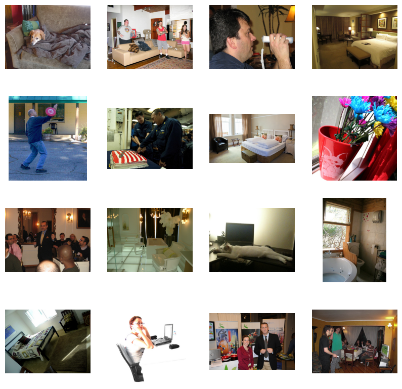
:::
:::

::: {.cell .markdown id="Y0qM6022XXrd"}
Even though we are utilizing the same dataset and the same quantity of
training samples, the specific set of 8,000 images used to train your
model might differ. This variation can occur despite using a seed, as
the dataset in this instance comprises only 20,000 images with a
different order, whereas I originally sampled 10,000 images from the
entire dataset.
:::

::: {.cell .markdown id="gEKkQQ9hXXrd"}
### 1.2- Making Datasets and DataLoaders {#12--making-datasets-and-dataloaders}
:::

::: {.cell .markdown id="CVCz3kl0XXrd"}
I resize the images and apply horizontal flipping (but only for the
training set). Afterward, I load an RGB image, convert it to the Lab
color space, and split it into two parts: the first channel (grayscale)
serves as the input for the models, while the remaining color channels
are used as targets. Following this, I proceed to create the data
loaders.
:::

::: {.cell .code id="2pBGeMEXXXrd"}
``` python
SIZE = 256
class ColorizationDataset(Dataset):
    def __init__(self, paths, split='train'):
        if split == 'train':
            self.transforms = transforms.Compose([
                transforms.Resize((SIZE, SIZE),  Image.BICUBIC),
                transforms.RandomHorizontalFlip(), # A little data augmentation!
            ])
        elif split == 'val':
            self.transforms = transforms.Resize((SIZE, SIZE),  Image.BICUBIC)

        self.split = split
        self.size = SIZE
        self.paths = paths

    def __getitem__(self, idx):
        img = Image.open(self.paths[idx]).convert("RGB")
        img = self.transforms(img)
        img = np.array(img)
        img_lab = rgb2lab(img).astype("float32") # Converting RGB to L*a*b
        img_lab = transforms.ToTensor()(img_lab)
        L = img_lab[[0], ...] / 50. - 1. # Between -1 and 1
        ab = img_lab[[1, 2], ...] / 110. # Between -1 and 1

        return {'L': L, 'ab': ab}

    def __len__(self):
        return len(self.paths)

def make_dataloaders(batch_size=16, n_workers=4, pin_memory=True, **kwargs): # A handy function to make our dataloaders
    dataset = ColorizationDataset(**kwargs)
    dataloader = DataLoader(dataset, batch_size=batch_size, num_workers=n_workers,
                            pin_memory=pin_memory)
    return dataloader
```
:::

::: {.cell .code colab="{\"base_uri\":\"https://localhost:8080/\"}" id="60jt91usXXre" outputId="565347d0-89c0-4590-d940-ca841d74ee6b"}
``` python
train_dl = make_dataloaders(paths=train_paths, split='train')
val_dl = make_dataloaders(paths=val_paths, split='val')

data = next(iter(train_dl))
Ls, abs_ = data['L'], data['ab']
print(Ls.shape, abs_.shape)
print(len(train_dl), len(val_dl))
```

::: {.output .stream .stdout}
    torch.Size([16, 1, 256, 256]) torch.Size([16, 2, 256, 256])
    500 125
:::
:::

::: {.cell .markdown id="WWqsP3pGXXre"}
### 1.3- Generator proposed by the paper {#13--generator-proposed-by-the-paper}
:::

::: {.cell .markdown id="Kn1mZx8SXXre"}
The code being discussed is designed to create a U-Net, which functions
as the generator in a Generative Adversarial Network (GAN). While the
specifics of the code are beyond the current discussion, it\'s essential
to grasp that the construction of the U-Net starts from its central
part, located at the bottom of the U shape. As the process progresses,
down-sampling and up-sampling modules are systematically added to the
left and right sides, respectively. This addition continues in each
iteration, extending from the middle module outwards until the input and
output modules are incorporated.
:::

::: {.cell .code id="q6gwKZcTXXrf"}
``` python
class UnetBlock(nn.Module):
    def __init__(self, nf, ni, submodule=None, input_c=None, dropout=False,
                 innermost=False, outermost=False):
        super().__init__()
        self.outermost = outermost
        if input_c is None: input_c = nf
        downconv = nn.Conv2d(input_c, ni, kernel_size=4,
                             stride=2, padding=1, bias=False)
        downrelu = nn.LeakyReLU(0.2, True)
        downnorm = nn.BatchNorm2d(ni)
        uprelu = nn.ReLU(True)
        upnorm = nn.BatchNorm2d(nf)

        if outermost:
            upconv = nn.ConvTranspose2d(ni * 2, nf, kernel_size=4,
                                        stride=2, padding=1)
            down = [downconv]
            up = [uprelu, upconv, nn.Tanh()]
            model = down + [submodule] + up
        elif innermost:
            upconv = nn.ConvTranspose2d(ni, nf, kernel_size=4,
                                        stride=2, padding=1, bias=False)
            down = [downrelu, downconv]
            up = [uprelu, upconv, upnorm]
            model = down + up
        else:
            upconv = nn.ConvTranspose2d(ni * 2, nf, kernel_size=4,
                                        stride=2, padding=1, bias=False)
            down = [downrelu, downconv, downnorm]
            up = [uprelu, upconv, upnorm]
            if dropout: up += [nn.Dropout(0.5)]
            model = down + [submodule] + up
        self.model = nn.Sequential(*model)

    def forward(self, x):
        if self.outermost:
            return self.model(x)
        else:
            return torch.cat([x, self.model(x)], 1)

class Unet(nn.Module):
    def __init__(self, input_c=1, output_c=2, n_down=8, num_filters=64):
        super().__init__()
        unet_block = UnetBlock(num_filters * 8, num_filters * 8, innermost=True)
        for _ in range(n_down - 5):
            unet_block = UnetBlock(num_filters * 8, num_filters * 8, submodule=unet_block, dropout=True)
        out_filters = num_filters * 8
        for _ in range(3):
            unet_block = UnetBlock(out_filters // 2, out_filters, submodule=unet_block)
            out_filters //= 2
        self.model = UnetBlock(output_c, out_filters, input_c=input_c, submodule=unet_block, outermost=True)

    def forward(self, x):
        return self.model(x)
```
:::

::: {.cell .markdown id="wFsUKKFgXXrf"}
### 1.4- Discriminator {#14--discriminator}
:::

::: {.cell .markdown id="ZiazC_GDXXrg"}
The structure of the discriminator in this context is relatively
uncomplicated. The code constructs a model by sequentially layering
units comprising Convolution (Conv), Batch Normalization (BatchNorm),
and Leaky Rectified Linear Unit (LeakyReLU). These blocks work in tandem
to evaluate if an input image is authentic or fabricated. It\'s
important to note that the first and final blocks diverge from this
pattern; the initial block does not incorporate normalization, and the
final block lacks an activation function. Instead, the activation
functionality for the last block is integrated into the loss function
that will be utilized.
:::

::: {.cell .code id="8cM9lbBIXXrg"}
``` python
class PatchDiscriminator(nn.Module):
    def __init__(self, input_c, num_filters=64, n_down=3):
        super().__init__()
        model = [self.get_layers(input_c, num_filters, norm=False)]
        model += [self.get_layers(num_filters * 2 ** i, num_filters * 2 ** (i + 1), s=1 if i == (n_down-1) else 2)
                          for i in range(n_down)] # the 'if' statement is taking care of not using
                                                  # stride of 2 for the last block in this loop
        model += [self.get_layers(num_filters * 2 ** n_down, 1, s=1, norm=False, act=False)] # Make sure to not use normalization or
                                                                                             # activation for the last layer of the model
        self.model = nn.Sequential(*model)

    def get_layers(self, ni, nf, k=4, s=2, p=1, norm=True, act=True): # when needing to make some repeatitive blocks of layers,
        layers = [nn.Conv2d(ni, nf, k, s, p, bias=not norm)]          # it's always helpful to make a separate method for that purpose
        if norm: layers += [nn.BatchNorm2d(nf)]
        if act: layers += [nn.LeakyReLU(0.2, True)]
        return nn.Sequential(*layers)

    def forward(self, x):
        return self.model(x)
```
:::

::: {.cell .markdown id="PcVfQpLpXXrg"}
Let\'s examine the components of its structure:
:::

::: {.cell .code colab="{\"base_uri\":\"https://localhost:8080/\"}" id="A3D4MVGUXXrh" outputId="a60cd1d6-15b8-45d5-ff90-7468e95be277"}
``` python
PatchDiscriminator(3)
```

::: {.output .execute_result execution_count="12"}
    PatchDiscriminator(
      (model): Sequential(
        (0): Sequential(
          (0): Conv2d(3, 64, kernel_size=(4, 4), stride=(2, 2), padding=(1, 1))
          (1): LeakyReLU(negative_slope=0.2, inplace=True)
        )
        (1): Sequential(
          (0): Conv2d(64, 128, kernel_size=(4, 4), stride=(2, 2), padding=(1, 1), bias=False)
          (1): BatchNorm2d(128, eps=1e-05, momentum=0.1, affine=True, track_running_stats=True)
          (2): LeakyReLU(negative_slope=0.2, inplace=True)
        )
        (2): Sequential(
          (0): Conv2d(128, 256, kernel_size=(4, 4), stride=(2, 2), padding=(1, 1), bias=False)
          (1): BatchNorm2d(256, eps=1e-05, momentum=0.1, affine=True, track_running_stats=True)
          (2): LeakyReLU(negative_slope=0.2, inplace=True)
        )
        (3): Sequential(
          (0): Conv2d(256, 512, kernel_size=(4, 4), stride=(1, 1), padding=(1, 1), bias=False)
          (1): BatchNorm2d(512, eps=1e-05, momentum=0.1, affine=True, track_running_stats=True)
          (2): LeakyReLU(negative_slope=0.2, inplace=True)
        )
        (4): Sequential(
          (0): Conv2d(512, 1, kernel_size=(4, 4), stride=(1, 1), padding=(1, 1))
        )
      )
    )
:::
:::

::: {.cell .markdown id="31JkUO2jXXrh"}
And its output shape:
:::

::: {.cell .code colab="{\"base_uri\":\"https://localhost:8080/\"}" id="tHpcLtRCXXri" outputId="788dc1b4-2980-48bd-c9ef-5873f9875cb5"}
``` python
discriminator = PatchDiscriminator(3)
dummy_input = torch.randn(16, 3, 256, 256) # batch_size, channels, size, size
out = discriminator(dummy_input)
out.shape
```

::: {.output .execute_result execution_count="13"}
    torch.Size([16, 1, 30, 30])
:::
:::

::: {.cell .markdown id="GbgEoJvEXXri"}
The model uses a \"Patch\" Discriminator, which differs from a standard
discriminator. Instead of outputting a single value for the entire
image, it evaluates individual 70x70 pixel patches of the image,
determining the authenticity of each patch separately. This approach is
more effective for tasks like colorization, where local details are
crucial. The model\'s output shape is 30x30, but this does not mean the
patches are 30x30 pixels. Instead, the actual patch size is 70x70
pixels, determined by the receptive field of each of the 900 (30 times
30) outputs. This method allows for a more nuanced assessment of the
image\'s authenticity at a granular level.
:::

::: {.cell .markdown id="YFAdYCmLXXri"}
### 1.5- GAN Loss {#15--gan-loss}
:::

::: {.cell .markdown id="7Azkv000XXri"}
This class is a useful tool for computing the GAN loss of our ultimate
model. Within the `__init__` method, we select the type of loss to
utilize (which, for our project, will be \"vanilla\") and establish
constant tensors to represent the \"real\" and \"fake\" labels. Upon
invoking this module, it generates a tensor filled with either zeros or
ones, based on the current requirement, and then proceeds to calculate
the loss.
:::

::: {.cell .code id="IA4YgBuNXXri"}
``` python
class GANLoss(nn.Module):
    def __init__(self, gan_mode='vanilla', real_label=1.0, fake_label=0.0):
        super().__init__()
        self.register_buffer('real_label', torch.tensor(real_label))
        self.register_buffer('fake_label', torch.tensor(fake_label))
        if gan_mode == 'vanilla':
            self.loss = nn.BCEWithLogitsLoss()
        elif gan_mode == 'lsgan':
            self.loss = nn.MSELoss()

    def get_labels(self, preds, target_is_real):
        if target_is_real:
            labels = self.real_label
        else:
            labels = self.fake_label
        return labels.expand_as(preds)

    def __call__(self, preds, target_is_real):
        labels = self.get_labels(preds, target_is_real)
        loss = self.loss(preds, labels)
        return loss
```
:::

::: {.cell .markdown id="nTJ5xBWlXXrj"}
### 1.x Model Initialization {#1x-model-initialization}
:::

::: {.cell .markdown id="Hd2hXJiyXXrj"}
We are going to initialize the weights of our model with a mean of 0.0
and standard deviation of 0.02 which are the proposed hyperparameters in
the article:
:::

::: {.cell .code id="5a1UPn0fXXrj"}
``` python
def init_weights(net, init='norm', gain=0.02):

    def init_func(m):
        classname = m.__class__.__name__
        if hasattr(m, 'weight') and 'Conv' in classname:
            if init == 'norm':
                nn.init.normal_(m.weight.data, mean=0.0, std=gain)
            elif init == 'xavier':
                nn.init.xavier_normal_(m.weight.data, gain=gain)
            elif init == 'kaiming':
                nn.init.kaiming_normal_(m.weight.data, a=0, mode='fan_in')

            if hasattr(m, 'bias') and m.bias is not None:
                nn.init.constant_(m.bias.data, 0.0)
        elif 'BatchNorm2d' in classname:
            nn.init.normal_(m.weight.data, 1., gain)
            nn.init.constant_(m.bias.data, 0.)

    net.apply(init_func)
    print(f"model initialized with {init} initialization")
    return net

def init_model(model, device):
    model = model.to(device)
    model = init_weights(model)
    return model
```
:::

::: {.cell .markdown id="C7zXzdzyXXrj"}
### 1.6- Putting everything together {#16--putting-everything-together}
:::

::: {.cell .markdown id="Vn9H9kEjXXrj"}
This class consolidates all the previously developed segments and
introduces several methods for the effective training of our full model.
Let\'s delve into its structure and functionality.

During the initialization phase (**init**), the generator and
discriminator are established using the functions and classes defined
earlier. They are also initialized through the `init_model` function,
which is not elaborated here but can be understood in detail from my
GitHub repository. Additionally, two loss functions and the optimizers
for both the generator and discriminator are set up.

The principal operation occurs in the class\'s `optimize` method. Here,
at each iteration (or batch of the training set), the module\'s forward
method is called exactly once, and the results are stored in the
`fake_color` variable of the class.

The training begins with the discriminator, using the `backward_D`
method. In this step, fake images generated by the generator are fed to
the discriminator (ensuring detachment from the generator\'s graph to
act as constants) and labeled as fake. Subsequently, a batch of real
images from the training set is fed to the discriminator and labeled as
real. Both losses for fake and real images are combined, averaged, and
then processed through the backward function to calculate the final
loss.

Training the generator follows. In the `backward_G` method, the
discriminator is presented with the fake image, attempting to deceive it
by labeling these images as real to calculate the adversarial loss.
Additionally, we employ L1 loss to measure the difference between the
predicted and target channels, multiplied by a coefficient (100 in this
case) to balance both losses. This total loss is then added to the
adversarial loss, followed by calling the backward method on this
cumulative loss.
:::

::: {.cell .code id="WwgoTX69XXrj"}
``` python
class MainModel(nn.Module):
    def __init__(self, net_G=None, lr_G=2e-4, lr_D=2e-4,
                 beta1=0.5, beta2=0.999, lambda_L1=100.):
        super().__init__()

        self.device = torch.device("cuda" if torch.cuda.is_available() else "cpu")
        self.lambda_L1 = lambda_L1

        if net_G is None:
            self.net_G = init_model(Unet(input_c=1, output_c=2, n_down=8, num_filters=64), self.device)
        else:
            self.net_G = net_G.to(self.device)
        self.net_D = init_model(PatchDiscriminator(input_c=3, n_down=3, num_filters=64), self.device)
        self.GANcriterion = GANLoss(gan_mode='vanilla').to(self.device)
        self.L1criterion = nn.L1Loss()
        self.opt_G = optim.Adam(self.net_G.parameters(), lr=lr_G, betas=(beta1, beta2))
        self.opt_D = optim.Adam(self.net_D.parameters(), lr=lr_D, betas=(beta1, beta2))

    def set_requires_grad(self, model, requires_grad=True):
        for p in model.parameters():
            p.requires_grad = requires_grad

    def setup_input(self, data):
        self.L = data['L'].to(self.device)
        self.ab = data['ab'].to(self.device)

    def forward(self):
        self.fake_color = self.net_G(self.L)

    def backward_D(self):
        fake_image = torch.cat([self.L, self.fake_color], dim=1)
        fake_preds = self.net_D(fake_image.detach())
        self.loss_D_fake = self.GANcriterion(fake_preds, False)
        real_image = torch.cat([self.L, self.ab], dim=1)
        real_preds = self.net_D(real_image)
        self.loss_D_real = self.GANcriterion(real_preds, True)
        self.loss_D = (self.loss_D_fake + self.loss_D_real) * 0.5
        self.loss_D.backward()

    def backward_G(self):
        fake_image = torch.cat([self.L, self.fake_color], dim=1)
        fake_preds = self.net_D(fake_image)
        self.loss_G_GAN = self.GANcriterion(fake_preds, True)
        self.loss_G_L1 = self.L1criterion(self.fake_color, self.ab) * self.lambda_L1
        self.loss_G = self.loss_G_GAN + self.loss_G_L1
        self.loss_G.backward()

    def optimize(self):
        self.forward()
        self.net_D.train()
        self.set_requires_grad(self.net_D, True)
        self.opt_D.zero_grad()
        self.backward_D()
        self.opt_D.step()

        self.net_G.train()
        self.set_requires_grad(self.net_D, False)
        self.opt_G.zero_grad()
        self.backward_G()
        self.opt_G.step()
```
:::

::: {.cell .markdown id="sPlBRZFgXXrk"}
### 1.xx Utility functions {#1xx-utility-functions}
:::

::: {.cell .markdown id="Ku8l-MHQXXrk"}
The functions mentioned here were not covered in the TDS article\'s
explanations. They serve as utility functions, primarily for recording
the network\'s losses and for visualizing the results throughout the
training process. You can explore these functions in detail here:
:::

::: {.cell .code id="iyuF1jz1XXrk"}
``` python
class AverageMeter:
    def __init__(self):
        self.reset()

    def reset(self):
        self.count, self.avg, self.sum = [0.] * 3

    def update(self, val, count=1):
        self.count += count
        self.sum += count * val
        self.avg = self.sum / self.count

def create_loss_meters():
    loss_D_fake = AverageMeter()
    loss_D_real = AverageMeter()
    loss_D = AverageMeter()
    loss_G_GAN = AverageMeter()
    loss_G_L1 = AverageMeter()
    loss_G = AverageMeter()

    return {'loss_D_fake': loss_D_fake,
            'loss_D_real': loss_D_real,
            'loss_D': loss_D,
            'loss_G_GAN': loss_G_GAN,
            'loss_G_L1': loss_G_L1,
            'loss_G': loss_G}

def update_losses(model, loss_meter_dict, count):
    for loss_name, loss_meter in loss_meter_dict.items():
        loss = getattr(model, loss_name)
        loss_meter.update(loss.item(), count=count)

def lab_to_rgb(L, ab):
    """
    Takes a batch of images
    """

    L = (L + 1.) * 50.
    ab = ab * 110.
    Lab = torch.cat([L, ab], dim=1).permute(0, 2, 3, 1).cpu().numpy()
    rgb_imgs = []
    for img in Lab:
        img_rgb = lab2rgb(img)
        rgb_imgs.append(img_rgb)
    return np.stack(rgb_imgs, axis=0)

def visualize(model, data, save=True):
    model.net_G.eval()
    with torch.no_grad():
        model.setup_input(data)
        model.forward()
    model.net_G.train()
    fake_color = model.fake_color.detach()
    real_color = model.ab
    L = model.L
    fake_imgs = lab_to_rgb(L, fake_color)
    real_imgs = lab_to_rgb(L, real_color)
    fig = plt.figure(figsize=(15, 8))
    for i in range(5):
        ax = plt.subplot(3, 5, i + 1)
        ax.imshow(L[i][0].cpu(), cmap='gray')
        ax.axis("off")
        ax = plt.subplot(3, 5, i + 1 + 5)
        ax.imshow(fake_imgs[i])
        ax.axis("off")
        ax = plt.subplot(3, 5, i + 1 + 10)
        ax.imshow(real_imgs[i])
        ax.axis("off")
    plt.show()
    if save:
        fig.savefig(f"colorization_{time.time()}.png")

def log_results(loss_meter_dict):
    for loss_name, loss_meter in loss_meter_dict.items():
        print(f"{loss_name}: {loss_meter.avg:.5f}")
```
:::

::: {.cell .markdown id="qReAUN4fXXrk"}
### 1.7- Training function {#17--training-function}
:::

::: {.cell .code id="OIBdRJmqXXrk"}
``` python
def train_model(model, train_dl, epochs, display_every=200):
    data = next(iter(val_dl)) # getting a batch for visualizing the model output after fixed intrvals
    for e in range(epochs):
        loss_meter_dict = create_loss_meters() # function returing a dictionary of objects to
        i = 0                                  # log the losses of the complete network
        for data in tqdm(train_dl):
            model.setup_input(data)
            model.optimize()
            update_losses(model, loss_meter_dict, count=data['L'].size(0)) # function updating the log objects
            i += 1
            if i % display_every == 0:
                print(f"\nEpoch {e+1}/{epochs}")
                print(f"Iteration {i}/{len(train_dl)}")
                log_results(loss_meter_dict) # function to print out the losses
                visualize(model, data, save=False) # function displaying the model's outputs

#model = MainModel()
#train_model(model, train_dl, 1)
```
:::

::: {.cell .markdown id="ZXzB4GgAXXrl"}
## 2- A new strategy - the final model {#2--a-new-strategy---the-final-model}
:::

::: {.cell .markdown id="WqTgTVPuXXrl"}
The focus of this article is centered around a specific approach that
was utilized to address a problem previously mentioned. Inspired by a
concept from Super Resolution literature, the generator was pre-trained
separately in a supervised and deterministic way. This method was chosen
to avoid the issue known as \"the blind leading the blind\" in GAN
training, where initially, neither the generator nor the discriminator
possesses adequate knowledge about the task.

Pre-training was conducted in two stages:

1.  **Backbone Pre-training:** The down-sampling path of the generator,
    initially, was pre-trained as a classification model using ImageNet.
2.  **Full Generator Pre-training:** The entire generator was then
    pre-trained for the task of colorization, employing L1 loss.

A pre-trained ResNet18 model was used as the backbone of the U-Net. For
the second stage of pre-training, the U-Net was trained on the training
set exclusively with L1 Loss. Subsequently, training that combined both
adversarial and L1 losses was undertaken, as previously described.
:::

::: {.cell .markdown id="_e1tONw1XXrl"}
### 2.1- Using a new generator {#21--using-a-new-generator}
:::

::: {.cell .markdown id="kTY-Pb-tXXrl"}
The construction of a U-Net with a ResNet backbone is a non-trivial
task. Therefore, the Dynamic U-Net module from the fastai library will
be employed for its simplified assembly.

For the code provided to run without errors, fastai version 2.4 needs to
be installed.
:::

::: {.cell .code id="f10O9ZYNEXjc"}
``` python
#!pip install fastai==2.4
```
:::

::: {.cell .code id="kLwko1-NFBIG"}
``` python
#!pip --version
```
:::

::: {.cell .code id="VaGvVk3fFjg5"}
``` python
#!pip3 list
```
:::

::: {.cell .code id="1TcWKuxtXXrl"}
``` python
from fastai.vision.learner import create_body
from torchvision.models.resnet import resnet18
from fastai.vision.models.unet import DynamicUnet
from fastai.vision import models
import torch
from fastai.vision.data import *
```
:::

::: {.cell .code id="LXmIB6ZWGgbE"}
``` python
#!pip3 install git+https://github.com/fastai/fastai.git
```
:::

::: {.cell .code id="xPH7-6RiXXrl"}
``` python
def build_res_unet(n_input=1, n_output=2, size=256):
    device = torch.device("cuda" if torch.cuda.is_available() else "cpu")
    body = create_body(resnet18(pretrained=True), cut=-2, n_in=n_input)
    net_G = DynamicUnet(body, n_output, (size, size)).to(device)
    return net_G
```
:::

::: {.cell .markdown id="pPtLgoLbXXrl"}
Indeed, with just a few lines of code, one can easily construct a
complex model. The `create_body` function is designed to load the
pre-trained weights of the ResNet18 architecture and modify the model by
removing the final two layers - specifically, the Global Average Pooling
layer and a Linear layer, which are typically used for the ImageNet
classification task. Following this, the `DynamicUnet` is utilized to
construct a U-Net using this backbone. This U-Net is tailored to have
the necessary output channels (two in this instance) and is configured
for an input size of 256.
:::

::: {.cell .markdown id="c6h8r3iWXXrl"}
### 2.2 Pretraining the generator for colorization task {#22-pretraining-the-generator-for-colorization-task}
:::

::: {.cell .code id="qyd4Hh2BXXrl"}
``` python
def pretrain_generator(net_G, train_dl, opt, criterion, epochs):
    for e in range(epochs):
        loss_meter = AverageMeter()
        for data in tqdm(train_dl):
            L, ab = data['L'].to(device), data['ab'].to(device)
            preds = net_G(L)
            loss = criterion(preds, ab)
            opt.zero_grad()
            loss.backward()
            opt.step()

            loss_meter.update(loss.item(), L.size(0))

        print(f"Epoch {e + 1}/{epochs}")
        print(f"L1 Loss: {loss_meter.avg:.5f}")
```
:::

::: {.cell .code colab="{\"base_uri\":\"https://localhost:8080/\",\"height\":1000,\"referenced_widgets\":[\"62977955cba247a1bd1f24d7cea0192f\",\"a783733965c24c5282918d8e903b3365\",\"c0b9414022d740d08424357855a13cf6\",\"c061b438ceeb41e7ab06064da43c4516\",\"9b7c8602d5ac42b6884492b9c445e7cb\",\"6560f3f0233947d8b1e90ad2c92d6626\",\"e4e3115d93de4c52abf6c9183d21144c\",\"6b713d2356614455b8d720122182ebc5\",\"a13fe12828d2481593b673acc0b9d62b\",\"5bc91556caa144f196ca3b82cfef704a\",\"b1557122969e4db392648ba65c1fe386\",\"294353020b0b40d5ad876a9959854fe3\",\"9dec7bd76029410f8165e9b8bf47e45b\",\"671310aeb9394bf6b08f8513e8c68fe9\",\"c7bf9823a3634ae695af9fc61dce3eb7\",\"65c8c2c4b07d45ceb6fc07fec54d4a85\",\"2388015ec5e745b18aa7a1607989966f\",\"66cd5aa2df954d00869d7eac17cb131d\",\"37d065b795604fba8ada0dd080d61939\",\"6c5aeec2599f4d13a8b53b52b07b2aac\",\"c739afd6fd3f4ad982310a15d0d1e337\",\"cff5ca4e722c421ab63f69095b8f4234\",\"199badb3ef944da697254738d3fc5330\",\"3f613fc4c6214ac4b53e52a7780c726b\",\"38c295c8b3414b2b992a22d6c4443054\",\"44503f4009c14439a886b2ff8e25852f\",\"c29c7e7351dd4cd085bc5fa13ff62b8f\",\"7d7a7361a38f4f1595e1f4b49d2ab521\",\"fec25bcee0e14661b9eaa6b762face1a\",\"d38bd062e65148118d0914d391ac0ce6\",\"7a37c7901e1a4468ac3a0464ed73d12b\",\"142177bf5af4458599dbe11e62b47fb0\",\"ce831908b63a41c38f6da3aac0639f8b\",\"55b0604d3260417d92a727d2da6f2693\",\"cf5ac47e146343e2aa25406a5924e305\",\"e403fd08a7be445da339d23c01af97ef\",\"7ca7e7017e1d45c9a75e83304a3b88ec\",\"956603db1a1447bebfddfe9ef7f0acfc\",\"025b3602700145858972137ba3b2fdd0\",\"dfc2ccac3efd4f1dbf67b31513022b11\",\"bcb7a221f3e740719ddb803a26d15dfb\",\"c7f7285bbb254b18ac757128e8968ea7\",\"4eef7ad99e9742a38606d756c92d9d2e\",\"d4da2258c1674472952fd78be4cce382\",\"b756059535404b6687fd53cab49a3708\",\"fc4bce3d6fda404dbc727488534c8d08\",\"2f0fc40b51e1423392c94e96cee58f1d\",\"bbc1b6ad10cc4db9a2b2845656bb4e34\",\"dd6725164ee94274bf38f66bb7fce160\",\"5e74bf26cbaa4ad280ef57920cb2a79f\",\"97b73c439755434ab751e72f4fcbe935\",\"78e7ef2c79d64c3dad8c7d4a49a88d70\",\"afd62faea11a4874aeab5c43edb731f1\",\"b4302904df564656a6863736c40bfc5b\",\"824fcac8c701483cb9a8d2754a91797d\",\"4774c60db5054ca9a58ab252a92928fe\",\"79ec1adf9f2444249ea6ea919146b873\",\"fd1e38d3651341c28e87e90c69e42195\",\"a104ff67c9a445b5a568254d8fad6a6b\",\"d743e0d1e9884d5592a12cb4dfd0cb5f\",\"c043655aede348778f5c09c40738cd69\",\"24a788214a9a4335940439133d7ff2f7\",\"b47cd7e1d3144942ba530d3bb3831054\",\"9206f565ec3b48a399a605c97b94a919\",\"bea6fc0384a440b0a7cfa3935785489b\",\"2568545102d243868c0ca429fb7ccdc8\",\"f5fa6fb3b659476baa82dcb1a7aa3c57\",\"87602d7909734c73b952f05722f1ab3f\",\"3791c20b114c4e10a3051912fc8a06ee\",\"35a7547cfa4a4f49851ce1e37724a37e\",\"9ee6906ea3d54568b91743e9f1c17027\",\"ab76b17cf23b42af9298ce5e0c86d7f1\",\"517bc692f0604f149600776b1d8b52fc\",\"926a3f4f05b34a93af4b58418fe02a7b\",\"d8bea906aa884ad3b1d04dbf70bc0a2a\",\"4f9923626faa4eb19052b31b9fbf60ed\",\"ee71718f98ce4001b745cddbe93c703b\",\"d38b1c56905e415c9d95ebf967877cb6\",\"4a9c8cbaaf524575bd190ec65b0a31cd\",\"924dfe3c435c4dd986152b38c56ff52c\",\"b37d71a40ada47a2965f3939fdfb4139\",\"37c8faa247334edf9ffd004353d6c33b\",\"562b5c6cf21246b784512eb813b090ba\",\"f2d30bcefaa44a6d858a5b3d37b7230f\",\"3e6dcb5f416a45b9bbbb59b9e61a1733\",\"8deafce358b54626a82be1f7e901ce63\",\"f477bc3cdcec41eaacba5b0ced83bf55\",\"90ebd024bdc54e62a23ac502a64ad964\",\"510b03c7a6894727baf736f06166c3be\",\"20da1006ce294701b200d4f976b359fe\",\"c387bb45fb284ccb8b5a9f53bbd19439\",\"f345b899aec34ca89124fb53c2772852\",\"ed7cd086368a4b02a088f17e59cca2ff\",\"e2a6e08befef47d197e452d5829a5041\",\"788b3fdef60b4f90a47ea68ef44d3917\",\"6e9c8ac6e1624328a806f08a0bca03c8\",\"1eb1a528f6754f54be480926de11c098\",\"2ea1ce1cd19f4fd092a93e55665e3e5d\",\"d8312bd7c7a3480db6e93868b246c20b\",\"e856f05272c9492b937659f500fb8998\",\"02c1ffa5d55a42ae9667320fd3e84ac9\",\"f2ffde4332ee4981adad033fdf0f108f\",\"dca2e1bc266643209fdd3d9444a47d57\",\"5bd849aa9f724b1ea4bc53b1ece4769a\",\"b231d684489e41228954a07bd3ce877e\",\"62e3f1eb04c848edb3636e619530b55e\",\"d4d993f03fc54ab0870b70e5f546234d\",\"02b7c534ca344596a35a4fe77edeecb7\",\"009f68d8f00645588ddb12f18b45a15f\",\"9fc7aeff2f00408ba65621f85e8d35dc\",\"faee5a4c004e4a42aba556f56bfe007f\",\"3ff0b98e55ca434b82709b9a2f12872c\",\"ae9438821dd748b6be5e46e30d00acd5\",\"23589e1ecdf4433baf8a2f068392e919\",\"6b66a80b5313432a8c8abe49b546ec90\",\"977fc3dc9fdb44d096f3d5d2cd24bfaf\",\"dec1982d2be140f88c4f370146eea21e\",\"19823ea7122c47e59b3ded8d71896b49\",\"f06a115414d0402390e27794f530cd89\",\"8f8db6b8f5144b20a41c8da651641859\",\"c8f5b816ad2f448e84ee9440d76d949d\",\"9fe73265b500457c9f07bb4b4327d89c\",\"4478e82c993e4c02a0b8d108461891c6\",\"aa05df980bd946a59bbfb3832a832722\",\"93376492841a48d2bbb6cd08175547e7\",\"b21cb5bc27674a8ba111b181b89e0525\",\"36bfd6759e51448e8590ee4e4f727f82\",\"5e81c2a7b983442b82fd06475ab5b7a7\",\"97db431b755e4ff2bc98128e336d3417\",\"95fbed57e7da4e77972278afbd124747\",\"f9057190921242cca0e13736a5d516c4\",\"9701ac197cdf4d20ad1f3c70b5d550aa\",\"04153979b020467089970320da5e8daa\",\"148e1084dcf0422fa73b9933c378c22f\",\"7df1f6139fbf4bc9ba26ccb49fe83bcc\",\"53102c12dbd8419ca774fd9a50129dbb\",\"d779352436a74db19070c6968d58d175\",\"28e9e0d1941c47fb8f20a9d28067eff6\",\"ac2dfb0c292240c49d438cda539bc42e\",\"252a9de00f024d77b2f8b31546480588\",\"9ffbdc6ed36e43f3a765630e252bbc79\",\"5e7b09d83eaa473c9c3a8ae7236af007\",\"7fe734770970460195ba88862b6a2453\",\"c104a5b0639948728d2af72fe076414b\",\"f068354bace84dc28ed43508f8c2ee25\",\"f7b40ae560144525ae72ec96fa531b42\",\"09a6c8edf6e148c58ed5e3e22ac75ce2\",\"1bc84fd431cb43f0b216f0e0fc06335c\",\"b245bc823c3d4deb83fcfc41b4073c80\",\"42f2cd74ace54bc7a3a031d19469966e\",\"a79edcd038af40ffaa93513295bb746f\",\"6e12dc66f32b471a8dfa157cd814de33\",\"8f1b7c3c477241be93b61d4d69c001c5\",\"61ef1780f03341f7aa5c784ae1c80361\",\"68ab4660a06541aba0ea13df6f00a382\",\"9099e6318c72462a99cbc06d610d6cfa\",\"33d9b77a9a714c029331d5c6a8e201d8\",\"07b4f0e8403846cbadd1b3eb965dd8c1\",\"3e0a523bcd7c4562baa4bed741d1ae29\",\"d680a1a043ca4a0eafbb08a8c7fbc96c\",\"8a1f0b1ae70d4c6c910e45440b703b99\",\"1fb04e7044224dff87bd3733013868a9\",\"3fe5872bd34d4ffdbbfe3605fc0b1bc6\",\"34e08780e6dd47a8957d4afe19d1fd33\",\"50090a1fd2e243c587a32b60a08e5dff\",\"f48efbf5fe0f465395d58eaa992302a9\",\"4d3ac21c5f754c1eb8acbe8fa2715aef\",\"0546e9e7b27241d1b2815ee54c11b2d1\",\"ffdb77aabe7646a393a3fed6e56df433\",\"957c564948b740eb947d3cd6df311f94\",\"638e35773dca49bfb31e973222d602cc\",\"d02298936bdf46f1b7532928b5733a76\",\"fb665bfdd44d4236be690768bb293a87\",\"43d1278a98cb4e5a807fd5305f9cfde5\",\"48a48ccc4d60447ca587128ea08beef0\",\"1f01c9e00caf4afd882344b6f114dff7\",\"fbbb314ef59e4f19b883becaf330f19d\",\"cdd28e8087174ec69866f7d2f5c369b9\",\"2dd4b895183c40238fd5e15b8cd66370\",\"a2f73e8d31f849a9b63a34f99158e696\",\"d9808ad0faf148b7a1ff45fdaf6d1240\",\"39d9e7e0ddf344248aa4a6f5c8a909d7\",\"592da5e013714e858ea9b9bfe5d059fa\",\"f7af6443f76a4dcdae12302e06bac829\",\"c031208f6f214b68b7731f8a248c2cb2\",\"994d54dae7d5470b9dbba124b895395d\",\"ef54f9df4f77414b95d4885628a677c8\",\"71a479777ce342ccaf4fdee4fce50d3a\",\"b676f2e4d93e42bd88618d48a6c2ad28\",\"c28bb438369b423ba5ca8e2e03463839\",\"b77ee9be88e1413482619235c86f7c52\",\"e0b3d1ad47c44515bf88cee6b19c2bd0\",\"f5287eaa05484a82990ef5ad14dd7c1a\",\"1555a6b107524df2bf7acfe32a198b4f\",\"a8816d9100de47e99351e03520b26c16\",\"0753e6a787d4465b965759e765aec0fc\",\"d5bec5d475da401c92122e0b43ed3ac8\",\"3f6bc515759442148d10aac1d54e38d7\",\"0a2b2c4eb6aa4b8eb5d4d4da9186ee23\",\"a4953d1be5224476a0c4d2d6b48e0b26\",\"cc8d49c9c73f46a6b04323707a737e50\",\"70774233e8f6417a9717e37c52958f2a\",\"c2115bfc60f14269ba4fc86c29f752b2\",\"6a13a66804f14f60ac2a5f56a8b9dc48\",\"b2ac429b3290494b9510963431f41605\",\"fc5b65b3d6ff41ab8fca99a6e323886c\",\"8663db83b4ca4768a83e6b4de0aeb0d1\",\"ebb47b02a90640aba48bd7691a9f0cc7\",\"7febcf42ac5d45c9a8de1a8050acb31c\",\"f805173ef2744c399693ddc114d4bb91\",\"57b88eb7221d412182d288eaa3f2e26d\",\"1baa148677bc4ae19ee86003b650cc11\",\"79d9ec74408540a4afd200e847583fe0\",\"49e11395db824b09a59426a75c386340\",\"1be9dc64f65642009b09024ce6cb4d69\",\"0c839724d3864cbb8d0cbc3c6221e6d9\",\"5310e72e1df74619a87bf279071903e2\",\"7bc831af6fe1424dbe5ad67e408ce16f\",\"55c78e1791af4537936fec2d9a44b010\",\"8a74940591e14f7eb64855d9c0d79c43\",\"ebd6a7d4c33e4f24ae5b96df4717dc1f\",\"35dbb3c6bfd349428f8454bfce8e3507\",\"27e784a3b73d4f4196ec79549999ecc3\",\"4f1af20d175f473d8cf02e78e8e4ee6d\",\"fc6b70dbc409458eb324e0a049992172\",\"4697a8174d5f4bd9b4e2cd91fb55b909\",\"84a00ef1559e42688262ee54bb87cd59\",\"0d44e6d9178d48f18d1ea4705e559202\",\"a99b2ddc7dc74b2db7d5af0aea6551d6\",\"13cd3eafb1d14e0dadb8ac6b54c37ddf\",\"9830a90eb0f744a1b280de1b3838ae07\",\"7103aaba83204b1f8d55b4b291e7a219\",\"ded9835bf9f14f788cbac71c44cccb88\",\"765ab32688934b5b86c82abc8d4ad1db\",\"423b3ac9acb843fa970af08d5a33fd0e\",\"227b96e637b847f6ad9c9b97ba7642cd\",\"c40c7305a1f84e2ea9aac195ad275eba\",\"a9a5ee46c9c043d79e2a52f80953b499\",\"c67a34f10b1f4a588fbcdab067c8cd49\",\"023b15aa464e41e68e7ef661b1678122\",\"da2750a8a0014feea664c92c18879444\",\"b5c24052329049eaaa8bc5803c4b7406\",\"955135dd0a1e4c0f9eb5b18f4e4bd906\",\"da6b9ae560bf49adb37c5f84ec5155d7\",\"15fc82ee65bf4e24b8e687414d203828\",\"4fbd3eb9faa942408ee2108d1f0178ac\",\"bea1df7a81e047c589fc6c13ded10875\",\"a90b89347af449ffa652bc409a8bd056\",\"61557153463349b3ad7c0f8c91f29554\",\"d9ecb3d85b0e4d92aa3129bb24241f8c\",\"33ef0cb331ea4d309de5ccccab790ef9\",\"a03c452ae61a42a7bd2f21fd5384957b\",\"347ae6184cd74bed89936f2e26b56670\",\"79f9002ceb634a2b8d38678e33c647ab\",\"1fda8275fcd24b73a740867ef5136754\",\"816692da2ba849e9884f1eea09c28029\",\"06f40181d59442698a7412be44b2d228\",\"0abe75bcabcf43cfb349e38613ee81fc\",\"7ee582c28da64dcfbb0a147ecee1985d\",\"d764aa75e66c4a37a3e9a50dd523ae26\",\"3ff5a0c62ac44ffeb6a6e511161e1cf0\",\"923f5c56f70e46eb835b925e6aed85be\",\"95ed243c77e94623b9556ef40c229ca5\",\"0e28932ffb66474ba6de4230ee494682\",\"22c72f3b90f74f20858980ea01f7ad6c\",\"c8dca229e99b4b808b7f05f8d786cfd6\",\"1108602957f6489f8fa6116802c45b96\",\"48fb99a3dc3645239631a858c8d8c916\",\"77714a79b86c49b8b13442dd1d458d8f\",\"13343061b9e6489da15ba27ffea3f3a7\",\"9d4f59d6acf94a19b796a06245f57d58\",\"5f78ec0f056c4e7694925fe8eda3556c\",\"71387bf760834f96bb57f2c9c2285529\",\"1a24d45c21d84f198ab63b5320cf1a4f\",\"312fc53e204c43f3ae92944f8f82c10f\"]}" id="_ggsOpz8EDwP" outputId="8a186d8a-a62e-4c01-fb01-dc53fa433b1c"}
``` python
net_G = build_res_unet(n_input=1, n_output=2, size=256)
opt = optim.Adam(net_G.parameters(), lr=1e-4)
criterion = nn.L1Loss()
pretrain_generator(net_G, train_dl, opt, criterion, 25) # epoch number
torch.save(net_G.state_dict(), "res18-unet2.pt")
```

::: {.output .display_data}
``` json
{"model_id":"62977955cba247a1bd1f24d7cea0192f","version_major":2,"version_minor":0}
```
:::

::: {.output .stream .stdout}
    Epoch 1/25
    L1 Loss: 0.08663
:::

::: {.output .display_data}
``` json
{"model_id":"294353020b0b40d5ad876a9959854fe3","version_major":2,"version_minor":0}
```
:::

::: {.output .stream .stdout}
    Epoch 2/25
    L1 Loss: 0.08315
:::

::: {.output .display_data}
``` json
{"model_id":"199badb3ef944da697254738d3fc5330","version_major":2,"version_minor":0}
```
:::

::: {.output .stream .stdout}
    Epoch 3/25
    L1 Loss: 0.08253
:::

::: {.output .display_data}
``` json
{"model_id":"55b0604d3260417d92a727d2da6f2693","version_major":2,"version_minor":0}
```
:::

::: {.output .stream .stdout}
    Epoch 4/25
    L1 Loss: 0.08205
:::

::: {.output .display_data}
``` json
{"model_id":"b756059535404b6687fd53cab49a3708","version_major":2,"version_minor":0}
```
:::

::: {.output .stream .stdout}
    Epoch 5/25
    L1 Loss: 0.08167
:::

::: {.output .display_data}
``` json
{"model_id":"4774c60db5054ca9a58ab252a92928fe","version_major":2,"version_minor":0}
```
:::

::: {.output .stream .stdout}
    Epoch 6/25
    L1 Loss: 0.08127
:::

::: {.output .display_data}
``` json
{"model_id":"f5fa6fb3b659476baa82dcb1a7aa3c57","version_major":2,"version_minor":0}
```
:::

::: {.output .stream .stdout}
    Epoch 7/25
    L1 Loss: 0.08091
:::

::: {.output .display_data}
``` json
{"model_id":"d38b1c56905e415c9d95ebf967877cb6","version_major":2,"version_minor":0}
```
:::

::: {.output .stream .stdout}
    Epoch 8/25
    L1 Loss: 0.08051
:::

::: {.output .display_data}
``` json
{"model_id":"510b03c7a6894727baf736f06166c3be","version_major":2,"version_minor":0}
```
:::

::: {.output .stream .stdout}
    Epoch 9/25
    L1 Loss: 0.07998
:::

::: {.output .display_data}
``` json
{"model_id":"e856f05272c9492b937659f500fb8998","version_major":2,"version_minor":0}
```
:::

::: {.output .stream .stdout}
    Epoch 10/25
    L1 Loss: 0.07947
:::

::: {.output .display_data}
``` json
{"model_id":"faee5a4c004e4a42aba556f56bfe007f","version_major":2,"version_minor":0}
```
:::

::: {.output .stream .stdout}
    Epoch 11/25
    L1 Loss: 0.07872
:::

::: {.output .display_data}
``` json
{"model_id":"9fe73265b500457c9f07bb4b4327d89c","version_major":2,"version_minor":0}
```
:::

::: {.output .stream .stdout}
    Epoch 12/25
    L1 Loss: 0.07818
:::

::: {.output .display_data}
``` json
{"model_id":"04153979b020467089970320da5e8daa","version_major":2,"version_minor":0}
```
:::

::: {.output .stream .stdout}
    Epoch 13/25
    L1 Loss: 0.07712
:::

::: {.output .display_data}
``` json
{"model_id":"c104a5b0639948728d2af72fe076414b","version_major":2,"version_minor":0}
```
:::

::: {.output .stream .stdout}
    Epoch 14/25
    L1 Loss: 0.07611
:::

::: {.output .display_data}
``` json
{"model_id":"68ab4660a06541aba0ea13df6f00a382","version_major":2,"version_minor":0}
```
:::

::: {.output .stream .stdout}
    Epoch 15/25
    L1 Loss: 0.07551
:::

::: {.output .display_data}
``` json
{"model_id":"f48efbf5fe0f465395d58eaa992302a9","version_major":2,"version_minor":0}
```
:::

::: {.output .stream .stdout}
    Epoch 16/25
    L1 Loss: 0.07442
:::

::: {.output .display_data}
``` json
{"model_id":"fbbb314ef59e4f19b883becaf330f19d","version_major":2,"version_minor":0}
```
:::

::: {.output .stream .stdout}
    Epoch 17/25
    L1 Loss: 0.07347
:::

::: {.output .display_data}
``` json
{"model_id":"71a479777ce342ccaf4fdee4fce50d3a","version_major":2,"version_minor":0}
```
:::

::: {.output .stream .stdout}
    Epoch 18/25
    L1 Loss: 0.07276
:::

::: {.output .display_data}
``` json
{"model_id":"0a2b2c4eb6aa4b8eb5d4d4da9186ee23","version_major":2,"version_minor":0}
```
:::

::: {.output .stream .stdout}
    Epoch 19/25
    L1 Loss: 0.07177
:::

::: {.output .display_data}
``` json
{"model_id":"f805173ef2744c399693ddc114d4bb91","version_major":2,"version_minor":0}
```
:::

::: {.output .stream .stdout}
    Epoch 20/25
    L1 Loss: 0.07113
:::

::: {.output .display_data}
``` json
{"model_id":"ebd6a7d4c33e4f24ae5b96df4717dc1f","version_major":2,"version_minor":0}
```
:::

::: {.output .stream .stdout}
    Epoch 21/25
    L1 Loss: 0.07046
:::

::: {.output .display_data}
``` json
{"model_id":"7103aaba83204b1f8d55b4b291e7a219","version_major":2,"version_minor":0}
```
:::

::: {.output .stream .stdout}
    Epoch 22/25
    L1 Loss: 0.06996
:::

::: {.output .display_data}
``` json
{"model_id":"955135dd0a1e4c0f9eb5b18f4e4bd906","version_major":2,"version_minor":0}
```
:::

::: {.output .stream .stdout}
    Epoch 23/25
    L1 Loss: 0.06930
:::

::: {.output .display_data}
``` json
{"model_id":"79f9002ceb634a2b8d38678e33c647ab","version_major":2,"version_minor":0}
```
:::

::: {.output .stream .stdout}
    Epoch 24/25
    L1 Loss: 0.06876
:::

::: {.output .display_data}
``` json
{"model_id":"22c72f3b90f74f20858980ea01f7ad6c","version_major":2,"version_minor":0}
```
:::

::: {.output .stream .stdout}
    Epoch 25/25
    L1 Loss: 0.06825
:::
:::

::: {.cell .markdown id="36oJ4PkxXXrm"}
This straightforward function enables the pretraining of the generator
for 25 epochs, after which its weights are saved. This process is
expected to take approximately an hour when using Colab. In the
subsequent section, this pretrained model will be employed as the
generator for our GAN, and the entire network will be trained as
described previously:
:::

::: {.cell .markdown id="-7l8qZd5XXrm"}
### 2.3 Putting everything together, again! {#23-putting-everything-together-again}
:::

::: {.cell .code colab="{\"base_uri\":\"https://localhost:8080/\",\"height\":1000,\"referenced_widgets\":[\"03b59d09a17c4a0d8b8a2cda26c5ccff\",\"c998b7a20bee4caebdf84898336112a3\",\"1c40428c45124864afc78f2791e99610\",\"e09c5f9a769e41b5b59dbc74c2980c1d\",\"6e71ca33782d435fa8932b406e7e60c3\",\"b79e8e7feaeb4a8db1004cc33eeda48d\",\"d45f5de36ffa4c21a925026897632278\",\"da8dde5b515f46ea886c2b1df03102e1\",\"905ea6461143426b8b712dab022c320a\",\"c3f026768f8f4ac987df4ed10e696e42\",\"f40f2c0b38344e06a5f52256c0449ec9\",\"cf2175848ca1402cb1530418a2d6e8b5\",\"1757a5ce339a4d8aaa042fdb8b7c9e4d\",\"df3ac99962df47ccadd2c25c0833f198\",\"9fe2862e304146c4bfd014ba9310c1bb\",\"008b864daeb14c9393a6a3b14d4e56af\",\"5f7e108f9d9b4928bd24d41ec6b6ceb3\",\"78559e60990c4fe3bf9262a45e213745\",\"6fa2c0ee2858415999d5d89c2415e87c\",\"aff9d30da8d1483485101dbaea18993c\",\"d650098170a74dcf84087afb30016642\",\"1f096c624aef42a0a0be77306d538d1f\",\"9047f4facf874e0283bec47743986b03\",\"21e6a87a17be48e39b46589de5981fb2\",\"d63ed0933259400d80d8b24a3fb65e67\",\"85d065ace42b49cc9ebaf16351eba1bd\",\"20c03ee0a17e4749a7d548a90ca4b98c\",\"7537a7f33042462494f2b653ae0856b3\",\"b61938c009344f92994ac77e977be0bc\",\"c3bd4d45a5c142eead7e20437903752b\",\"294c570e26c0490ba399cf0739edc6ba\",\"26737ce318e549a1aaa2d37824e2d5c4\",\"3875531efe3944d0aacef15fc70eb9a8\",\"13617b2106fa4a5fb7c5183a575909ae\",\"f5f536e6eb66409eb86b266ae404b563\",\"d527ba8ae8ba4de6842306b449e0be79\",\"e53a471387a64ec894568805f41bbbef\",\"18a8a87684bb4e29876e23805bdcae08\",\"cbe82e1c435046d5870ce420de2684e5\",\"7c25ce848658442282539669de389d5a\",\"49297fd74d554d43b924aa517695d5ce\",\"416fd463142249ec867ca834e0eceaeb\",\"2cb856cc193647989653fe193f8c9406\",\"1a13d023ac344120897ecbf3df2d2d55\",\"345eadc454a84a88b0eb79fc314454a4\",\"347c6616d2d843a9bedc81f34250f6ef\",\"deed473d9a68496ca928b16dd6648b35\",\"9e32a883afe241fc98cfd4576b4b6940\",\"3be514c2167a4ae1bdd7adf8cd407eeb\",\"b6534f28030840848356f69890f5abc7\",\"5c3086a720ef46159d1baa8bc508dde9\",\"3f04607a602d467bba642e178e5a3781\",\"efd6e3c6877d4173808352c2be569841\",\"fb6c66addf7d46f883ab1fc7032f2782\",\"a351aca99fba4eec9796da5c75ec7d87\",\"6c2f334f361b4b409c9aac74abdeaa31\",\"fae546d55dd84bfc9ee27d1c94f1895b\",\"584bd2be47d14e439141d0a98623000c\",\"e85a66fa4f24483ba497dad17ab93619\",\"ab0cffaf942f4ac1b479a99b0f6b7d66\",\"a422fd23544f408cbc4aed73ae162f03\",\"06e0fea4e4ae4e5d82d672b77f20b238\",\"06d462dd3dbb4d7d8ee6be9e3141d15f\",\"38142ec1f18b4784933af2893ccb41e1\",\"b941a1b55cd7469380aee0a98ec3cdc9\",\"2a730403968f4d7fa113f02d2b143010\",\"f347f7fff21f47bda4b2c37430b11071\",\"b4e16681655b4d1aa3cd4dc68c87e5ac\",\"d1bb1b2d0a9f41e0914d30137c51629f\",\"cde7179e307d4117b5f6b7e862e69f28\",\"e2910ebc74e04961913c30457c2065ac\",\"abe05321fa1741968dc14b6b1413abfd\",\"6294741ef0464c8ab0b605798b105eef\",\"bb5027e9e0854a3a9aae3cdfa2844b49\",\"d555cc0b02b44426bf328600249e7d26\",\"3542ccc7c8fb40ff80971fe67ad13527\",\"c84cb3ee05104a4da2e26e2bb621eac9\",\"3556235859824fb7852b65f082e6c1c0\",\"9d121913a69e42c9bed3be7ecf70334c\",\"54eabef8306b47538d173974768f021c\",\"59334876043142439ea50fcb0f1c79d5\",\"2e75685971a7484f9f6a736ecf0947ef\",\"cda404e7e3384e01b3eca89bcd77581d\",\"d3bcb6faf4f946208041abdb0389d01f\",\"1e397ed98b994410b8f801b591278e0c\",\"2ea507fe60294a5c8c95eccd1e2a1b10\",\"b8a49989caee4f80bc629da4337dd6be\",\"ea001cb1f12f4c2abf1136edeb694008\",\"089581e7efec45d2963cb914efacb855\",\"aa007f1c55014f6ca3cd738fee714f6e\",\"4174c828e1904a9c896b42110b63f685\",\"5a0fa745706a47eab376af32ac7e0bef\",\"e9421955cea848f98d6560202e10a17a\",\"a65a004bb82741aea7b2038c1d410dd4\",\"ec0fed58dd2a4ca0ba67be57ffdbd434\",\"b3fceff77b7d4053a6aaafc13b938ea1\",\"1863bb510ae14988921d4eb22f3a6cfa\",\"89ebbbd0f7eb47208bcb15741456dc85\",\"029c60df5eed454bbc3f27cdcac2c522\",\"5b40828efc6a40f6b77cccbb960dc0f8\",\"74ff68fe533a4eee9d38e21569c4d33d\",\"f95a542a77b14527a4d97c26c490c65d\",\"de62fcce3248470f828c85ce19687389\",\"64e5a7e399c14bfba81d6e533f7ec959\",\"4a43f2f6387f4e6eb702f96135947efc\",\"5c1b93bce7444c49abf45dea0e958d31\",\"72f6655922d840b58ba7991a83413941\",\"d0ffeeebcb8940209be109a9dab90aa8\",\"f83dca7a75f848fd8509b610f05e65c7\",\"e3a328eb267d4d69b14d0847e5b311a6\",\"26e791480b744ce690c9def446540093\",\"a05c53f4ca1e407fa7b07f638b0b710d\",\"6eb86a1d534c4205ad684ff8eea79993\",\"010a75cfc93546beb2e8df0a0803a8e1\",\"14d70edb48d24ad2a08fd164b2602ade\",\"3c7d5c78a4e04fdfb66bcecffb618fed\",\"8ea10ffded52484a8e1829310aee4a08\",\"973a245e166447f18b7effb9e36de5ee\",\"a6b21753e1be42cf893a57efbacd527d\",\"6d086cff8acd49df8151c9c1579936d4\",\"9f62b631e7804dc7af26221b1de293d2\",\"c19ca7e8b6e94349a011bcce84569fb4\",\"396727b9b70c45979f99f2f595def373\",\"5bcc8a6ffc2e4a15a6b20c2359b73c57\",\"d017d60f7f0a4566b9f4ed0229280ecd\",\"d0355445e9e74c2c8fd854ea4d237c37\",\"8fbe0471e9aa406aba061b62ba83dc13\",\"488f933399ec4321825f4a46479ca207\",\"2741c2afc1f140f4a18a7041551789ba\",\"5e9860bb6b61498bb088ced1336cf5a5\",\"dac97544f11948e5a5dc83e8962b0fa5\",\"e162589bc64b465c99dead428c27ee7f\",\"30d59784b4da44c08a0fdc189d927dde\",\"2779aa1e5d774d5abbe8c5e4998c86a5\",\"b4dea9e72d414b57973a10d1d8159518\",\"38053483bf034191a6d369866bdd3361\",\"3cccc445000742be9a8418f8d60f42fe\",\"f55a8a0a31a845bca56c0ef71c7ced16\",\"23100945e7a643499e7401e88e8714f9\",\"fef97a04820e4afeb60004170275dcb7\",\"dda097297a494b7eb6245698653ab22e\",\"c49e0e44a0d54f0fb0a3d2ca801ff3bb\",\"5e3c7ffb7f144f6f95480255d99c0721\",\"f0a4614ff12d45dbbe231fc5c024140b\",\"707328404be5440b840e59631faa5b91\",\"3afcdb223e8e400287c98529f3982b35\",\"543722359c1f48b687e4955c1b9adf18\",\"7942b3a6c2cb47598dc94ac967cdce60\",\"def22e37ab5f4b30b5311daeddc6c6b1\",\"c896c381603a44c999d9aa4fc29507ad\"]}" id="j_DqAew9XXrm" outputId="b716580d-1c4d-40b2-d04c-e1934bfa6b45"}
``` python
net_G = build_res_unet(n_input=1, n_output=2, size=256)
net_G.load_state_dict(torch.load("res18-unet2.pt", map_location=device))
model = MainModel(net_G=net_G)
train_model(model, train_dl, 20) # epoch number
```

::: {.output .stream .stdout}
    model initialized with norm initialization
:::

::: {.output .display_data}
``` json
{"model_id":"03b59d09a17c4a0d8b8a2cda26c5ccff","version_major":2,"version_minor":0}
```
:::

::: {.output .stream .stdout}

    Epoch 1/20
    Iteration 200/500
    loss_D_fake: 0.60188
    loss_D_real: 0.61177
    loss_D: 0.60683
    loss_G_GAN: 1.13990
    loss_G_L1: 8.20116
    loss_G: 9.34106
:::

::: {.output .stream .stderr}
    /usr/local/lib/python3.10/dist-packages/skimage/_shared/utils.py:394: UserWarning: Color data out of range: Z < 0 in 328 pixels
      return func(*args, **kwargs)
:::

::: {.output .display_data}
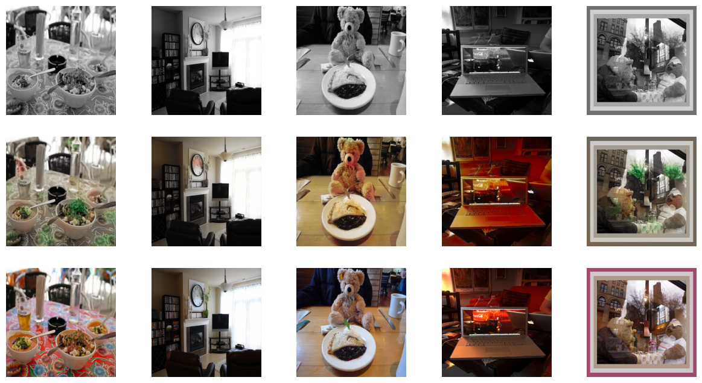
:::

::: {.output .stream .stdout}

    Epoch 1/20
    Iteration 400/500
    loss_D_fake: 0.58503
    loss_D_real: 0.58732
    loss_D: 0.58617
    loss_G_GAN: 1.18291
    loss_G_L1: 8.46351
    loss_G: 9.64642
:::

::: {.output .display_data}

:::

::: {.output .display_data}
``` json
{"model_id":"cf2175848ca1402cb1530418a2d6e8b5","version_major":2,"version_minor":0}
```
:::

::: {.output .stream .stdout}

    Epoch 2/20
    Iteration 200/500
    loss_D_fake: 0.58202
    loss_D_real: 0.58855
    loss_D: 0.58529
    loss_G_GAN: 1.15965
    loss_G_L1: 8.63086
    loss_G: 9.79051
:::

::: {.output .stream .stderr}
    /usr/local/lib/python3.10/dist-packages/skimage/_shared/utils.py:394: UserWarning: Color data out of range: Z < 0 in 1528 pixels
      return func(*args, **kwargs)
    /usr/local/lib/python3.10/dist-packages/skimage/_shared/utils.py:394: UserWarning: Color data out of range: Z < 0 in 60 pixels
      return func(*args, **kwargs)
    /usr/local/lib/python3.10/dist-packages/skimage/_shared/utils.py:394: UserWarning: Color data out of range: Z < 0 in 229 pixels
      return func(*args, **kwargs)
:::

::: {.output .display_data}
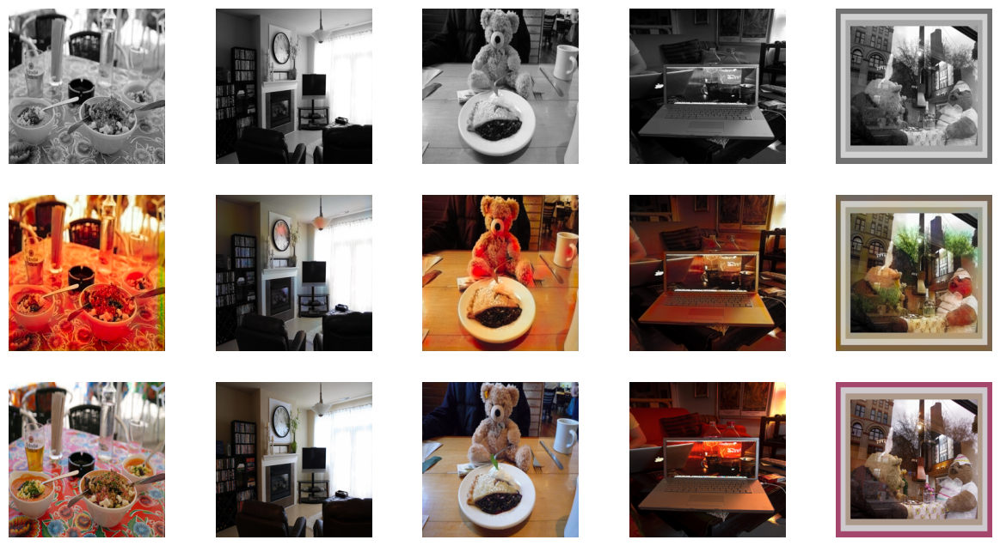
:::

::: {.output .stream .stdout}

    Epoch 2/20
    Iteration 400/500
    loss_D_fake: 0.58044
    loss_D_real: 0.58989
    loss_D: 0.58517
    loss_G_GAN: 1.13709
    loss_G_L1: 8.62734
    loss_G: 9.76443
:::

::: {.output .stream .stderr}
    /usr/local/lib/python3.10/dist-packages/skimage/_shared/utils.py:394: UserWarning: Color data out of range: Z < 0 in 6 pixels
      return func(*args, **kwargs)
    /usr/local/lib/python3.10/dist-packages/skimage/_shared/utils.py:394: UserWarning: Color data out of range: Z < 0 in 18 pixels
      return func(*args, **kwargs)
    /usr/local/lib/python3.10/dist-packages/skimage/_shared/utils.py:394: UserWarning: Color data out of range: Z < 0 in 156 pixels
      return func(*args, **kwargs)
    /usr/local/lib/python3.10/dist-packages/skimage/_shared/utils.py:394: UserWarning: Color data out of range: Z < 0 in 49 pixels
      return func(*args, **kwargs)
    /usr/local/lib/python3.10/dist-packages/skimage/_shared/utils.py:394: UserWarning: Color data out of range: Z < 0 in 38 pixels
      return func(*args, **kwargs)
:::

::: {.output .display_data}
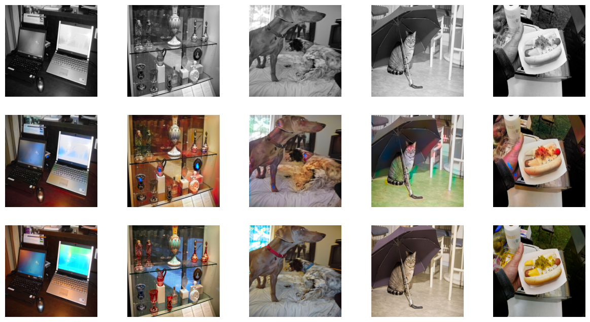
:::

::: {.output .display_data}
``` json
{"model_id":"1757a5ce339a4d8aaa042fdb8b7c9e4d","version_major":2,"version_minor":0}
```
:::

::: {.output .stream .stdout}

    Epoch 3/20
    Iteration 200/500
    loss_D_fake: 0.57892
    loss_D_real: 0.60840
    loss_D: 0.59366
    loss_G_GAN: 1.11526
    loss_G_L1: 8.46541
    loss_G: 9.58067
:::

::: {.output .stream .stderr}
    /usr/local/lib/python3.10/dist-packages/skimage/_shared/utils.py:394: UserWarning: Color data out of range: Z < 0 in 5 pixels
      return func(*args, **kwargs)
    /usr/local/lib/python3.10/dist-packages/skimage/_shared/utils.py:394: UserWarning: Color data out of range: Z < 0 in 244 pixels
      return func(*args, **kwargs)
    /usr/local/lib/python3.10/dist-packages/skimage/_shared/utils.py:394: UserWarning: Color data out of range: Z < 0 in 227 pixels
      return func(*args, **kwargs)
    /usr/local/lib/python3.10/dist-packages/skimage/_shared/utils.py:394: UserWarning: Color data out of range: Z < 0 in 2 pixels
      return func(*args, **kwargs)
    /usr/local/lib/python3.10/dist-packages/skimage/_shared/utils.py:394: UserWarning: Color data out of range: Z < 0 in 21 pixels
      return func(*args, **kwargs)
    /usr/local/lib/python3.10/dist-packages/skimage/_shared/utils.py:394: UserWarning: Color data out of range: Z < 0 in 87 pixels
      return func(*args, **kwargs)
    /usr/local/lib/python3.10/dist-packages/skimage/_shared/utils.py:394: UserWarning: Color data out of range: Z < 0 in 248 pixels
      return func(*args, **kwargs)
    /usr/local/lib/python3.10/dist-packages/skimage/_shared/utils.py:394: UserWarning: Color data out of range: Z < 0 in 178 pixels
      return func(*args, **kwargs)
:::

::: {.output .display_data}
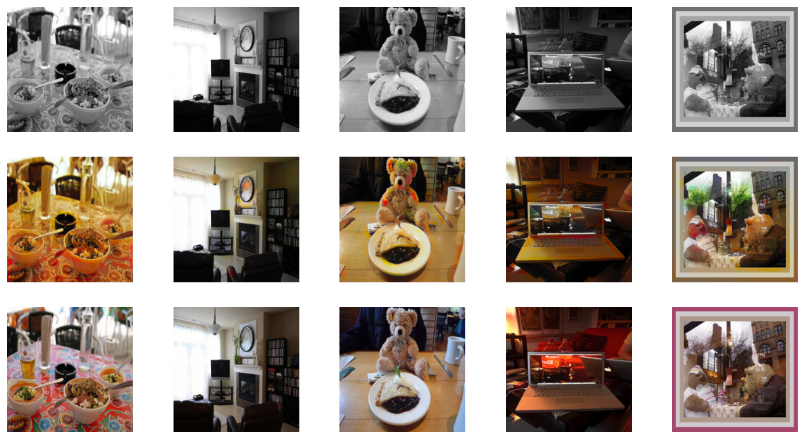
:::

::: {.output .stream .stdout}

    Epoch 3/20
    Iteration 400/500
    loss_D_fake: 0.57611
    loss_D_real: 0.59697
    loss_D: 0.58654
    loss_G_GAN: 1.12429
    loss_G_L1: 8.47733
    loss_G: 9.60162
:::

::: {.output .display_data}
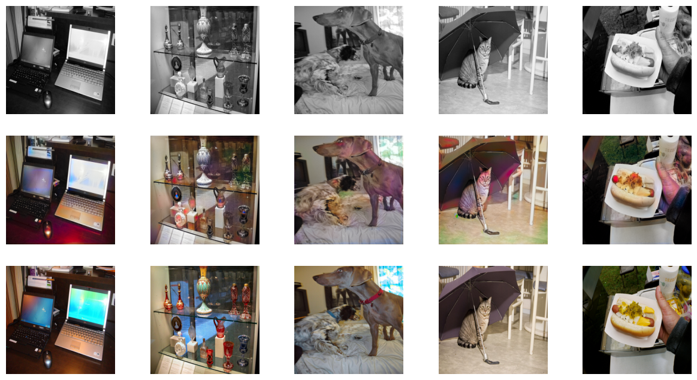
:::

::: {.output .display_data}
``` json
{"model_id":"df3ac99962df47ccadd2c25c0833f198","version_major":2,"version_minor":0}
```
:::

::: {.output .stream .stdout}

    Epoch 4/20
    Iteration 200/500
    loss_D_fake: 0.57926
    loss_D_real: 0.61339
    loss_D: 0.59633
    loss_G_GAN: 1.08658
    loss_G_L1: 8.33211
    loss_G: 9.41869
:::

::: {.output .stream .stderr}
    /usr/local/lib/python3.10/dist-packages/skimage/_shared/utils.py:394: UserWarning: Color data out of range: Z < 0 in 8 pixels
      return func(*args, **kwargs)
    /usr/local/lib/python3.10/dist-packages/skimage/_shared/utils.py:394: UserWarning: Color data out of range: Z < 0 in 14 pixels
      return func(*args, **kwargs)
    /usr/local/lib/python3.10/dist-packages/skimage/_shared/utils.py:394: UserWarning: Color data out of range: Z < 0 in 12 pixels
      return func(*args, **kwargs)
    /usr/local/lib/python3.10/dist-packages/skimage/_shared/utils.py:394: UserWarning: Color data out of range: Z < 0 in 1 pixels
      return func(*args, **kwargs)
    /usr/local/lib/python3.10/dist-packages/skimage/_shared/utils.py:394: UserWarning: Color data out of range: Z < 0 in 4 pixels
      return func(*args, **kwargs)
:::

::: {.output .display_data}
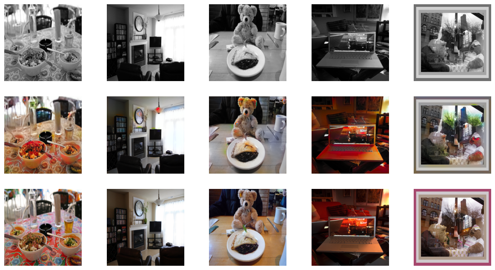
:::

::: {.output .stream .stdout}

    Epoch 4/20
    Iteration 400/500
    loss_D_fake: 0.58138
    loss_D_real: 0.60728
    loss_D: 0.59433
    loss_G_GAN: 1.07710
    loss_G_L1: 8.37990
    loss_G: 9.45700
:::

::: {.output .stream .stderr}
    /usr/local/lib/python3.10/dist-packages/skimage/_shared/utils.py:394: UserWarning: Color data out of range: Z < 0 in 26 pixels
      return func(*args, **kwargs)
    /usr/local/lib/python3.10/dist-packages/skimage/_shared/utils.py:394: UserWarning: Color data out of range: Z < 0 in 134 pixels
      return func(*args, **kwargs)
    /usr/local/lib/python3.10/dist-packages/skimage/_shared/utils.py:394: UserWarning: Color data out of range: Z < 0 in 67 pixels
      return func(*args, **kwargs)
    /usr/local/lib/python3.10/dist-packages/skimage/_shared/utils.py:394: UserWarning: Color data out of range: Z < 0 in 24 pixels
      return func(*args, **kwargs)
:::

::: {.output .display_data}
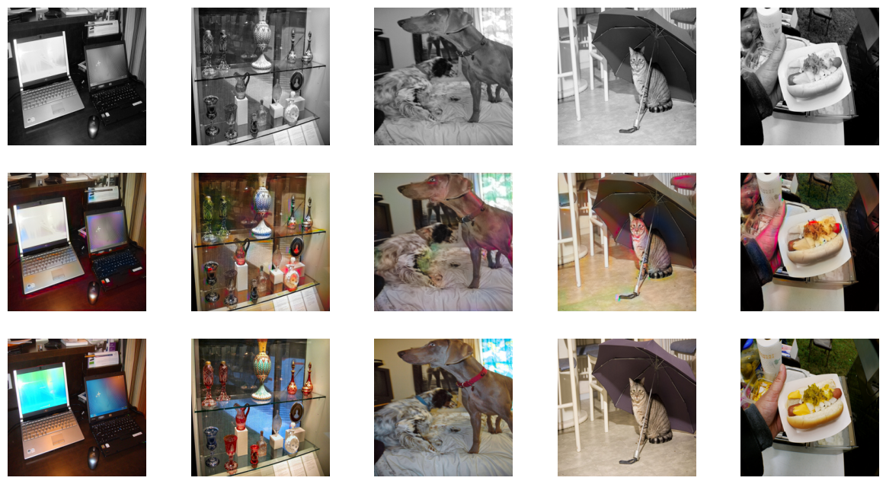
:::

::: {.output .display_data}
``` json
{"model_id":"9fe2862e304146c4bfd014ba9310c1bb","version_major":2,"version_minor":0}
```
:::

::: {.output .stream .stdout}

    Epoch 5/20
    Iteration 200/500
    loss_D_fake: 0.59530
    loss_D_real: 0.62247
    loss_D: 0.60889
    loss_G_GAN: 1.04008
    loss_G_L1: 8.22397
    loss_G: 9.26405
:::

::: {.output .display_data}
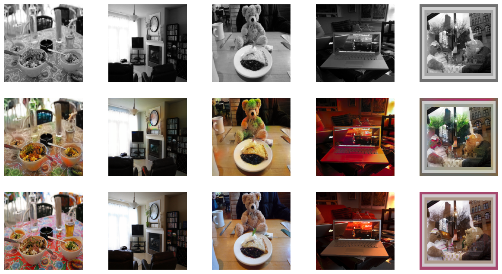
:::

::: {.output .stream .stdout}

    Epoch 5/20
    Iteration 400/500
    loss_D_fake: 0.59418
    loss_D_real: 0.61670
    loss_D: 0.60544
    loss_G_GAN: 1.03905
    loss_G_L1: 8.25092
    loss_G: 9.28997
:::

::: {.output .stream .stderr}
    /usr/local/lib/python3.10/dist-packages/skimage/_shared/utils.py:394: UserWarning: Color data out of range: Z < 0 in 79 pixels
      return func(*args, **kwargs)
    /usr/local/lib/python3.10/dist-packages/skimage/_shared/utils.py:394: UserWarning: Color data out of range: Z < 0 in 284 pixels
      return func(*args, **kwargs)
:::

::: {.output .display_data}
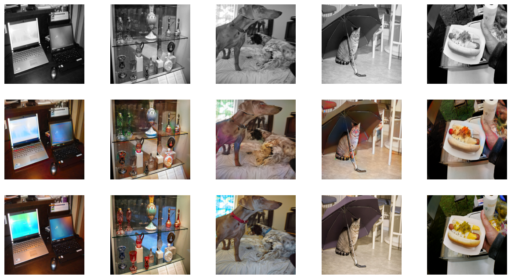
:::

::: {.output .display_data}
``` json
{"model_id":"008b864daeb14c9393a6a3b14d4e56af","version_major":2,"version_minor":0}
```
:::

::: {.output .stream .stdout}

    Epoch 6/20
    Iteration 200/500
    loss_D_fake: 0.59818
    loss_D_real: 0.62386
    loss_D: 0.61102
    loss_G_GAN: 1.02170
    loss_G_L1: 8.13122
    loss_G: 9.15292
:::

::: {.output .stream .stderr}
    /usr/local/lib/python3.10/dist-packages/skimage/_shared/utils.py:394: UserWarning: Color data out of range: Z < 0 in 452 pixels
      return func(*args, **kwargs)
    /usr/local/lib/python3.10/dist-packages/skimage/_shared/utils.py:394: UserWarning: Color data out of range: Z < 0 in 457 pixels
      return func(*args, **kwargs)
:::

::: {.output .display_data}
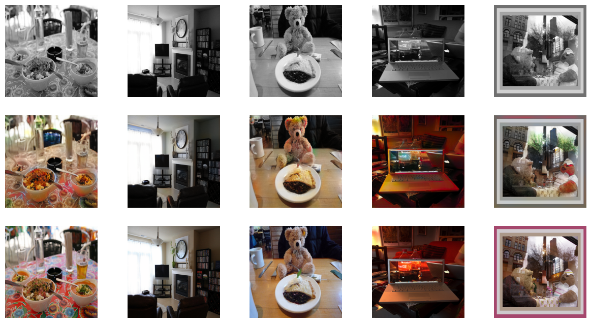
:::

::: {.output .stream .stdout}

    Epoch 6/20
    Iteration 400/500
    loss_D_fake: 0.59520
    loss_D_real: 0.61903
    loss_D: 0.60711
    loss_G_GAN: 1.02294
    loss_G_L1: 8.14380
    loss_G: 9.16674
:::

::: {.output .stream .stderr}
    /usr/local/lib/python3.10/dist-packages/skimage/_shared/utils.py:394: UserWarning: Color data out of range: Z < 0 in 11 pixels
      return func(*args, **kwargs)
    /usr/local/lib/python3.10/dist-packages/skimage/_shared/utils.py:394: UserWarning: Color data out of range: Z < 0 in 10 pixels
      return func(*args, **kwargs)
:::

::: {.output .display_data}
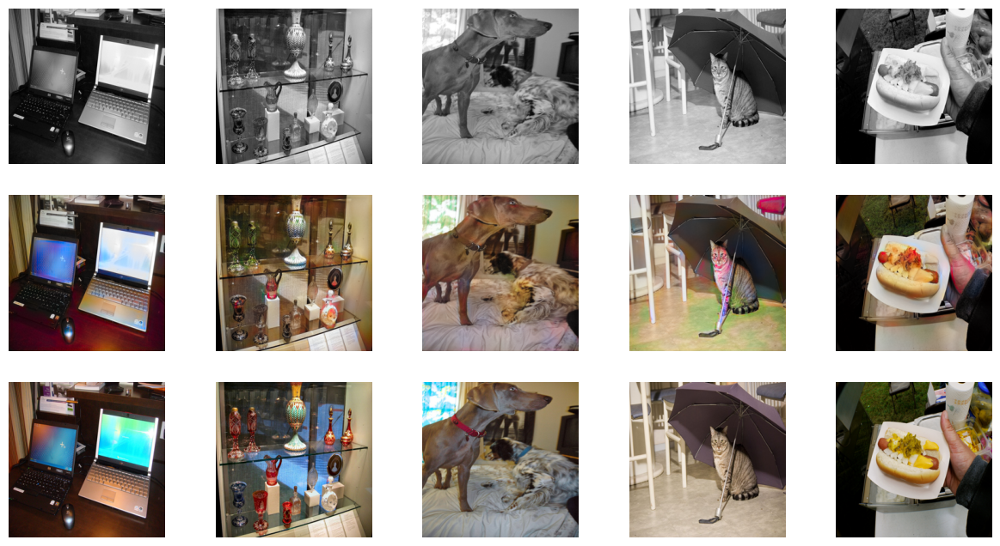
:::

::: {.output .display_data}
``` json
{"model_id":"5f7e108f9d9b4928bd24d41ec6b6ceb3","version_major":2,"version_minor":0}
```
:::

::: {.output .stream .stdout}

    Epoch 7/20
    Iteration 200/500
    loss_D_fake: 0.59281
    loss_D_real: 0.62810
    loss_D: 0.61046
    loss_G_GAN: 1.01820
    loss_G_L1: 7.97419
    loss_G: 8.99239
:::

::: {.output .display_data}
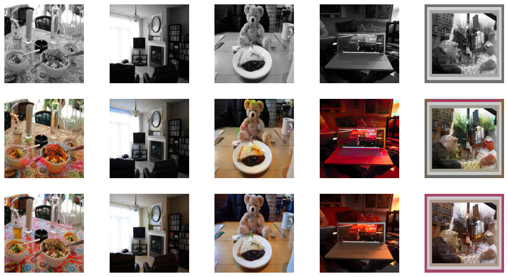
:::

::: {.output .stream .stdout}

    Epoch 7/20
    Iteration 400/500
    loss_D_fake: 0.59383
    loss_D_real: 0.62169
    loss_D: 0.60776
    loss_G_GAN: 1.01206
    loss_G_L1: 8.00354
    loss_G: 9.01560
:::

::: {.output .stream .stderr}
    /usr/local/lib/python3.10/dist-packages/skimage/_shared/utils.py:394: UserWarning: Color data out of range: Z < 0 in 3 pixels
      return func(*args, **kwargs)
:::

::: {.output .display_data}
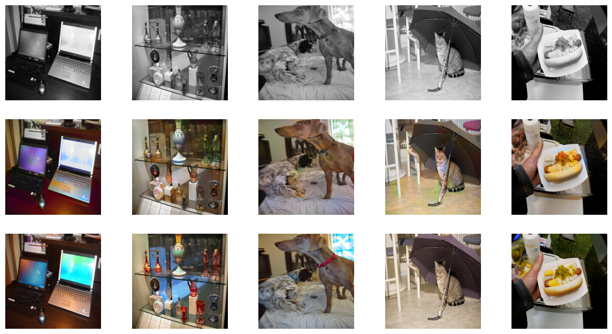
:::

::: {.output .display_data}
``` json
{"model_id":"78559e60990c4fe3bf9262a45e213745","version_major":2,"version_minor":0}
```
:::

::: {.output .stream .stdout}

    Epoch 8/20
    Iteration 200/500
    loss_D_fake: 0.59726
    loss_D_real: 0.62576
    loss_D: 0.61151
    loss_G_GAN: 1.00937
    loss_G_L1: 7.83054
    loss_G: 8.83990
:::

::: {.output .display_data}
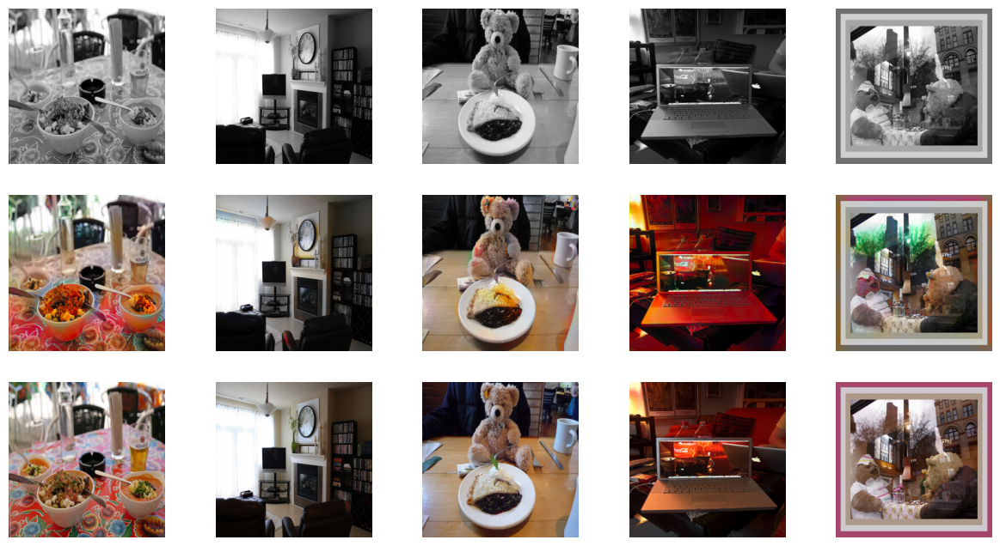
:::

::: {.output .stream .stdout}

    Epoch 8/20
    Iteration 400/500
    loss_D_fake: 0.59757
    loss_D_real: 0.62170
    loss_D: 0.60963
    loss_G_GAN: 1.00348
    loss_G_L1: 7.86827
    loss_G: 8.87175
:::

::: {.output .stream .stderr}
    /usr/local/lib/python3.10/dist-packages/skimage/_shared/utils.py:394: UserWarning: Color data out of range: Z < 0 in 7 pixels
      return func(*args, **kwargs)
    /usr/local/lib/python3.10/dist-packages/skimage/_shared/utils.py:394: UserWarning: Color data out of range: Z < 0 in 9 pixels
      return func(*args, **kwargs)
:::

::: {.output .display_data}
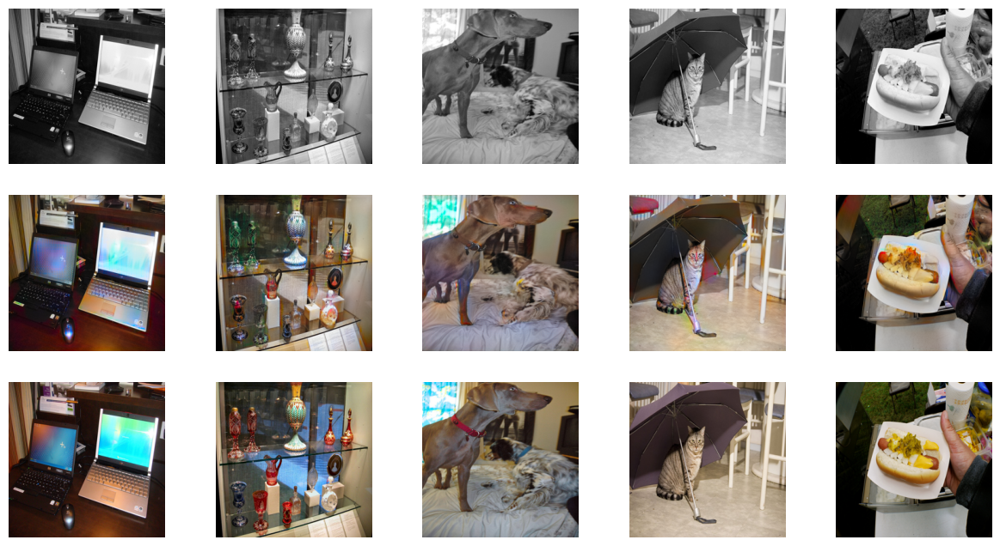
:::

::: {.output .display_data}
``` json
{"model_id":"6fa2c0ee2858415999d5d89c2415e87c","version_major":2,"version_minor":0}
```
:::

::: {.output .stream .stdout}

    Epoch 9/20
    Iteration 200/500
    loss_D_fake: 0.60119
    loss_D_real: 0.63004
    loss_D: 0.61561
    loss_G_GAN: 1.00117
    loss_G_L1: 7.72911
    loss_G: 8.73027
:::

::: {.output .display_data}
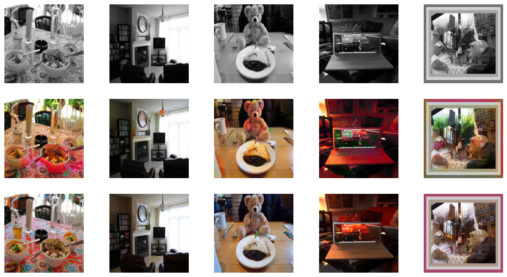
:::

::: {.output .stream .stdout}

    Epoch 9/20
    Iteration 400/500
    loss_D_fake: 0.60068
    loss_D_real: 0.62418
    loss_D: 0.61243
    loss_G_GAN: 0.99779
    loss_G_L1: 7.76901
    loss_G: 8.76681
:::

::: {.output .display_data}
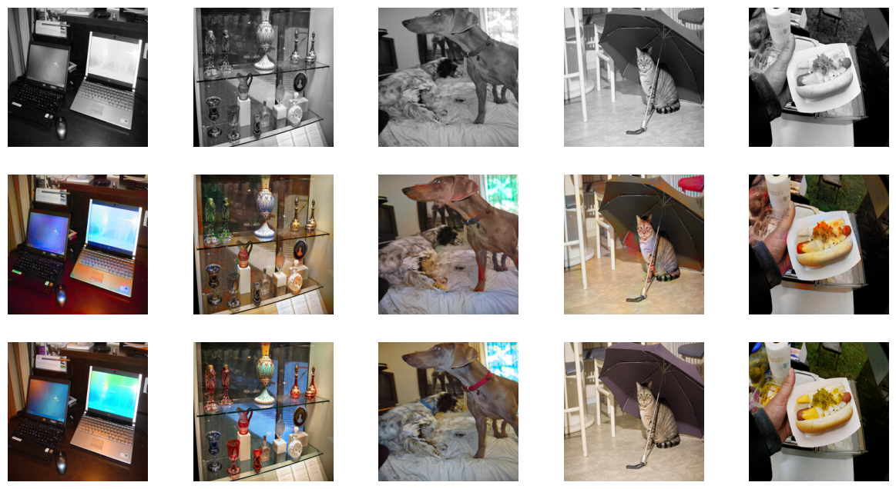
:::

::: {.output .display_data}
``` json
{"model_id":"c3bd4d45a5c142eead7e20437903752b","version_major":2,"version_minor":0}
```
:::

::: {.output .stream .stdout}

    Epoch 10/20
    Iteration 200/500
    loss_D_fake: 0.60033
    loss_D_real: 0.62759
    loss_D: 0.61396
    loss_G_GAN: 1.00027
    loss_G_L1: 7.62433
    loss_G: 8.62460
:::

::: {.output .display_data}
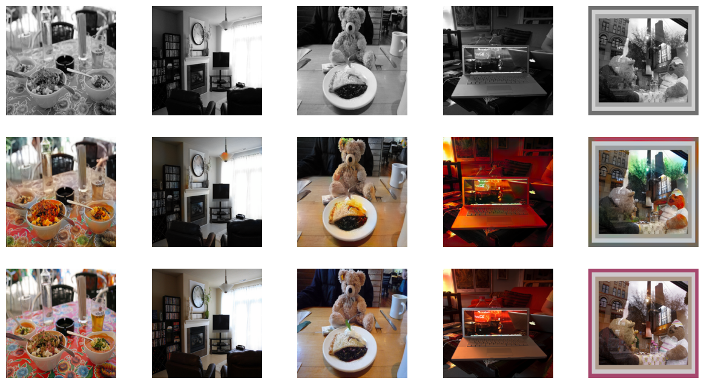
:::

::: {.output .stream .stdout}

    Epoch 10/20
    Iteration 400/500
    loss_D_fake: 0.60040
    loss_D_real: 0.62373
    loss_D: 0.61207
    loss_G_GAN: 0.99384
    loss_G_L1: 7.64537
    loss_G: 8.63920
:::

::: {.output .display_data}

:::

::: {.output .display_data}
``` json
{"model_id":"49297fd74d554d43b924aa517695d5ce","version_major":2,"version_minor":0}
```
:::

::: {.output .stream .stdout}

    Epoch 11/20
    Iteration 200/500
    loss_D_fake: 0.59985
    loss_D_real: 0.62861
    loss_D: 0.61423
    loss_G_GAN: 0.97986
    loss_G_L1: 7.46337
    loss_G: 8.44323
:::

::: {.output .stream .stderr}
    /usr/local/lib/python3.10/dist-packages/skimage/_shared/utils.py:394: UserWarning: Color data out of range: Z < 0 in 242 pixels
      return func(*args, **kwargs)
:::

::: {.output .display_data}
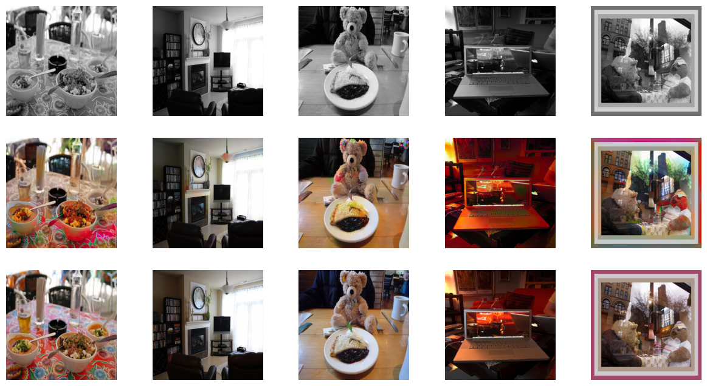
:::

::: {.output .stream .stdout}

    Epoch 11/20
    Iteration 400/500
    loss_D_fake: 0.60090
    loss_D_real: 0.62410
    loss_D: 0.61250
    loss_G_GAN: 0.97849
    loss_G_L1: 7.49176
    loss_G: 8.47025
:::

::: {.output .display_data}
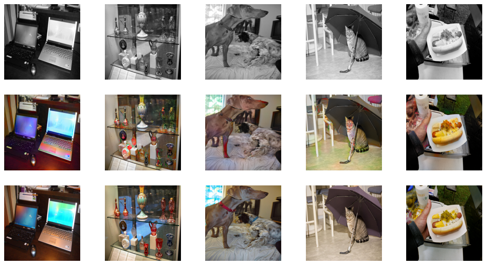
:::

::: {.output .display_data}
``` json
{"model_id":"3f04607a602d467bba642e178e5a3781","version_major":2,"version_minor":0}
```
:::

::: {.output .stream .stdout}

    Epoch 12/20
    Iteration 200/500
    loss_D_fake: 0.60738
    loss_D_real: 0.62783
    loss_D: 0.61761
    loss_G_GAN: 0.98722
    loss_G_L1: 7.33297
    loss_G: 8.32019
:::

::: {.output .display_data}
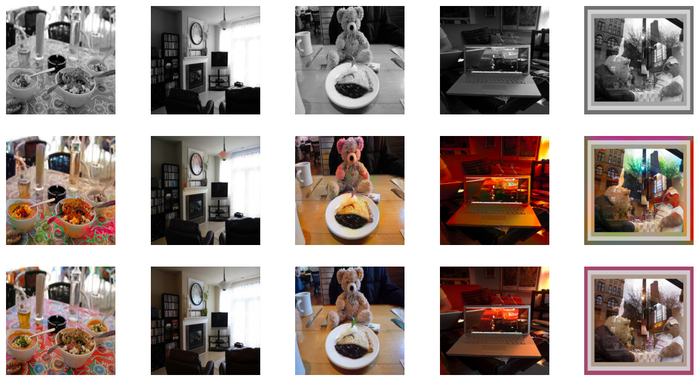
:::

::: {.output .stream .stdout}

    Epoch 12/20
    Iteration 400/500
    loss_D_fake: 0.60589
    loss_D_real: 0.62605
    loss_D: 0.61597
    loss_G_GAN: 0.97822
    loss_G_L1: 7.34981
    loss_G: 8.32803
:::

::: {.output .display_data}
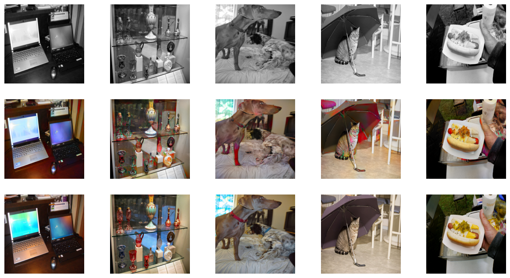
:::

::: {.output .display_data}
``` json
{"model_id":"06d462dd3dbb4d7d8ee6be9e3141d15f","version_major":2,"version_minor":0}
```
:::

::: {.output .stream .stdout}

    Epoch 13/20
    Iteration 200/500
    loss_D_fake: 0.60682
    loss_D_real: 0.62811
    loss_D: 0.61747
    loss_G_GAN: 0.97142
    loss_G_L1: 7.18555
    loss_G: 8.15697
:::

::: {.output .display_data}
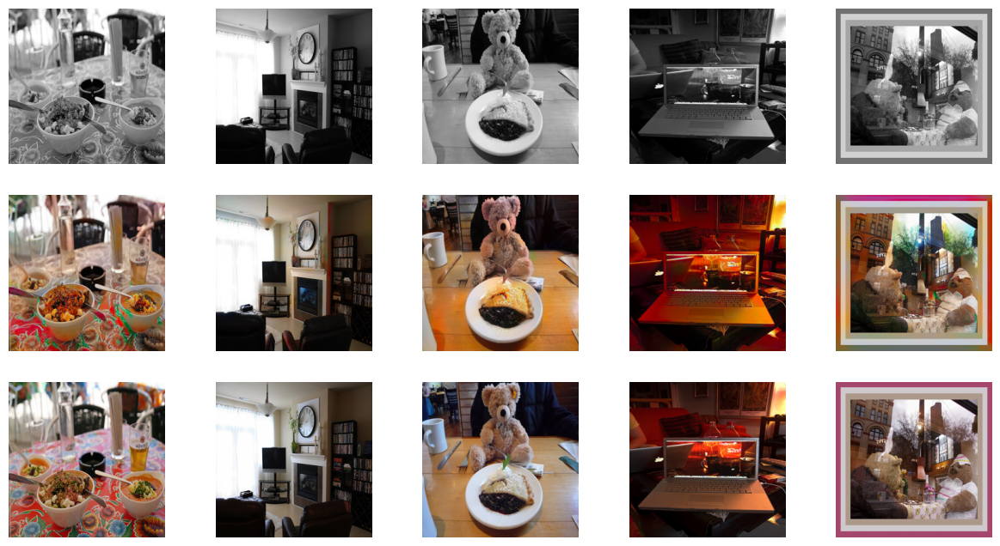
:::

::: {.output .stream .stdout}

    Epoch 13/20
    Iteration 400/500
    loss_D_fake: 0.60608
    loss_D_real: 0.62826
    loss_D: 0.61717
    loss_G_GAN: 0.96442
    loss_G_L1: 7.22673
    loss_G: 8.19116
:::

::: {.output .stream .stderr}
    /usr/local/lib/python3.10/dist-packages/skimage/_shared/utils.py:394: UserWarning: Color data out of range: Z < 0 in 22 pixels
      return func(*args, **kwargs)
:::

::: {.output .display_data}
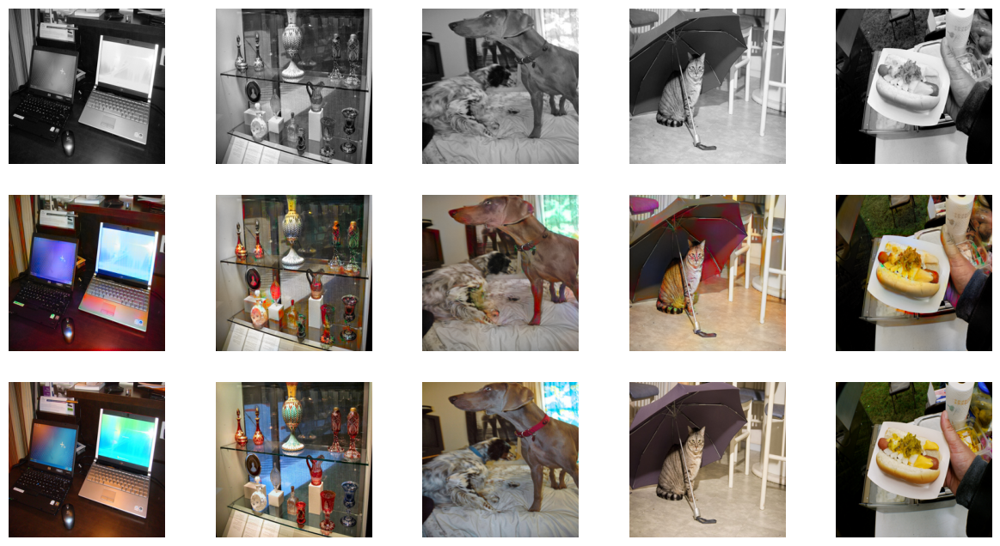
:::

::: {.output .display_data}
``` json
{"model_id":"bb5027e9e0854a3a9aae3cdfa2844b49","version_major":2,"version_minor":0}
```
:::

::: {.output .stream .stdout}

    Epoch 14/20
    Iteration 200/500
    loss_D_fake: 0.61216
    loss_D_real: 0.62947
    loss_D: 0.62081
    loss_G_GAN: 0.96149
    loss_G_L1: 7.05378
    loss_G: 8.01527
:::

::: {.output .display_data}
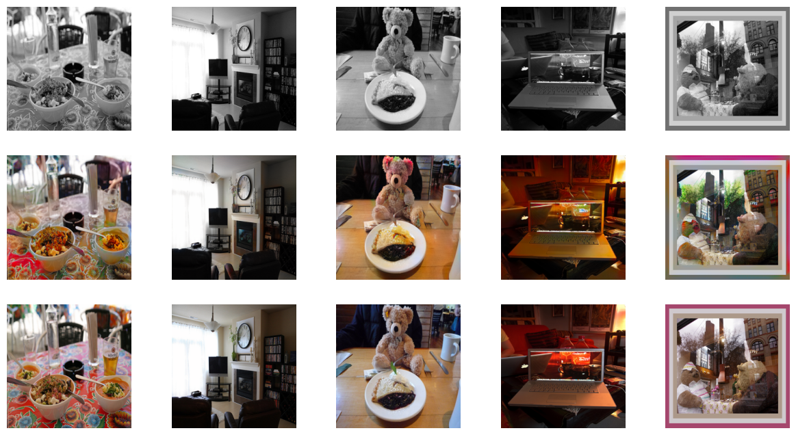
:::

::: {.output .stream .stdout}

    Epoch 14/20
    Iteration 400/500
    loss_D_fake: 0.61286
    loss_D_real: 0.62976
    loss_D: 0.62131
    loss_G_GAN: 0.95392
    loss_G_L1: 7.09427
    loss_G: 8.04820
:::

::: {.output .display_data}
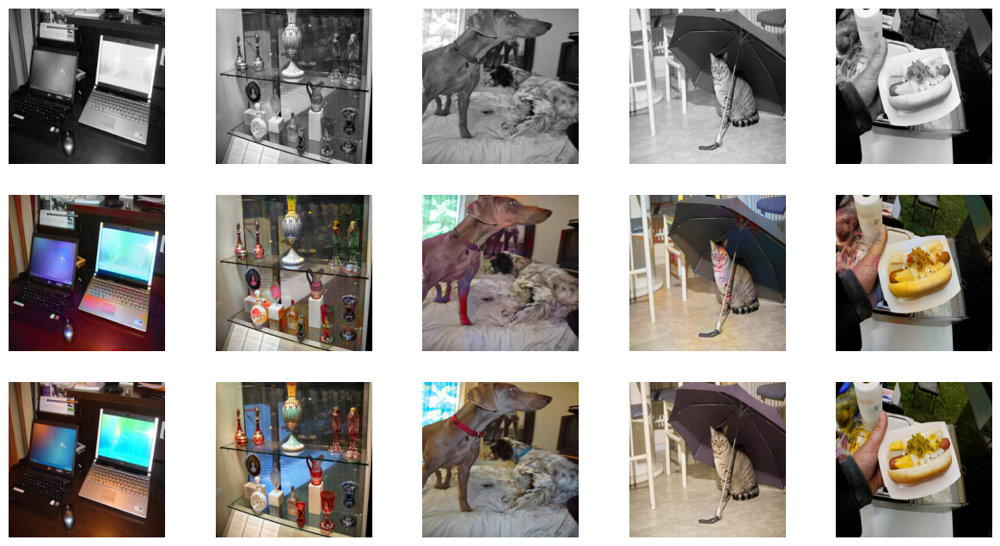
:::

::: {.output .display_data}
``` json
{"model_id":"1e397ed98b994410b8f801b591278e0c","version_major":2,"version_minor":0}
```
:::

::: {.output .stream .stdout}

    Epoch 15/20
    Iteration 200/500
    loss_D_fake: 0.61828
    loss_D_real: 0.63542
    loss_D: 0.62685
    loss_G_GAN: 0.95234
    loss_G_L1: 6.91806
    loss_G: 7.87040
:::

::: {.output .display_data}
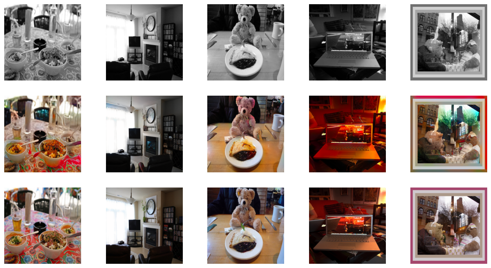
:::

::: {.output .stream .stdout}

    Epoch 15/20
    Iteration 400/500
    loss_D_fake: 0.61719
    loss_D_real: 0.63335
    loss_D: 0.62527
    loss_G_GAN: 0.94871
    loss_G_L1: 6.93897
    loss_G: 7.88767
:::

::: {.output .display_data}
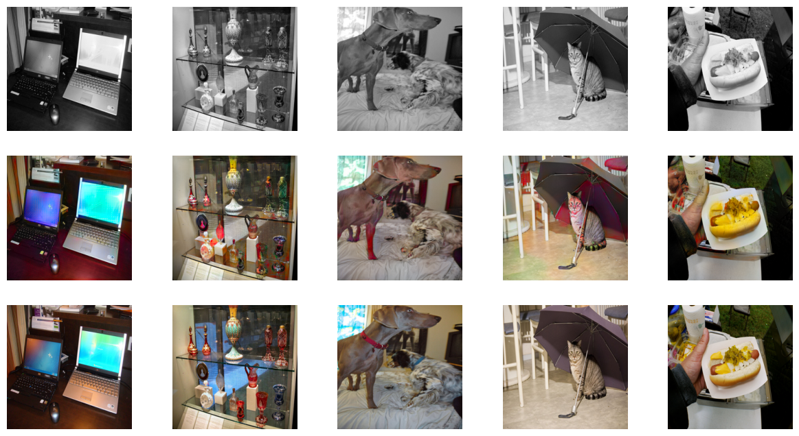
:::

::: {.output .display_data}
``` json
{"model_id":"b3fceff77b7d4053a6aaafc13b938ea1","version_major":2,"version_minor":0}
```
:::

::: {.output .stream .stdout}

    Epoch 16/20
    Iteration 200/500
    loss_D_fake: 0.61850
    loss_D_real: 0.63451
    loss_D: 0.62650
    loss_G_GAN: 0.93258
    loss_G_L1: 6.75254
    loss_G: 7.68512
:::

::: {.output .display_data}
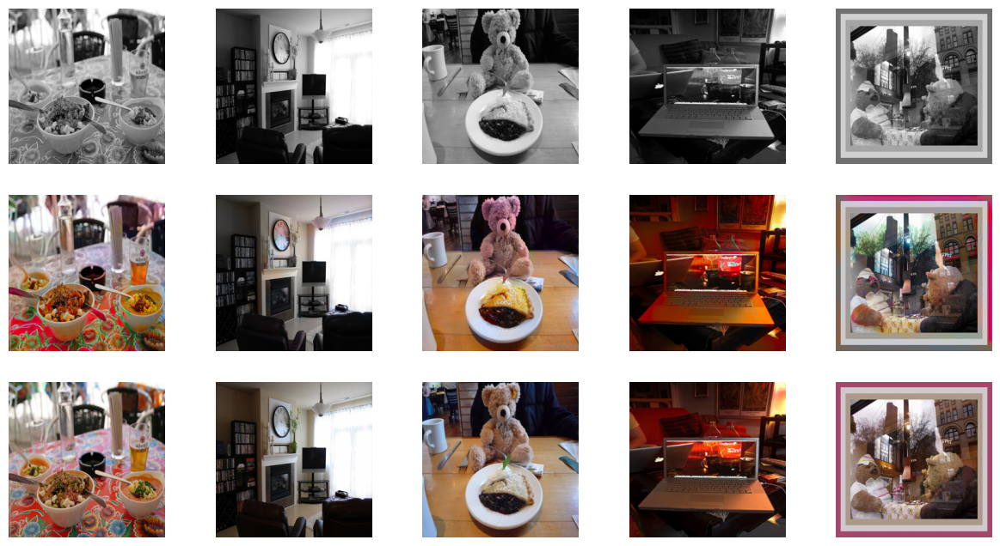
:::

::: {.output .stream .stdout}

    Epoch 16/20
    Iteration 400/500
    loss_D_fake: 0.61971
    loss_D_real: 0.63459
    loss_D: 0.62715
    loss_G_GAN: 0.93232
    loss_G_L1: 6.76170
    loss_G: 7.69402
:::

::: {.output .display_data}
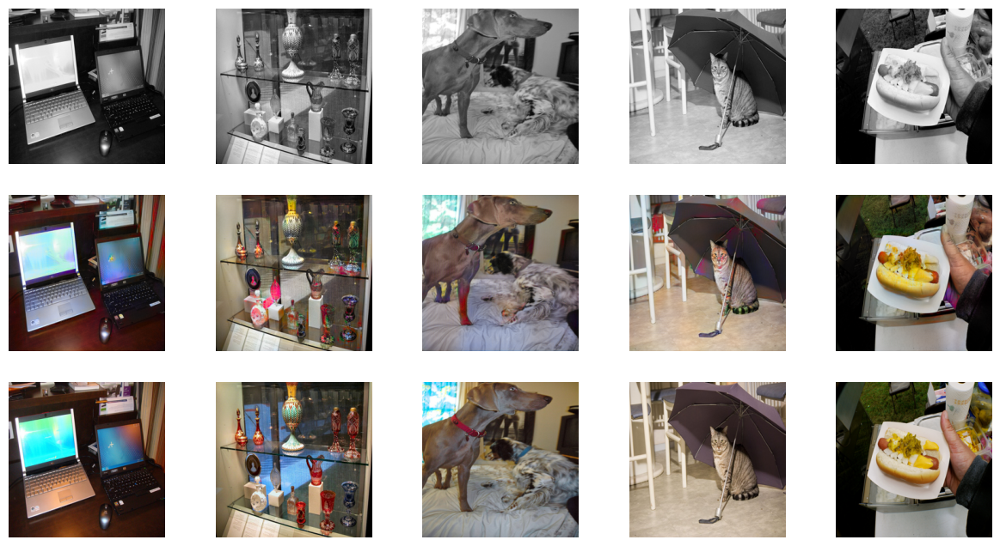
:::

::: {.output .display_data}
``` json
{"model_id":"72f6655922d840b58ba7991a83413941","version_major":2,"version_minor":0}
```
:::

::: {.output .stream .stdout}

    Epoch 17/20
    Iteration 200/500
    loss_D_fake: 0.62174
    loss_D_real: 0.63542
    loss_D: 0.62858
    loss_G_GAN: 0.93562
    loss_G_L1: 6.65684
    loss_G: 7.59246
:::

::: {.output .display_data}
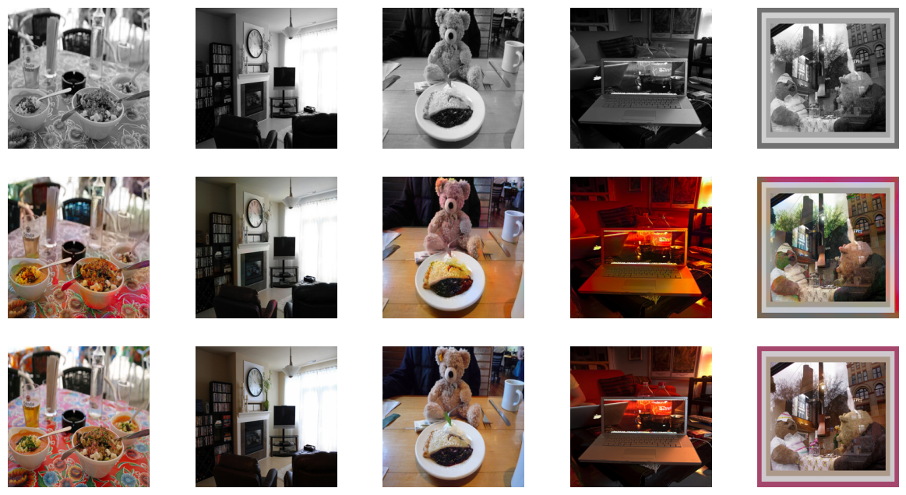
:::

::: {.output .stream .stdout}

    Epoch 17/20
    Iteration 400/500
    loss_D_fake: 0.62231
    loss_D_real: 0.63586
    loss_D: 0.62908
    loss_G_GAN: 0.93166
    loss_G_L1: 6.64187
    loss_G: 7.57353
:::

::: {.output .display_data}
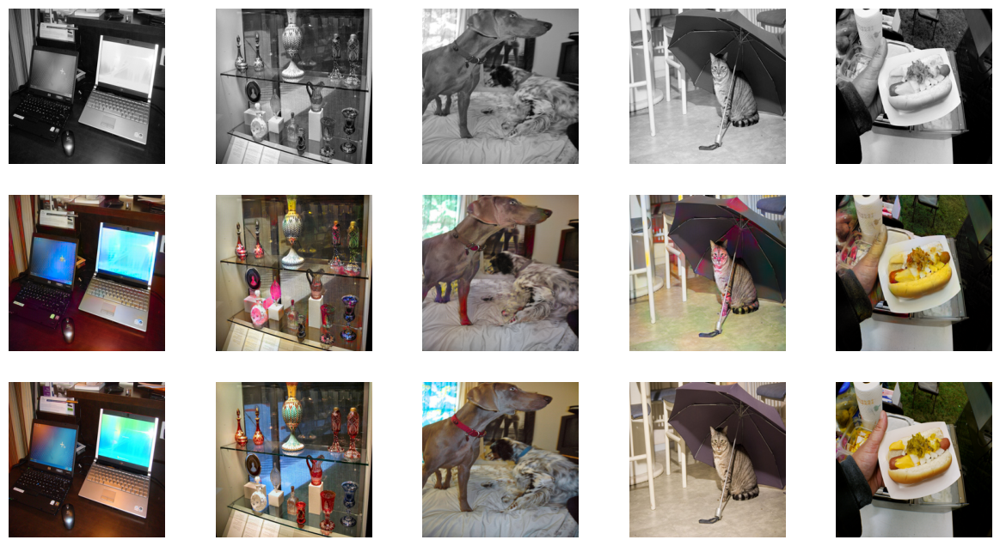
:::

::: {.output .display_data}
``` json
{"model_id":"973a245e166447f18b7effb9e36de5ee","version_major":2,"version_minor":0}
```
:::

::: {.output .stream .stdout}

    Epoch 18/20
    Iteration 200/500
    loss_D_fake: 0.62320
    loss_D_real: 0.63595
    loss_D: 0.62958
    loss_G_GAN: 0.92901
    loss_G_L1: 6.48908
    loss_G: 7.41809
:::

::: {.output .display_data}
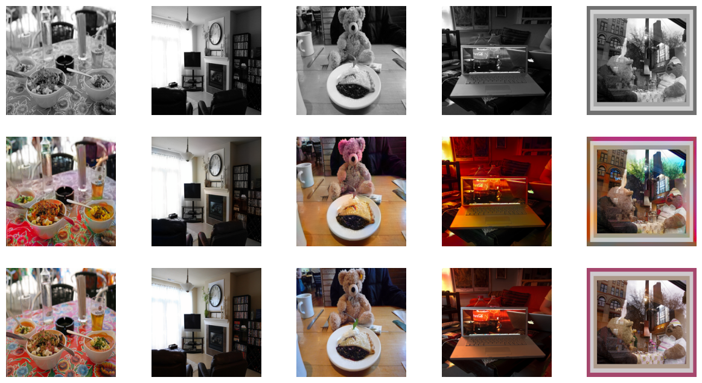
:::

::: {.output .stream .stdout}

    Epoch 18/20
    Iteration 400/500
    loss_D_fake: 0.62344
    loss_D_real: 0.63456
    loss_D: 0.62900
    loss_G_GAN: 0.92525
    loss_G_L1: 6.49762
    loss_G: 7.42288
:::

::: {.output .display_data}
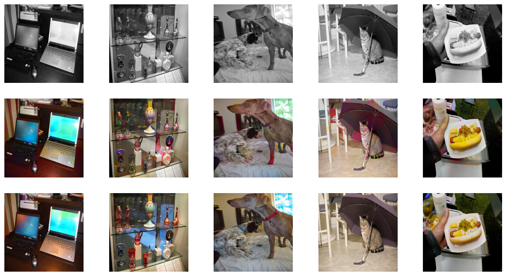
:::

::: {.output .display_data}
``` json
{"model_id":"2741c2afc1f140f4a18a7041551789ba","version_major":2,"version_minor":0}
```
:::

::: {.output .stream .stdout}

    Epoch 19/20
    Iteration 200/500
    loss_D_fake: 0.61972
    loss_D_real: 0.63448
    loss_D: 0.62710
    loss_G_GAN: 0.91991
    loss_G_L1: 6.36434
    loss_G: 7.28424
:::

::: {.output .display_data}
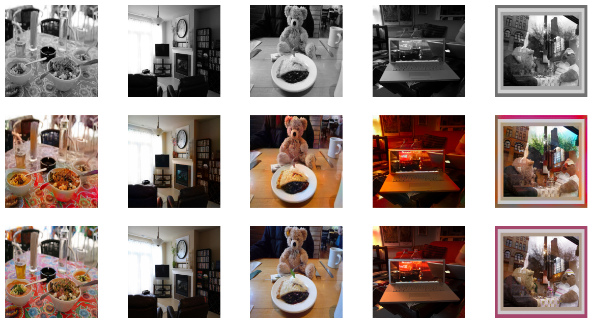
:::

::: {.output .stream .stdout}

    Epoch 19/20
    Iteration 400/500
    loss_D_fake: 0.62023
    loss_D_real: 0.63444
    loss_D: 0.62734
    loss_G_GAN: 0.92416
    loss_G_L1: 6.36753
    loss_G: 7.29169
:::

::: {.output .display_data}
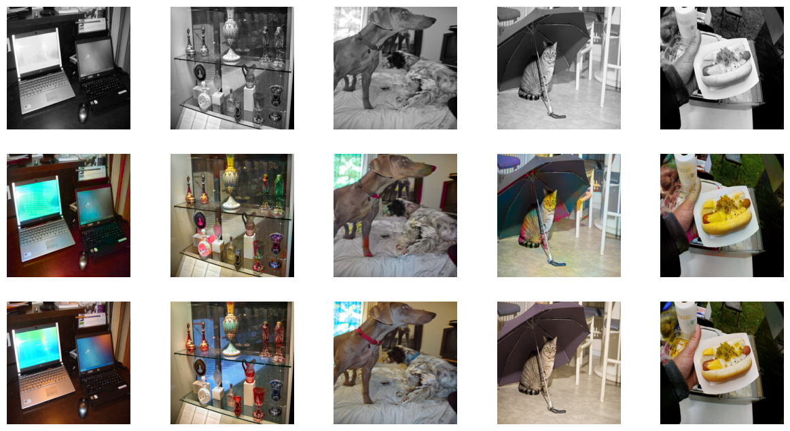
:::

::: {.output .display_data}
``` json
{"model_id":"fef97a04820e4afeb60004170275dcb7","version_major":2,"version_minor":0}
```
:::

::: {.output .stream .stdout}

    Epoch 20/20
    Iteration 200/500
    loss_D_fake: 0.62360
    loss_D_real: 0.63717
    loss_D: 0.63038
    loss_G_GAN: 0.92034
    loss_G_L1: 6.21672
    loss_G: 7.13705
:::

::: {.output .display_data}
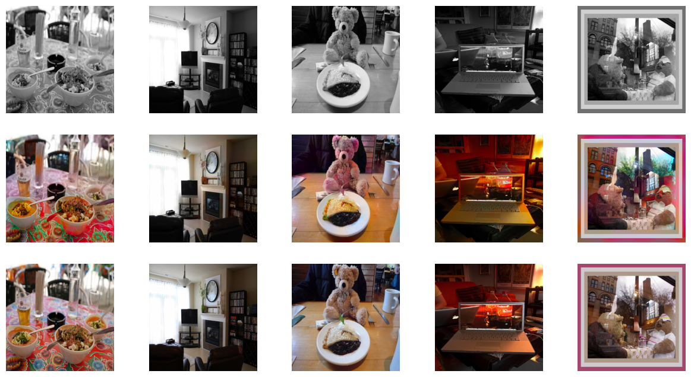
:::

::: {.output .stream .stdout}

    Epoch 20/20
    Iteration 400/500
    loss_D_fake: 0.62608
    loss_D_real: 0.63717
    loss_D: 0.63162
    loss_G_GAN: 0.91935
    loss_G_L1: 6.20040
    loss_G: 7.11975
:::

::: {.output .display_data}
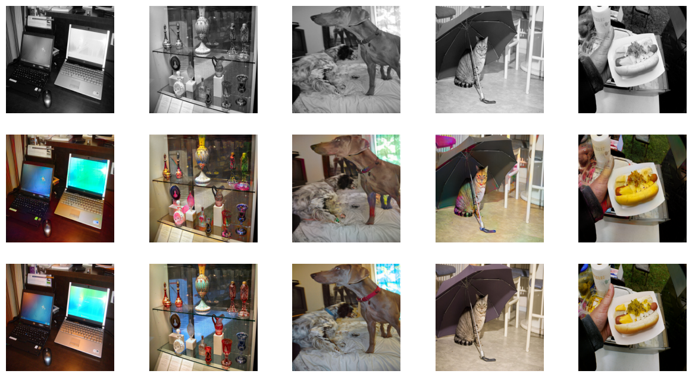
:::
:::

::: {.cell .markdown id="qNv63bp7XXrm"}
In this step, the saved weights for the generator, which were preserved
in the previous section, are loaded. Subsequently, this model is
incorporated as the generator within our MainModel class, effectively
preventing it from undergoing random initialization. The training
process for the model is then conducted over the course of 20 epochs.
It\'s worth noting that each epoch requires approximately 3 to 4 minutes
on Colab.
:::

::: {.cell .code id="gIegjtg82pQ8"}
``` python
# After training the model
torch.save(model.state_dict(), 'final_model_weights2.pt')
```
:::

::: {.cell .code colab="{\"base_uri\":\"https://localhost:8080/\"}" id="_YjcVeb7XXrm" outputId="ede2458e-7fb3-4b62-f15f-997cfd5447a0"}
``` python
net_G = build_res_unet(n_input=1, n_output=2, size=256)
net_G.load_state_dict(torch.load("res18-unet2.pt", map_location=device))
model = MainModel(net_G=net_G)
model.load_state_dict(torch.load("final_model_weights2.pth", map_location=device))
```

::: {.output .stream .stdout}
    model initialized with norm initialization
:::

::: {.output .execute_result execution_count="76"}
    <All keys matched successfully>
:::
:::
